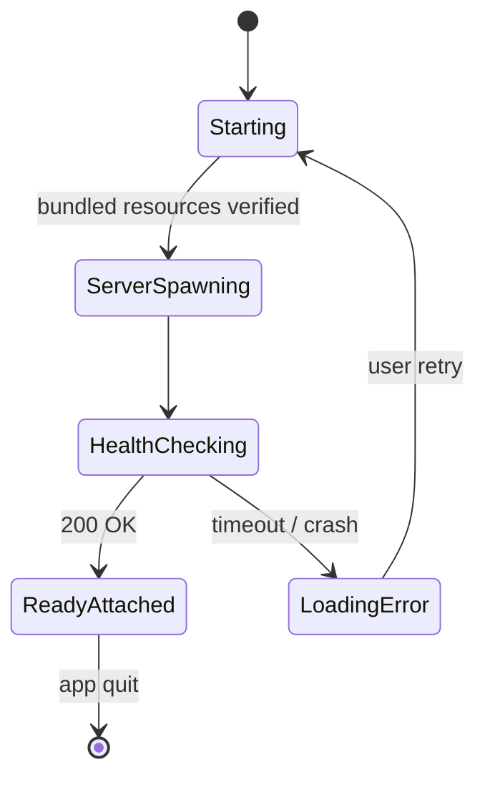

# Bootstrap Architecture — Exploration & Decision Record

Exploration record. Session date: 2026-05-18. Outcome: change `eliminate-electron-runtime-install`. Captures reasoning chain, not just verdict. Future agents reconstruct path here.

---

## 1. Starting framing

User observation:

> *"bootstrap is a mess; 3 install methods: pi install / npm install / electron."*

Three install arms today:

| Arm | Mechanism | Target user |
|---|---|---|
| `pi install pi-agent-dashboard` | Bridge extension inside pi session | Terminal-first developer |
| `npm install -g pi-agent-dashboard` | Standalone CLI on shell | Remote-server / docker operator |
| Electron `.dmg` / `.deb` / `.exe` | Desktop launcher | LLM-tool-naive user |

Three target users matrix:

```
                     terminal-first    remote-server    LLM-tool-naive
pi-install              primary            ok                no
npm-install               ok             primary              no
electron                 niche            niche             primary
```

Mess concentrated on Electron arm. Other arms boot via shell.

---

## 2. First reframe — runtime convergence

At runtime layer all three arms produce same Node process running TypeScript via jiti loader. Differ only in pre-launch concerns.

```
       BRIDGE ARM            STANDALONE ARM         ELECTRON ARM
            │                       │                    │
            ▼                       ▼                    ▼
   pi session detects        user runs CLI         user double-clicks
   no dashboard up           pi-dashboard start         .app
            │                       │                    │
            ▼                       ▼                    ▼
   server-auto-start         cmdStart              wizard / startup
   spawns detached           spawns local           spawns child
            │                       │                    │
            └───────────┬───────────┴────────────────────┘
                        ▼
              ┌──────────────────────┐
              │  node --import jiti  │
              │  packages/server/    │
              │  src/cli.ts          │
              └──────────────────────┘
                        │
                        ▼
              fastify on :8000 + WS gateways
```

Divergence axes:

| Axis | Bridge | Standalone | Electron |
|---|---|---|---|
| Starter (`DASHBOARD_STARTER`) | `Bridge` | `Standalone` | `Electron` |
| Where deps live | pi cache (`~/.pi/agent/…`) | npm-global prefix | `~/.pi-dashboard/` |
| Node source | system node (pi requires) | system node | bundled node fallback |
| TUI alongside | yes | no | no |
| Lifecycle owner | bridge | shell user | electron main |

Things only Electron does:

| # | Concern | File |
|---|---|---|
| 1 | First-run wizard window | `wizard-window.ts` |
| 2 | Offline cacache extract | `offline-packages.ts` |
| 3 | `installStandalone` npm into `~/.pi-dashboard/` | `dependency-installer.ts` |
| 4 | Per-launch preflight reconcile | `preflight-reconcile.ts` |
| 5 | Force-reinstall surgical wipe | `force-reinstall.ts` |
| 6 | Bundled-node fallback | `bundled-node.ts` |
| 7 | Power-user-install decision | `power-user-install.ts` |
| 8 | Installable catalog assembly | `installable-catalog.ts` |
| 9 | Wizard progress badge classify | `wizard-badge.ts` |
| 10 | Bridge non-destructive register | `bridge-register.ts` (shared) |
| 11 | Bundle-server build step | `bundle-server.mjs` |
| 12 | Bundle-offline-packages build step | `bundle-offline-packages.sh` |
| 13 | Doctor force-reinstall surface | `doctor-window.ts` |
| 14 | Version-skew banner + bootstrap state machine | `bootstrap-state.ts` |

Pattern: Electron reimplements inside sandbox what shell-based arms get free.

---

## 3. In-flight-changes signal

Count of open proposals by arm:

| Arm | Open changes |
|---|---|
| bridge | 0 |
| standalone | 0 |
| electron | 9+ |

Electron in-flight list:

- `streamline-electron-bootstrap-and-recovery`
- `fix-stale-bundled-server-cache`
- `fix-electron-wizard-npm-root-enoent`
- `fix-electron-server-launch-node-bin`
- `skip-affected-bundled-node`
- `fix-resolve-client-dir-prefers-durable-managed-path`
- `fix-is-npm-package-installed-exports-map`
- `fix-build-installer-stale-server-bundle`
- `fix-darwin-dmg-maker-macos-alias`

Bootstrap mess = one arm reimplementing inside sandbox what other arms get free from shell.

---

## 4. Model A vs Model B

Two mental models surfaced.

### Model A — server-as-satellite

```
┌────────────────────────┐
│   pi session (TUI)     │
│  ┌──────────────────┐  │
│  │ bridge extension │──┼──► spawns dashboard server
│  └──────────────────┘  │     as child of pi session
└────────────────────────┘
```

Dashboard cannot exist without pi session. Server lifecycle bound to TUI.

### Model B — server-as-platform

```
┌────────────────────────┐
│   dashboard server     │◄─── runs standalone
│  (fastify + WS)        │     pi sessions connect as clients
└────────────────────────┘
         ▲   ▲   ▲
         │   │   │
       pi₁  pi₂  pi₃   (multiple sessions, optional, transient)
```

Dashboard runs without any pi session. Pi sessions = peripheral clients.

User framing:

> *"the dashboard server able to run and serve without any pi session started. So it can be installed inside a docker instance."*

> *"I told docker as an example. It can be bare metals too. It is acceptable when npm install is required."*

→ Model B selected. Reference deployment = standalone (npm-global on real shell). Bridge arm conceptually still Model A; treated as legacy convenience.

---

## 5. Constraint matrix

```
                       │  must work without  │  must embed full
                       │  pre-installed node │  runtime in installer
npm-global / docker    │         NO          │         NO
pi-extension (bridge)  │        YES (*)      │         YES (*)
electron               │        YES          │         YES
```

(*) bridge embeds server inside its own pi extension package; pi itself supplies node.

User decision:

> *"Electron is launcher, but have to be able to embed the whole required stuffz, so it have to operate without any preinstalled npm / node."*

---

## 6. The HOW-to-embed fork

Two options for "embed full runtime."

### Option 1 — ship pre-installed `node_modules` tree, immutable

Build time:
```
npm install in CI → bundle node_modules into resources/server/node_modules/
  → ship inside .app / .deb / .exe as read-only tree
```

Install time:
```
extract .app → done. node_modules already present in resources/.
```

Launch time:
```
spawn node --import jiti server entry → require() resolves from
resources/server/node_modules/ → fastify boots.
```

Disappears: cacache, manifest, installStandalone, preflight-reconcile, force-reinstall, installable.json, ELECTRON_OWNED_PACKAGES, wizard install step.

### Option 2 — ship offline npm tarball cache, install at runtime [current]

Build time:
```
bundle-offline-packages.sh → npm pack pi/openspec/tsx + deps →
cacache tarball + manifest.json → ship inside resources/offline-packages/.
```

Install time (first launch):
```
extract .app → empty ~/.pi-dashboard/ →
wizard runs installStandalone → npm install --cache=offline-cache
→ writes ~/.pi-dashboard/node_modules/.
```

Launch time:
```
preflight-reconcile compares ~/.pi-dashboard/ vs installable.json →
spawn child against ~/.pi-dashboard/.
```

Current code = Option 2.

---

## 7. Four candidate reasons for keeping Option 2

Evaluated each against actual code.

| Reason | Verdict |
|---|---|
| (a) Installer size | Rejected. Current `.dmg` 225 MB (v0.5.3). +50–80 MB acceptable. |
| (b) User pi-* extensions coexist in `~/.pi-dashboard/node_modules/` | Rejected. `pi install <ext>` writes pi's own cache under `~/.pi/agent/…`, not `~/.pi-dashboard/`. |
| (c) `electron-updater` patches incrementally | Rejected. `electron-updater` = whole-`.app` replacement. Never touches `~/.pi-dashboard/`. |
| (d) Native deps (node-pty) need install-time resolution | Rejected. node-pty ships prebuilds for darwin/linux/win × arm64/x64. Loads at runtime from read-only location. |

Survivor: `/api/pi-core/update`. In-place upgrade of pi/openspec/tsx (3 packages = exact `ELECTRON_OWNED_PACKAGES` whitelist) without re-downloading `.app`.

---

## 8. The dependency pyramid

```
              ┌──────────────────────────────────────────────┐
              │   /api/pi-core/update                        │
              │   "upgrade pi inside the running dashboard"  │
              └──────────────────────────────────────────────┘
                                │ depends on
                                ▼
              ┌──────────────────────────────────────────────┐
              │   ~/.pi-dashboard/ must be writable + mutable│
              └──────────────────────────────────────────────┘
                                │ depends on
                                ▼
     ┌──────────────────────────────────────────────────────────┐
     │  Bootstrap machinery (only on Electron arm):             │
     │  - ELECTRON_OWNED_PACKAGES whitelist                     │
     │  - offline cacache + manifest                            │
     │  - installable.json v2 + kind/source/required            │
     │  - preflight-reconcile every launch                      │
     │  - installStandalone w/ skipPackages=upToDate            │
     │  - planSafeWipe + force-reinstall                        │
     │  - materializeWorkspaceSymlinks rescue                   │
     │  - version-skew banner                                   │
     │  - resolveManagedDirRoot + 6-strategy client-dir         │
     │  - loading-page-error reinstall surface                  │
     │  - Doctor force-reinstall                                │
     └──────────────────────────────────────────────────────────┘
```

Entire pyramid base exists to support apex feature.

---

## 9. Decision

User said:

> *"/api/pi-core/update is replaceable by .app update"*

Pyramid collapses. Pi version updates ride electron-updater whole-`.app` replacement. Base machinery loses justification. Eliminate runtime npm install from Electron arm.

Change name: `eliminate-electron-runtime-install`.

---

## 10. Post-decision architecture

```
┌─────────────────────────────────────────────────────────────────┐
│  THREE BOOTSTRAPPERS, ONE SERVER, ZERO RUNTIME INSTALL          │
│                                                                 │
│  ┌──────────────┐   ┌──────────────┐   ┌──────────────┐         │
│  │ npm-global   │   │ pi-extension │   │   electron   │         │
│  │  (docker /   │   │   (bridge)   │   │  (.app/.deb/ │         │
│  │   bare-shell)│   │              │   │    .exe)     │         │
│  └──────┬───────┘   └──────┬───────┘   └──────┬───────┘         │
│         │                  │                  │                 │
│         │ shell PATH       │ pi cache         │ .app resources/ │
│         │ node + deps      │ node + deps      │ node + deps     │
│         │                  │                  │                 │
│         └─────────┬────────┴──────────────────┘                 │
│                   ▼                                             │
│         ┌──────────────────────┐                                │
│         │  dashboard server    │   ← same code, same entry      │
│         │  (no sandbox npm)    │                                │
│         └──────────────────────┘                                │
└─────────────────────────────────────────────────────────────────┘
```

Three distribution channels. All converge on same server. None owns sandboxed package manager.

---

## 11. State machine before vs after

### Before — 12 states, 7 triggers, 10 end states

States: `WizardOpen`, `OfflineCacheExtracting`, `InstallingStandalone`, `PreflightReconciling`, `BundleExtracting`, `MaterializingSymlinks`, `ForceReinstalling`, `ServerSpawning`, `HealthChecking`, `ReadyAttached`, `LoadingError`, `DoctorOpen`.

Triggers: first-launch, preflight-drift, manifest-mismatch, server-spawn-fail, health-fail, /api/pi-core/update, doctor-force-reinstall, version-skew.

End states: Ready, Wizard-stuck, Install-fail, Preflight-loop, Spawn-fail, Health-timeout, Update-fail, Doctor-reinstall-fail, Stale-cache-loop, Symlink-rescue-loop.

### After — 6 states, 3 triggers, 3 end states



States: `Starting`, `ServerSpawning`, `HealthChecking`, `ReadyAttached`, `LoadingError`, `Updating` (electron-updater).

Triggers: app-launch, server-spawn-fail, electron-updater-event.

End states: Ready, Loading-error-retry, App-updated-relaunch.

---

## 12. What disappears / survives

### DELETE

```
packages/electron/offline-packages.json
packages/electron/scripts/bundle-offline-packages.sh
packages/electron/resources/offline-packages/
packages/electron/src/lib/offline-packages.ts
packages/electron/src/lib/dependency-installer.ts
packages/electron/src/lib/preflight-reconcile.ts
packages/electron/src/lib/force-reinstall.ts
packages/electron/src/lib/power-user-install.ts
packages/electron/src/lib/installable-catalog.ts
packages/electron/src/lib/wizard-badge.ts
packages/shared/src/managed-package-whitelist.ts
packages/shared/src/installable-list.ts
packages/shared/src/managed-workspace-materialize.ts
packages/shared/src/recommended-extensions.ts
packages/server/src/bootstrap-install-from-list.ts
packages/server/src/bootstrap-state.ts
packages/server/src/bootstrap-queue.ts
packages/server/src/pi-core-checker.ts
packages/server/src/pi-core-updater.ts
packages/server/src/routes/pi-core-routes.ts
packages/server/src/routes/bootstrap-routes.ts
packages/client/src/hooks/useBootstrapStatus.ts
packages/client/src/components/BootstrapBanner.tsx
```

### SIMPLIFY

| File | Change |
|---|---|
| `packages/electron/src/main.ts` | Remove wizard/preflight/install branches |
| `packages/electron/src/lib/launch-source.ts` | 5 strategies → 2 (bundled-resources, dev-monorepo) |
| `packages/electron/src/lib/server-lifecycle.ts` | Drop install gating |
| `packages/electron/src/lib/wizard-window.ts` + `wizard.html` | ~620 LOC → ~100 LOC |
| `packages/electron/src/renderer/loading.html` | Reinstall buttons removed |
| `packages/electron/src/lib/doctor*.ts` + `doctor.html` | Force-reinstall removed |
| `packages/electron/scripts/bundle-server.mjs` | Extend to include pi/openspec/tsx |
| `packages/electron/scripts/build-installer.sh` | Drop offline-cacache step |
| `packages/server/src/server.ts` + `resolve-client-dir.ts` | 6 strategies → 1 |
| `packages/electron/src/lib/pick-node.ts` | Always use bundled node |

### KEEP

| File | Reason |
|---|---|
| `packages/electron/src/lib/app-updater.ts` | electron-updater now sole update path |
| Watchdog respawn | Group 16 Failure 5 |
| `packages/electron/src/lib/dependency-detector.ts` | Spawned-session PATH detection |
| `packages/electron/src/lib/bundled-node.ts` | Still resolves bundled node |
| `packages/shared/src/dashboard-paths.ts` | Failure 3 single-source paths |
| `packages/shared/src/server-identity.ts` | Failure 4 health check |
| `src/extension/bridge.ts` | Bridge arm untouched |
| `src/server/process-manager.ts` | Session spawning unaffected |

---

## 13. Supersedes table

| Change | Status | Disposition |
|---|---|---|
| `streamline-electron-bootstrap-and-recovery` | 91/97 | Supersedes mostly; Group 16 Failures 3/4/5 survive |
| `fix-stale-bundled-server-cache` | 0/16 | Supersedes entirely |
| `fix-electron-wizard-npm-root-enoent` | 23/25 | Supersedes entirely |
| `skip-affected-bundled-node` | 12/17 | Partially supersedes |
| `fix-electron-server-launch-node-bin` | 28/34 | Simplifies |
| `fix-build-installer-stale-server-bundle` | 21/22 | Independent — keep |
| `docker-packaging` | in-progress | Independent — reinforces Model B |
| `npm-publish-first-party-extensions` | 30/32 | Independent — keep |

---

## 14. Open questions / deferred

- **Q1.** What happens to `streamline-electron-bootstrap-and-recovery`? Finish / archive-as-is / stop-and-fold?
- **Q2.** Wizard collapses to one step or zero steps?
- **Q3.** Should bridge arm get same treatment? Separate exploration: "is bridge an install channel or a launcher?"

---

## 15. One-way property

Once `/api/pi-core/update` removed, restoring requires rebuilding most deleted machinery. Acceptable because:

- electron-updater path exists, tested, used.
- Power users wanting pi-version flexibility independent of dashboard releases have standalone arm (`npm install -g`, `npm update -g`).

Decision asymmetry intentional. Simplification one-way; reversal expensive.

---

## 16. Migration for existing installs

- `~/.pi-dashboard/` left alone. Not used. Not deleted.
- Doctor surfaces advisory row: "managed dir present but unused — safe to remove."
- `~/.pi/dashboard/config.json` unaffected.
- `~/.pi/agent/sessions/` unaffected.
- `~/.pi/agent/settings.json` unaffected.

Zero data loss. Zero forced cleanup.

---

## 17. Cross-references

- `openspec/changes/eliminate-electron-runtime-install/proposal.md`
- `openspec/changes/eliminate-electron-runtime-install/design.md`
- `docs/electron-bootstrap-flow.md` — current state machine; will be rewritten post-archive.
- `docs/service-bootstrap.md` — current chain documentation; will be rewritten post-archive.
