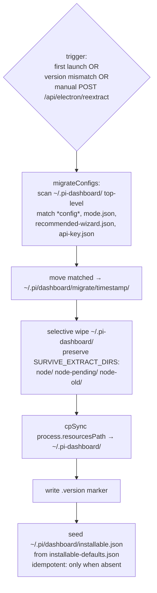
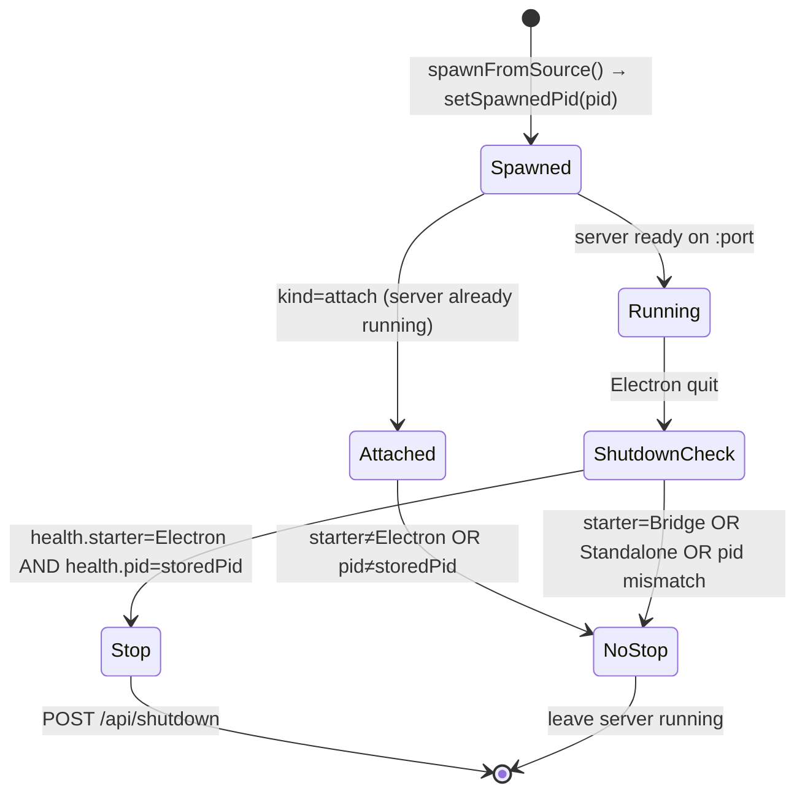
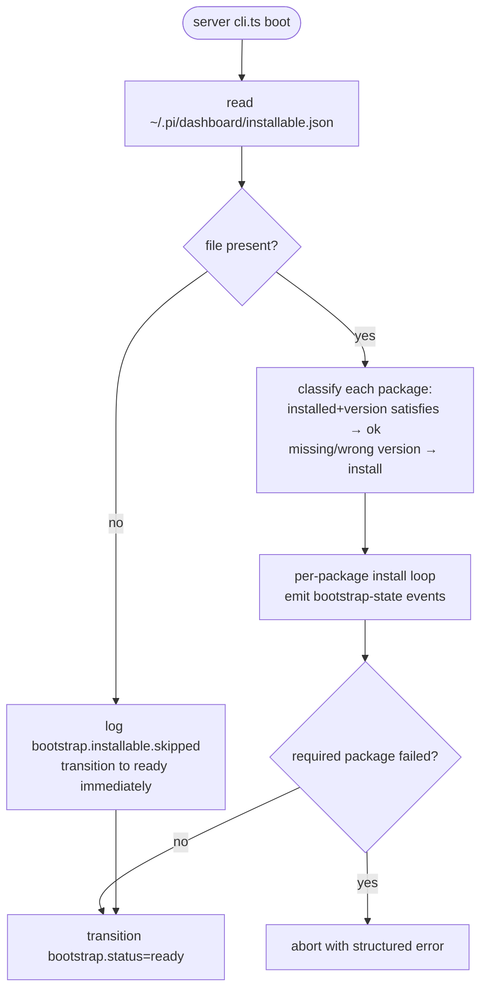
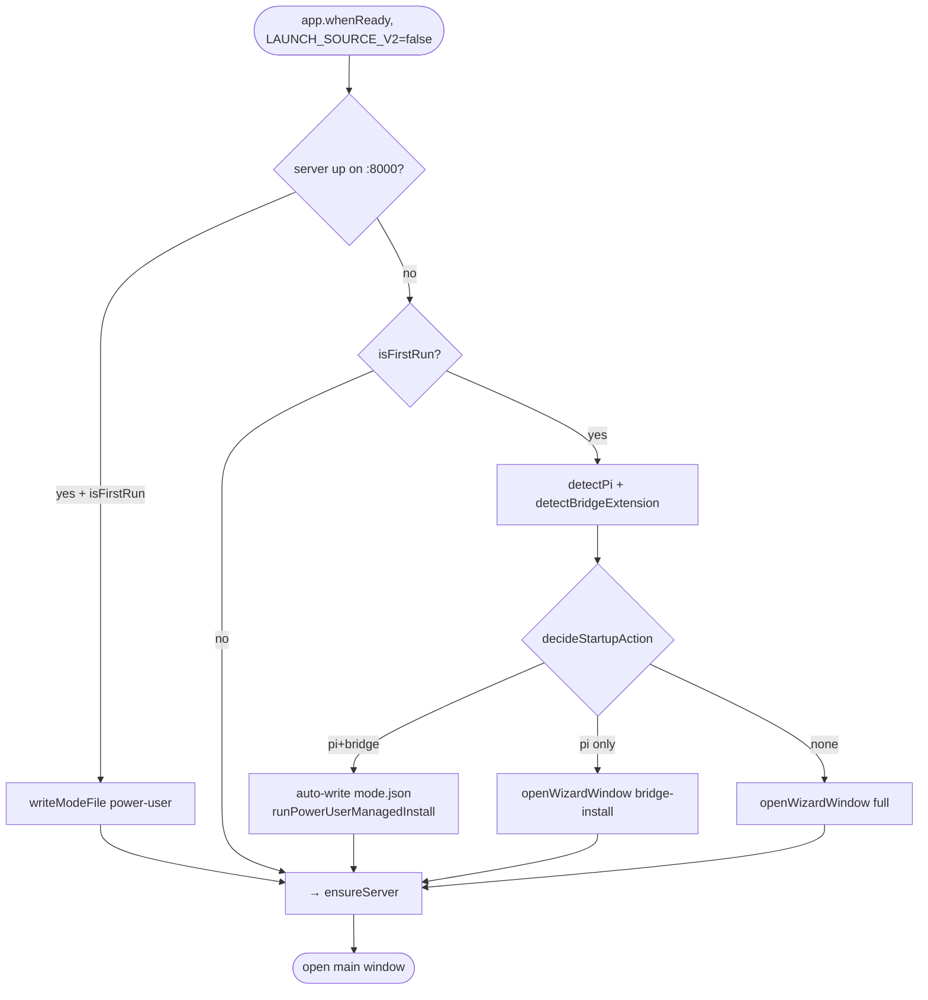

# Electron Bootstrap Flow

Doc covers state machine from `app.whenReady()` to dashboard window open.
Updated for Phase C of `simplify-electron-bootstrap-derived-state`: `selectLaunchSource()` replaces `isFirstRun` + `mode.json` branching.

## Slice 1 — LaunchSource V2 main path (default, Phase C)

`LAUNCH_SOURCE_V2=false` reverts to the legacy path (see Slice 5).

```mermaid
flowchart TD
    Start([app.whenReady]) --> Splash[show splash]
    Splash --> SLS[selectLaunchSource]
    SLS -->|running on :8000| Attach[source: attach]
    SLS -->|devMonorepo probe ok| Dev[source: devMonorepo]
    SLS -->|piExtension probe ok<br/>listPiPackages on settings.packages[]| Ext[source: piExtension]
    SLS -->|npmGlobal probe ok| Npm[source: npmGlobal]
    SLS -->|fallback| Extracted[source: extracted]

    Attach --> OpenMain[open main window]
    Dev --> Spawn[spawnFromSource<br/>DASHBOARD_STARTER=Electron<br/>store PID via setSpawnedPid]
    Ext --> Spawn
    Npm --> Spawn
    Extracted --> NeedsExtract{needsExtraction?}
    NeedsExtract -->|yes| MigrateExtract[migrateConfigs +<br/>extractBundle +<br/>seed installable.json]
    MigrateExtract --> Spawn
    NeedsExtract -->|no| HealthCheck{extractedSourceIsHealthy<br/>cliPath exists +<br/>jiti reachable?}
    HealthCheck -->|yes| Spawn
    HealthCheck -->|no| MigrateExtract
    Spawn --> SetupScreen{kind=extracted<br/>AND didExtract?}
    SetupScreen -->|yes| WizardWindow[open wizard window<br/>shows bootstrap progress]
    WizardWindow --> OpenMain
    SetupScreen -->|no| OpenMain
    OpenMain --> Tray[create tray + start updaters]
```

## Slice 2 — Bundle extraction internals



## Slice 3 — Server lifecycle ownership



## Slice 4 — installable.json bootstrap (server side)



## Slice 5 — Legacy path (LAUNCH_SOURCE_V2=false only)

Kept for escape-hatch debugging. Removed in a follow-up change.



## End-states (V2)

| # | State | Trigger |
|---|---|---|
| E1 | Dashboard ready, no extraction | source=attach/devMonorepo/piExtension/npmGlobal |
| E2 | Dashboard ready, extraction ran | source=extracted + didExtract=true + bootstrap ok |
| E3 | Dashboard ready, extraction skipped | source=extracted + version marker matches |
| E4 | Launch source unavailable | DASHBOARD_PREFER_SOURCE pinned + probe failed → dialog + quit |
| E5 | Server unreachable fallback | main window opens with reconnect-loop banner |

## DASHBOARD_STARTER ownership

| Setter | Value |
|---|---|
| `packages/extension/src/server-launcher.ts` (bridge auto-spawn) | `"Bridge"` |
| `packages/server/src/cli.ts` direct invocation | `"Standalone"` (default when env unset) |
| `packages/electron/src/lib/launch-source.ts` (any non-attach kind) | `"Electron"` |

`/api/health` exposes both `starter` and `pid`. `decideShutdownOnQuit` uses both fields for ownership.

## Invariants

| Invariant | Source |
|---|---|
| Extraction preserves node/, node-pending/, node-old/ across version bump | `SURVIVE_EXTRACT_DIRS` in bundle-extract.ts |
| installable.json seeding is idempotent | existence check before write in buildExtractedSource |
| Bridge never seeds installable.json | no write path in extension or server bootstrap |
| Electron stops server only when starter=Electron AND pid matches | `decideShutdownOnQuit` pure helper |
| Legacy path gated by LAUNCH_SOURCE_V2=false | `isLaunchSourceV2Enabled` defaults to true in Phase C |
| Extracted source health-checks jiti reachability before spawn; re-extract on miss | `extractedSourceIsHealthy` in launch-source.ts |
| Launch-source diagnostics dual-write to `~/.pi/dashboard/server.log` | `logLaunchSource` + `appendDashboardLog` in launch-source.ts (change: fix-electron-cold-launch-probe-cascade) |
| extractBundle wipe runs real-fs (Partial<ExtractFs> in buildExtractedSource) | `buildFs` real-fs defaults for `rmSync`/`readdirSync`/`statSync`/`mkdirSync`; clears stale symlinks before `cpSync` (change: fix-electron-cold-launch-probe-cascade) |
