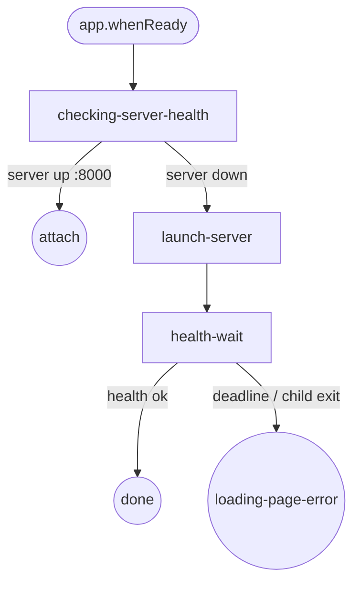
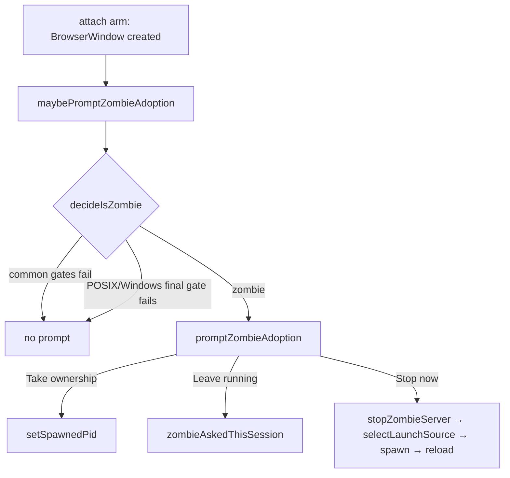

# Electron Bootstrap Flow

Doc covers Electron startup state machine from `app.whenReady()` to dashboard window.

Architecture: Electron is launcher only. Runtime install eliminated. Server resources read-only at `<resourcesPath>/server/node_modules/`. Updates ship via electron-updater whole-app replacement. See [electron-immutable-bundle.md](./electron-immutable-bundle.md).

## State machine (5 states, 3 triggers, 3 end states)

## States

| State | Purpose |
|---|---|
| `checking-server-health` | Probe `GET /api/health` on configured port. 3 s deadline. |
| `launch-server` | `selectLaunchSource()` → `spawnFromSource()`. Stamps `DASHBOARD_STARTER=Electron`. `setSpawnedPid(pid)`. |
| `health-wait` | Poll `/api/health` until 200. Deadline `SERVER_READY_DEADLINE_MS = 15000`. |
| `attach` (end) | Server already running. Open main window, no spawn. |
| `done` (end) | Server up, owned by this Electron. Open main window. |
| `loading-page-error` (end) | Spawn failed or deadline elapsed. Open `loading.html` with `[Start server]` + `[Open Doctor]` + server-log tail. |

## Triggers

| Trigger | Source |
|---|---|
| `boot` | `app.whenReady` |
| `health-check-result` | `isDashboardRunning(port)` result |
| `server-spawn-result` | `spawnFromSource` resolve / reject |

## launchSource resolution (3 strategies)

`selectLaunchSource()` in `packages/electron/src/lib/launch-source.ts`:

1. `attach` — `isDashboardRunning(port)` returns running.
2. `devMonorepo` — `!app.isPackaged AND existsSync(cwd/packages/server/src/cli.ts)`.
3. `bundled` — fallback. `<resourcesPath>/server/node_modules/@blackbelt-technology/pi-dashboard-server/src/cli.ts`. `BundledServerMissingError` when missing.

Override: `DASHBOARD_PREFER_SOURCE=attach|bundled|devMonorepo`. Pre-R3 kinds (`piExtension`, `npmGlobal`, `extracted`) rejected with warning.

## Node binary resolution (2 strategies)

`pickNodeForServer()` in `packages/electron/src/lib/pick-node.ts`:

1. `bundled` — `<resourcesPath>/node/bin/node` (POSIX) / `<resourcesPath>/node/node.exe` (Win).
2. `execpath-fallback` — `process.execPath` + `ELECTRON_RUN_AS_NODE=1`. Corrupted-install signal, not normal mode.

## DASHBOARD_STARTER ownership

| Setter | Value |
|---|---|
| `packages/extension/src/server-launcher.ts` | `Bridge` |
| `packages/server/src/cli.ts` direct invocation | `Standalone` |
| `packages/electron/src/lib/launch-source.ts` (non-attach) | `Electron` |

`/api/health` returns `launchSource: "electron" | "standalone" | "bridge"`. `decideShutdownOnQuit` stops server only when `health.launchSource === "electron" AND health.pid === storedSpawnedPid`.

`/api/health` also returns derived `launchSourceEffective: "electron" | "standalone" | "bridge" | "bridge-orphaned"`. Computed per request by `computeEffectiveLaunchSource({raw, activeBridgeCount, uptimeMs})` in `packages/server/src/launch-source-effective.ts`. Rule: `raw === "bridge"` AND `activeBridgeCount === 0` AND `uptimeMs > 30_000` → `"bridge-orphaned"`; else `raw`. 30 s grace window absorbs restart→bridge-reconnect race (server up before bridge reconnects after `server_restarting`). Static `launchSource` unchanged (back-compat with `decideShutdownOnQuit`); only `launchSourceEffective` promotes bridge-orphan. Tray ownership probe + Doctor version-skew row read `launchSourceEffective`.

| launchSource | activeBridgeCount | uptime | launchSourceEffective |
|---|---|---|---|
| bridge | 0 | >30s | bridge-orphaned |
| bridge | 0 | <30s | bridge |
| bridge | ≥1 | any | bridge |
| electron | any | any | electron |
| standalone | any | any | standalone |

## Invariants

| Invariant | Source |
|---|---|
| App bundle read-only at runtime | electron-updater replaces whole `.app` |
| No `npm install` runs after build | `bundle-server.mjs` Phase 1 GO/NO-GO guard |
| Legacy `~/.pi-dashboard/` untouched | `detectLegacyManagedDir()` surfaces Doctor advisory only |
| Electron stops server only when it owns it | `decideShutdownOnQuit` pure helper |
| first-run-done marker written on first `done` | `~/.pi/dashboard/first-run-done` |
| Bundled-server missing → `BundledServerMissingError` | corrupted-install signal |

## Zombie adoption

Electron `attach` arm runs `maybePromptZombieAdoption()` (in `packages/electron/src/main.ts`) after BrowserWindow created. Detects leftover server from prior Electron lifetime via `decideIsZombie(...)` in `packages/electron/src/lib/server-lifecycle.ts`.

Common gates (all platforms): `health.launchSourceEffective === "electron"` AND `storedSpawnedPid === null`.

| Platform | Final gate |
|---|---|
| POSIX (macOS/Linux) | `health.ppid !== health.bootParentPid` AND `health.bootParentAlive === false` (reparented away AND boot parent gone). NOT `ppid === 1` (unreliable under Linux subreapers/containers). |
| Windows | `health.bootParentAlive === false` alone (Windows never reparents). Job Object (`JOB_OBJECT_LIMIT_KILL_ON_JOB_CLOSE`) kills server on common crash path; detection covers bypass cases (`CREATE_BREAKAWAY_FROM_JOB`, nested-job assignment failure, self-respawn). |

`bootParentAlive` computed server-side, two tiers (in `packages/server/src/boot-parent-liveness.ts`):
- Tier 1: `isProcessAlive(bootParentPid)` all platforms, PID-reuse-vulnerable.
- Tier 2: win32-only optional `koffi` FFI holds `SYNCHRONIZE` `OpenProcess` handle + `WaitForSingleObject(h,0)`, PID-reuse-safe, falls back to Tier 1.

Modal: `promptZombieAdoption({pid})` (`packages/electron/src/lib/zombie-adoption-dialog.ts`), 3 buttons, default "Leave running".

| Button | Action |
|---|---|
| Take ownership | `setSpawnedPid(health.pid)`; subsequent quit stops server. |
| Leave running | In-memory `zombieAskedThisSession` flag; no re-prompt this process lifetime; re-evaluated next launch. |
| Stop now | `stopZombieServer` (SIGTERM → poll ≤5 s → SIGKILL), re-enter `selectLaunchSource()`, spawn fresh server, reload BrowserWindow after positive health probe. |

`--no-zombie-prompt` switch suppresses modal (detection still runs for logging). Used by QA.

