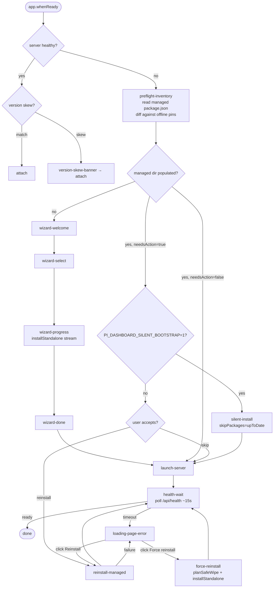

# Electron Bootstrap Flow

Documents Electron app→server bootstrap state machine end-to-end.
Spans `app.whenReady()` → splash → preflight → server launch → main window.
Covers attach, install, reconcile, recovery surfaces.

See change: streamline-electron-bootstrap-and-recovery.

## Triggers

| # | Trigger | Entry state |
|---|---|---|
| T1 | `app.whenReady()` (every launch) | `checking-server-health` |
| T2 | Loading page `[Reinstall managed packages]` click | `reinstall-managed` |
| T3 | Loading page `[Force reinstall]` click (after corrupt diagnosis OR failed reinstall) | `force-reinstall` |
| T4 | Doctor `[Force reinstall managed packages]` click | `force-reinstall` |
| T5 | Cross-version banner `[Restart server]` click | `launch-server` via `requestServerLaunch({force:true})` |
| T6 | Tray `Start server` | `launch-server` |
| T7 | App menu → Run Setup Wizard | `wizard-welcome` |

## States

| State | Entry | Exit |
|---|---|---|
| `checking-server-health` | T1 | server reachable → `version-skew-banner`; unreachable → `preflight-inventory` |
| `version-skew-banner` | running server detected, `/api/health.version` ≠ `app.getVersion()` | banner rendered; main window opens → `attach` |
| `attach` | server reachable | terminal: dashboard window points at running `serverUrl` |
| `preflight-inventory` | server unreachable | `runPreflight(MANAGED_DIR)` reads `package.json#version` per `ELECTRON_OWNED_PACKAGES`; diffs against `offline-packages.json` pins; classifies `missing` / `stale` / `current` / `corrupt`. Routes per managed-dir population + `needsAction`. |
| `wizard-welcome` | managed dir empty (no whitelisted-package dir present) | user clicks Get started → `wizard-select` |
| `wizard-select` | from `wizard-welcome` | user picks required + bundled extensions → `wizard-progress` |
| `wizard-progress` | from `wizard-select` | `installStandalone` streams per-package rows → `wizard-done` on completion |
| `wizard-done` | install completed | user clicks Launch dashboard → `launch-server`; deep-link button opens `/settings?tab=provider-auth` post-launch |
| `silent-install` | `needsAction=true` AND managed dir populated AND `PI_DASHBOARD_SILENT_BOOTSTRAP=1` | `installStandalone(..., skipPackages=upToDate)` runs without dialog → `launch-server` |
| `reinstall-managed` | needs-action prompt accepted OR T2 fired | `installStandalone(..., skipPackages=upToDate)` runs; progress streams via `dashboard:launch-status`; success → `health-wait`; failure → `loading-page-error` with Advanced disclosure expanded |
| `force-reinstall` | T3 OR T4 | confirmation dialog; on confirm: `planSafeWipe(MANAGED_DIR)` → wipe Electron-owned entries + `node/` + `.offline-cache/`; preserve user `pi-*` packages and `~/.pi/` paths; → `installStandalone` → `launch-server` |
| `launch-server` | preflight clean OR install completed | `selectLaunchSource()` → `spawnFromSource()`; `setSpawnedPid(pid)`; `DASHBOARD_STARTER=Electron`; → `health-wait` |
| `health-wait` | server spawn issued | ~15s `/api/health` poll loop; success → `done`; timeout → `loading-page-error` |
| `loading-page-error` | health timeout OR install failure | `loading.html` renders diagnosis row from `api.checkManagedInventory()`; primary `[Start server]`, `[Open Doctor]`, server-log tail, known-servers list always shown; `[Reinstall managed packages]` shown iff any `missing` or `stale`; `[Force reinstall]` shown under Advanced iff `corrupt` OR after reinstall failure |
| `done` | server reachable | terminal: main window loads `serverUrl`; tray created; updaters started |

## State diagram

## End states

| ID | State | Outcome |
|---|---|---|
| E1 | `attach` | dashboard window pointed at already-running server |
| E2 | `done` after `launch-server` (no install) | inventory clean; server spawned by Electron |
| E3 | `done` after `silent-install` | populated dir reconciled headlessly; server spawned |
| E4 | `done` after `reinstall-managed` | user-consented selective reinstall; server spawned |
| E5 | `done` after `force-reinstall` | safe-wipe + full reinstall; server spawned |
| E6 | `done` after wizard | first-run install completed; server spawned |
| E7 | User cancels at `wizard-welcome` / `wizard-select` | `app.quit()` |
| E8 | `installStandalone` rejects in wizard | wizard-progress shows error; retry button reruns install |
| E9 | `loading-page-error` persistent | window stays on `loading.html`; user picks Doctor / log / Force reinstall |
| E10 | `DASHBOARD_PREFER_SOURCE` pinned + probe fails | error dialog → `app.quit()` |

## Env overrides

| Variable | Effect |
|---|---|
| `PI_DASHBOARD_SILENT_BOOTSTRAP=1` | Suppress preflight dialog. `needsAction=true` reconcile runs automatically via `installStandalone(skipPackages=upToDate)`. |
| `DASHBOARD_PREFER_SOURCE` | Pin launch source (`attach` / `devMonorepo` / `piExtension` / `npmGlobal` / `extracted`). Pinned source unreachable → dialog + quit. Parsed by `parsePreferOverride`. |
| `LAUNCH_SOURCE_V2` | Defaults true. `LAUNCH_SOURCE_V2=false` reverts to pre-Phase-C path (escape hatch; slated for removal). |
| `DASHBOARD_STARTER` | Set to `Electron` by `spawnFromSource` for ownership; consumed by `decideShutdownOnQuit`. |
| `ELECTRON_DEV` | Skip discovery; main window targets `http://localhost:8000` directly. |
| `ELECTRON_DISABLE_GPU` | Force `app.disableHardwareAcceleration()` (VM auto-detect already sets this). |

## Failure modes per surface

| Surface | Failure | Behavior |
|---|---|---|
| Wizard (`wizard-progress`) | `installStandalone` rejects | error row inline; retry button reruns install; `app.quit()` on user cancel |
| Loading page (`loading-page-error`) | health timeout | diagnosis row from `api.checkManagedInventory`; `[Start server]`, `[Open Doctor]`, log tail, known-servers always visible |
| Loading page reinstall | `installStandalone` rejects | error state persists; Advanced disclosure expanded; `[Force reinstall]` revealed |
| Loading page force-reinstall | `planSafeWipe` or `installStandalone` rejects | Doctor offered as next surface |
| Doctor force-reinstall | confirmation cancelled | no-op |
| Doctor force-reinstall | wipe/install rejects | error surfaced inline in Doctor; manual remediation via Doctor log + managed-dir browser |
| Preflight (`runPreflight`) | inventory read throws | logged; treated as `skipped`; server launch proceeds (failure surfaces downstream at `health-wait`) |
| Launch source (`selectLaunchSource`) | `PinnedSourceUnavailableError` | error dialog + `app.quit()` |
| Cross-version banner | server older than app, user clicks Restart | `requestServerLaunch({force:true})` → `launch-server` |

## Invariants

| Invariant | Source |
|---|---|
| Preflight uses fs-only IO (no spawn, no network) | `readManagedInventory` in `preflight-reconcile.ts` |
| `ELECTRON_OWNED_PACKAGES` is single source of truth for wipe + reconcile scope | `packages/shared/src/managed-package-whitelist.ts`; regression test pins to `offline-packages.json` |
| Force-reinstall never touches paths outside `MANAGED_DIR` | `planSafeWipe` plan; tested invariant |
| User-installed `pi-*` extensions preserved on force-reinstall | whitelist filter in `planSafeWipe` |
| Electron stops server only when `health.starter=Electron` AND `health.pid=spawnedPid` | `decideShutdownOnQuit` |
| Bundle extraction preserves `node/`, `node-pending/`, `node-old/` | `SURVIVE_EXTRACT_DIRS` in `bundle-extract.ts` |
| Preflight skipped when `source.kind="extracted"` AND `didExtract=true` | fresh extraction already populated managed dir |

## Removed

- `mode.json` machinery (`isFirstRun`, `writeModeFile`) — replaced by managed-dir filesystem presence check. `cleanupLegacyStateFiles(MANAGED_DIR)` removes residual file on every launch.
- `decideStartupAction` first-run gate — every-launch preflight subsumes it.
- `auto-skip-wizard-with-install` branch — folded into preflight + silent-install path.
- 5-step and 7-step wizard flows — replaced by 4-step (welcome / select / progress / done).
- Pre-wizard server-running auto-write of `mode.json` — version-skew banner replaces it.

## DASHBOARD_STARTER ownership

| Setter | Value |
|---|---|
| `packages/extension/src/server-launcher.ts` | `Bridge` |
| `packages/server/src/cli.ts` direct invocation | `Standalone` |
| `packages/electron/src/lib/launch-source.ts` (non-attach) | `Electron` |

`/api/health` exposes `starter` + `pid`. `decideShutdownOnQuit` uses both.

## Common failure modes

Five distinct failures shipped together; co-land in Group 16.

| # | Symptom | Root cause | Fix location |
|---|---|---|---|
| 1 | UI 404s on `/`. Server alive. | `npm install` in bootstrap installable run wipes `~/.pi-dashboard/node_modules/@blackbelt-technology/`; server loses `pi-dashboard-web`. | `packages/shared/src/managed-workspace-materialize.ts::materializeWorkspaceSymlinks` re-copies scope entries from `<managed>/packages/<short>/`. Called by `packages/server/src/bootstrap-install-from-list.ts` after installable done. Idempotent. |
| 2 | Server up, `/` returns blank or 404. | Client-dist resolver chain (4 strategies) doesn't match `<managed>/packages/dist/client/` layout. | `packages/shared/src/managed-paths.ts::resolveManagedDirRoot` walks up for `.version` marker. New strategy #6 in `packages/server/src/resolve-client-dir.ts`. |
| 3 | Loading page "Server log" panel shows installer banner, not live server output. | IPC `dashboard:read-server-log` + Doctor `open-log` read `~/.pi-dashboard/server.log` (installer); live server writes `~/.pi/dashboard/server.log`. | `packages/shared/src/dashboard-paths.ts::getDashboardServerLogPath`. `readServerLogTail` (server-lifecycle.ts) + Doctor `open-log` (doctor-window.ts) migrated. |
| 4 | Second launch lands on loading-page with "port in use" while first is mid-bootstrap. | Pre-wizard probe had 2s timeout, false-negative under cold-install load. | `packages/shared/src/server-identity.ts::isDashboardRunning(port, host, opts)` retry loop. `main.ts` pre-wizard passes `{ timeoutMs: 8000, retries: 3, retryDelayMs: 500 }`. Log line widened to `running=... portConflict=... pid=...`. |
| 5 | Electron-spawned server child dies, app hangs. | No watchdog; parent never notices child exit after readiness. | `packages/shared/src/server-launcher.ts::LaunchOpts.onExitAfterReady` callback. `packages/electron/src/lib/server-lifecycle.ts::makeServerWatchdog` + `gracefulShutdownInProgress` flag. `main.ts` wires watchdog to `showLoadingPage`; `before-quit` flips flag. |
