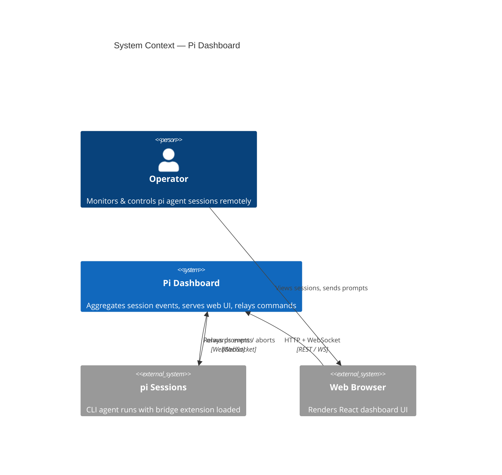
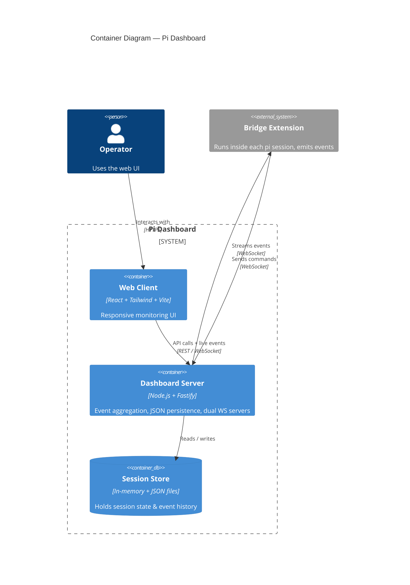
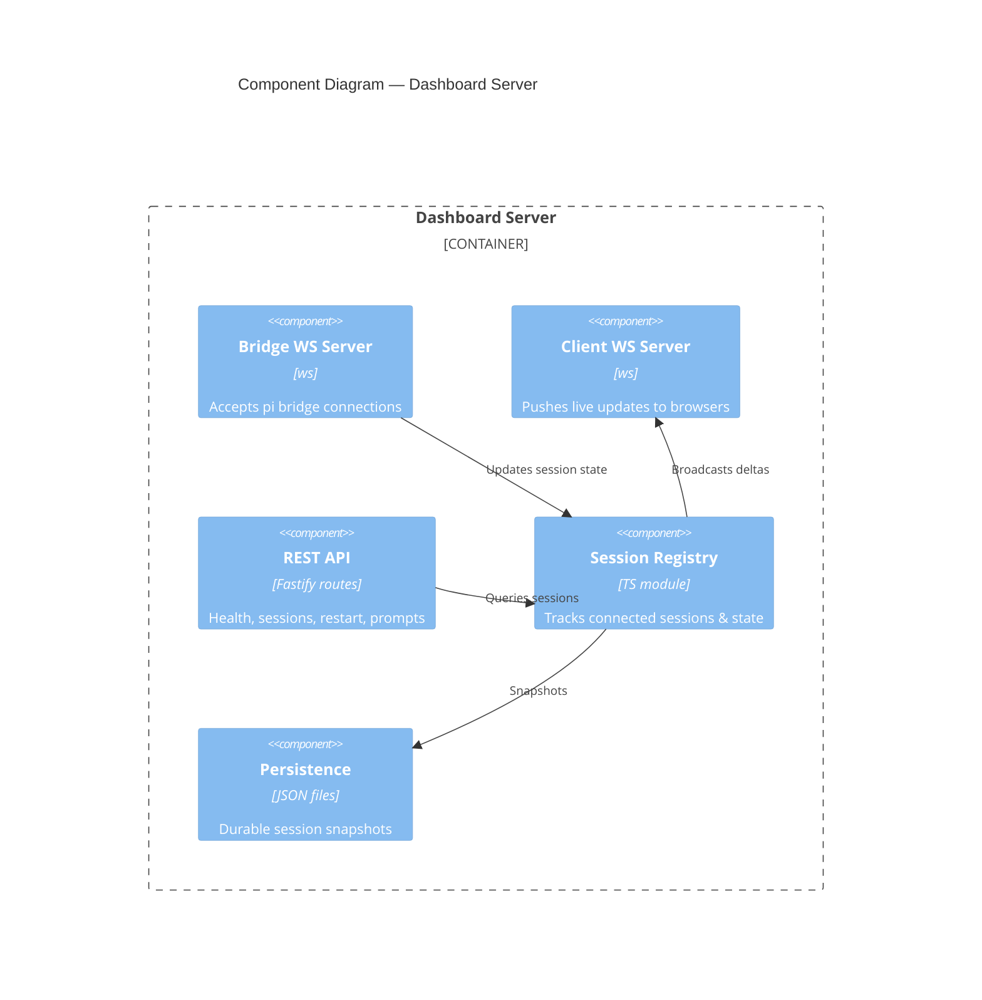

# C4 Diagram Example (Mermaid)

This file demonstrates embedding **C4 model** diagrams inside Markdown using
fenced ` ```mermaid ` blocks. It renders natively on GitHub, GitLab, VS Code
(Mermaid preview), Obsidian, and most Mermaid-aware viewers — no extra toolchain.

> Mermaid's C4 support is **experimental**: auto-layout is weak, so you sometimes
> nudge it with `UpdateLayoutConfig` / `UpdateElementStyle`.

---

## 1. System Context — `C4Context`

The widest view: who uses the dashboard and what it talks to.



---

## 2. Container — `C4Container`

Zoom in: the deployable/runnable pieces inside the dashboard boundary.



---

## 3. Component — `C4Component`

Zoom further into a single container (the server).



---

## How to view it rendered

- **GitHub / GitLab** — push the file; the blocks render inline automatically.
- **VS Code** — install "Markdown Preview Mermaid Support", then open Preview (`Cmd+Shift+V`).
- **CLI → PNG/SVG** — `npx @mermaid-js/mermaid-cli -i docs/examples/c4-example.md -o c4.png`.
