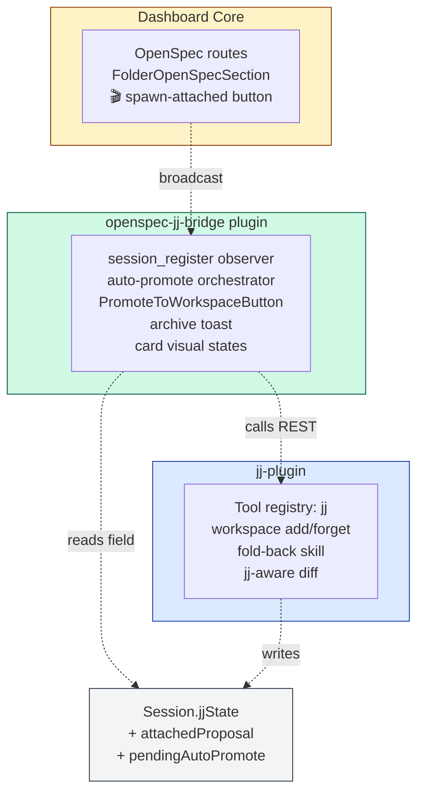
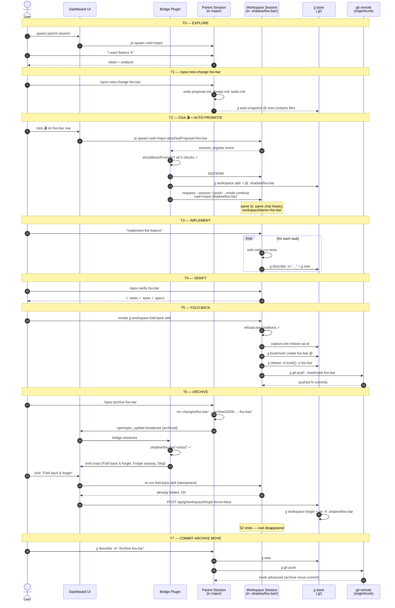
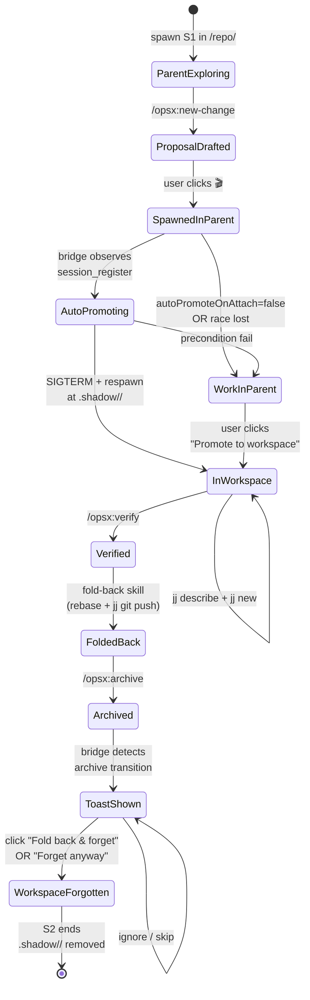
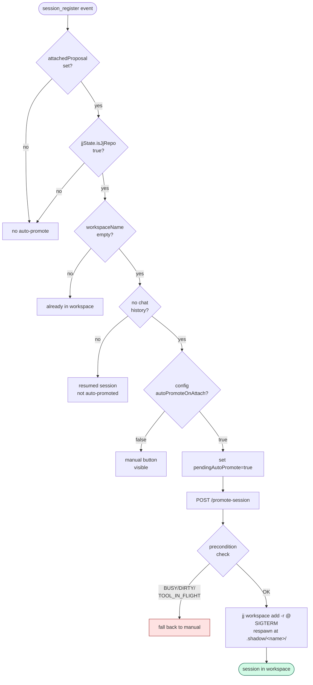
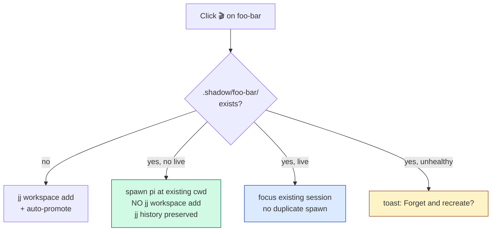

# OpenSpec ↔ Jujutsu Bridge — Comprehensive Plan

> **Status:** explore-mode artifact captured for future reference. Live proposal lives at `openspec/changes/add-openspec-jj-bridge/`. This document is the design narrative; the proposal/design/tasks/spec files are the normative source.

---

## 1. Problem Statement

Implementing an OpenSpec change in the same working tree the rest of the user's work lives in produces two recurring pains:

1. **Concurrency conflict.** A second pi session can't safely work in the same repo while the implementation is in flight — they fight over the working tree, bash `$PWD`, and tool caches.
2. **Reversibility cost.** If the implementation goes sideways, rolling back means hunting for which edits belong to that change vs. unrelated work in progress.

`add-jj-workspace-plugin` (already archived) shipped the foundation: a generic jj-workspace plugin with `+ Workspace` ad-hoc creation, fold-back skill, jj-aware diff. But the **headline use case** for parallel agents at scale is "spawn an isolated agent to implement THIS change". This proposal adds a third plugin (`openspec-jj-bridge`) that composes the public surfaces of `jj-plugin` and OpenSpec core to make change-implementation-in-a-workspace the default zero-decision flow.

### Constraint: standalone for both peers

The user explicitly required: **jj-plugin must work without OpenSpec; OpenSpec must work without jj-plugin; this bridge composes both without modifying either.** Architecturally this means a third plugin, not a feature added to either peer.

---

## 2. Architecture



| Plugin | Standalone | Coupling |
|---|---|---|
| openspec (core) | ✓ | knows nothing about jj |
| jj-plugin | ✓ | knows nothing about openspec |
| openspec-jj-bridge | only when both peers active | depends on both via public surfaces (REST endpoints, slot claims, WS broadcasts, `Session.jjState`) |

Removing the bridge restores both peers to byte-equivalent pre-bridge behavior. No source modification, no migration step.

---

## 3. Full Development Cycle

The headline flow this proposal enables:


### Sequence diagram



### Lifecycle as a state machine



---

## 4. Decisions

All decisions locked through discovery. Numbered to match `design.md`.

### D1 — Bridge is its own plugin package

Putting the binding logic in `jj-plugin` would force every jj user to ship OpenSpec coupling. Putting it in OpenSpec core would force every OpenSpec user to know about jj. The third-plugin pattern keeps both peers ignorant of each other.

### D2 — Auto-promote on attach (no slot-priority refactor)



**Why:** Q1 forbade modifying OpenSpec core (even structurally to make the 🎬 button overridable via slot priority). The auto-promote mechanism intercepts the *result* of the click via the public `session_register` broadcast. Recovers the one-click "silent upgrade" feel without touching OpenSpec core.

**Race window:** sub-second worst case. If user types a prompt before promote's SIGTERM lands, promote refuses (BUSY); manual button surfaces; no retry. Acceptable because manual fallback is never an error condition.

### D3 — 1:1 binding via existing equality witness

The auto-rename rule from `proposal-attach-naming.ts` extends cleanly:

```
  workspaceName === attachedProposal === session.name === changeName
```

Triple equality is the binding witness. No new mechanism.

### D4 — Promote relocates parent session (Option A); spawn-child fallback (Option B)

`POST /api/openspec-jj-bridge/promote-session` with `{ sessionId, strategy? }`:

1. Validate preconditions (status idle, no in-flight tool, clean git index).
2. Determine WT status; pick effective strategy (D4a).
3. Apply strategy:
   - `silent`: `jj workspace add -r @ .shadow/<change>`
   - `split`: `jj split @ -i` extract change-dir paths; `jj workspace add -r <split-id>`
   - `trunk`: precondition-check; `jj workspace add -r 'trunk()'`
   - `cancel`: no-op; manual button surfaces
4. SIGTERM + respawn pi `--session <jsonl> --mode continue` at workspace cwd.
5. Bridge re-registers same session id; chat history preserved.

**Spawn-child (B):** when busy precondition fails, dialog offers "Spawn child instead" — new session in fresh workspace, no chat carryover.

### D4a — Dirty WT triggers strategy modal

```mermaid
flowchart TD
    Click[Auto-promote scheduled] --> WT{WT dirty<br/>outside change<br/>dir?}
    WT -->|no| Silent[silent: jj workspace add -r @]
    WT -->|yes| Modal[Modal: Split / Trunk / Cancel]

    Modal --> Split[jj split + jj workspace add<br/>workspace inherits change-only commit<br/>unrelated edits stay in /repo/]
    Modal --> Trunk{Change exists<br/>on trunk?}
    Modal --> Cancel[stay in /repo/<br/>manual button surfaces]

    Trunk -->|yes| TrunkOK[jj workspace add -r 'trunk()']
    Trunk -->|no| Refuse[409 CHANGE_NOT_ON_TRUNK<br/>warning shown]

    style Silent fill:#d1fae5,stroke:#065f46
    style Modal fill:#fef3c7,stroke:#92400e
    style Refuse fill:#fee2e2,stroke:#991b1b
```

**Why ask not refuse:** auto-promote silently snapshotting unrelated WT edits causes "working-tree leakage" — S1's unrelated `auth.ts` work gets pushed under `foo-bar`'s bookmark. The modal makes the choice explicit with descriptions.

**Why a dashboard-native modal (not PromptBus / `ask_user`):** the agent has no chat context yet at the moment auto-promote fires. A bridge-owned modal mounted in the dashboard sidebar is clearly the system asking, not the agent.

### D4b — Existing workspace handling

Replaces the old "409 refuse if workspace exists" with three sub-cases:



**Liveness detection:** `session.status !== "ended" && session.cwd resolves inside .shadow/<change>/`.

**Unhealthy detection:** `jj st` inside the workspace returns non-zero. User opts in to destructive recovery; bridge never silently destroys.

### D4c — Card visual states + chip de-duplication


The binding witness `bindingWitnessHolds(session)`:

```
  attachedProposal != null AND
  jjState.workspaceName != null AND
  attachedProposal === jjState.workspaceName === (name?.trim() || null)
```

When witness holds: render single combined badge `🌿 foo-bar`, suppress redundant `📋` and `🌿 ws:<name>` chips via slot-priority claim.

When witness breaks (custom name, or change rename): bridge contributes nothing; lower-priority OpenSpec/jj-plugin chips emerge so divergence is visible.

Six lifecycle states mapped to visual treatments:

| State | Title | Pill | cwd | Action |
|---|---|---|---|---|
| Plain | session.name OR firstMessage OR cwd basename | (none) | /repo | (default) |
| Attached | foo-bar | 📋 foo-bar | /repo | Promote to workspace |
| Auto-promoting | foo-bar | 📋 foo-bar | /repo ➜ .shadow/foo-bar/ | (spinner) |
| InWorkspace | foo-bar | 🌿 foo-bar (combined) | /repo/.shadow/foo-bar/ | Fold back |
| Folded | foo-bar | 🌿 foo-bar ✓ folded | /repo/.shadow/foo-bar/ | Forget workspace, Open log |
| Ended | foo-bar (greyed) | 🌿 foo-bar (greyed) | /repo/.shadow/foo-bar/ | Reopen → D4b reuse path |

### D5 — Archive lifecycle hook = non-modal toast

Bridge plugin subscribes to OpenSpec's `openspec_update` WS broadcast. On `archived: true` transition + `.shadow/<change>/` exists on disk, emit sticky toast:

```
  ┌─────────────────────────────────────────────────────┐
  │ Workspace `foo-bar` has unfolded work               │
  │ [Fold back & forget] [Forget anyway] [Skip]         │
  └─────────────────────────────────────────────────────┘
```

**Q2 lock:** "Fold back & forget" SHALL be DISABLED with explanatory tooltip when no live workspace session exists. **No auto-spawn.** User must manually reopen a session in the workspace first. "Forget anyway" remains unconditional.

### D6 — Bridge gates on jj-plugin presence indirectly

Bridge does NOT `import`-depend on jj-plugin. It detects effective presence via `Session.jjState` being populated. If absent: every bridge predicate returns false; no UI. Clean degradation.

### D7 — Server-orchestrated multi-step ops; UI is thin

Multi-step operations (spawn-in-workspace, promote, fold-back orchestration) live as REST endpoints on the bridge plugin's server. Client renders buttons, dialogs, errors. Server composes jj-plugin's existing endpoints + pi-spawn primitives.

---

## 5. Configuration

Plugin config schema (JSON Schema 7), all global (no per-repo overrides v1):

| Field | Default | Effect |
|---|---|---|
| `enabled` | `true` | Master switch |
| `autoPromoteOnAttach` | `true` | Whether auto-promote fires on `session_register` |
| `autoFoldBackOnArchive` | `false` | Toast offers; never auto-acts |

Settings panel exposes `autoPromoteOnAttach` prominently with explanatory text.

---

## 6. Edge Cases

| # | Case | Handled how | Bridge work |
|---|---|---|---|
| 1 | Working-tree leakage | D4a strategy modal | NEW (D4a) |
| 2 | New spec mid-implementation | Pure OpenSpec governance; verify catches drift | none |
| 3 | New child change inside workspace | Skill warning + bridge advisory toast | minor advisory |
| 4 | Concurrent edits to change artifacts in /repo/ + workspace | jj rebase conflicts → jj-plugin D12 (jj op restore) | none |
| 5 | Workspace session dies, re-open | D4b reuse path | already designed |
| 6 | 🎬 clicked when workspace exists | D4b reuse / focus / unhealthy | already designed |
| 7 | Change renamed during impl | Open Question 4 (advisory only) | already designed |
| 8 | Archive before fold-back | Existing archive-toast covers it | already designed |
| 9 | Implementation revises proposal | jj just commits revised proposal | none |
| 10 | Recursive nested workspace | Refuse with explanation | minor advisory |

---

## 7. Open Questions

1. ~~**Slot refactor counts as modifying OpenSpec core?**~~ — RESOLVED: yes, forbidden. D2 routes around via `session_register` hook.
2. ~~**Auto-spawn for fold-back?**~~ — RESOLVED: no, manual reopen (Q2).
3. **Bridge plugin `private:true` or independently published?** Lean private:true v1; revisit if external users want to swap implementations.
4. **Change-renamed-during-impl: auto-rename workspace or advise-only?** Lean advise-only. Auto-rename invites confusion if user has uncommitted commits referencing old name.
5. **Bridge REST endpoint authentication.** Same `networkGuard` preHandler — confirm during apply phase.
6. **Auto-promote race window measurement.** Phase 4 timing test — if reliably <200 ms, race is essentially unreachable; if seconds, gate first-prompt input.

---

## 8. Implementation Phases

From `tasks.md`:

| Phase | Scope |
|---|---|
| 0 | Prereqs verification |
| 1 | No slot/taxonomy work (D2 routes around it) |
| 2 | Bridge plugin scaffold |
| 3 | Auto-promote-on-attach (observer + helper + tests) |
| 3b | Existing-workspace handling (D4b classify + 4 outcomes) |
| 4 | Promote-to-workspace flow (endpoint + strategy execution) |
| 4d | Card visual states (D4c witness + 6 states + tests) |
| 5 | Archive lifecycle hook (toast + Q2 disabled-when-no-live behavior) |
| 6 | Skill (`openspec-implement-in-workspace`) |
| 7 | Cross-plugin integration tests + standalone-degradation tests + docs |
| 8 | Publish (private:true inside `pi-dashboard-web`) |

---

## 9. Standalone Degradation Contract

Three guarantees, repo-pinned via tests:

```
   Bridge installed, jj-plugin uninstalled:
     bridge predicates fail safely; settings panel shows
     "Inactive — jj-plugin not installed" advisory.

   Bridge uninstalled, both peers untouched:
     OpenSpec's 🎬 button reappears; spawn-attached behaves
     byte-equivalent to pre-bridge (session in parent cwd).

   OpenSpec core hypothetically disabled:
     bridge's predicates fail; no UI emitted.
```

The bridge SHALL NOT modify any source file in `packages/jj-plugin/` nor `packages/server/src/routes/openspec-routes.ts`. Removing the bridge plugin's package directory SHALL leave both peers behavior-identical.

---

## 10. References

| Artifact | Path |
|---|---|
| Proposal | `openspec/changes/add-openspec-jj-bridge/proposal.md` |
| Design | `openspec/changes/add-openspec-jj-bridge/design.md` |
| Tasks | `openspec/changes/add-openspec-jj-bridge/tasks.md` |
| Spec | `openspec/changes/add-openspec-jj-bridge/specs/openspec-jj-bridge/spec.md` |
| Foundation (archived) | `openspec/changes/archive/2026-05-02-add-jj-workspace-plugin/` |
| Visual aids | `docs/diagrams/openspec-jj-bridge/` |
| This plan | `docs/plans/openspec-jj-bridge.md` |

| Diagram | Type | Location |
|---|---|---|
| 8-station timeline | nano-banana | `dev-cycle-timeline-v2.png` |
| Workspaces-as-branches | nano-banana | `dev-cycle.png` |
| Three-panel UI mockup | nano-banana | `dev-cycle-ui.png` |
| Six card states | nano-banana | `card-states.png` |
| Sequence T0→T7 | mermaid | embedded in `design.md` |
| Lifecycle state machine | mermaid | embedded in `design.md` |
| Auto-promote flowchart | mermaid | embedded in `design.md` |
| 3-plugin architecture | mermaid | embedded in `proposal.md` |

---

## 11. Conversation Provenance

This plan was produced through a multi-turn explore-mode conversation. Key turning points:

- Initial framing: workspace = generic ad-hoc isolation primitive
- Pivot: workspace primarily for OpenSpec change implementation (1:1 binding)
- Q1 lock (no modifying OpenSpec core) → forced auto-promote-on-attach mechanism over slot-priority replacement
- Q2 lock (no auto-spawn for fold-back) → archive toast disables fold-back action when no live session
- D4a added (dirty-WT strategy modal) after surfacing working-tree leakage failure mode
- D4b added (existing-workspace reuse/focus/unhealthy) after user noted "no way to attach to existing .shadow/ workspaces"
- D4c added (card visual states + chip de-duplication) after user asked "how will the card be displayed when workspace created"

Three-plugin architecture (`openspec` core + `jj-plugin` + `openspec-jj-bridge`) emerged from the standalone constraint: each peer must work without the others, bridge composes via public surfaces only.
