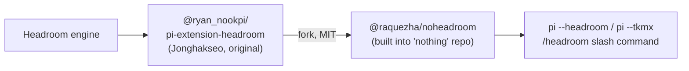
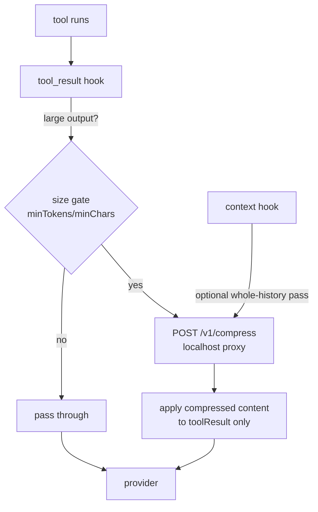

# Headroom × Pi Integration — Research Dossier

> Status: **research / pre-planning** (explore mode output, no implementation).
> Goal: map every way [Headroom](https://github.com/headroomlabs-ai/headroom) can be
> integrated "seamlessly" into the Pi coding agent, survey prior art, and surface
> the tradeoffs so a real plan can be written later.
> Date: 2026-06-26.

---

## 1. TL;DR / Recommendation

- Headroom is a **local context-compression layer** for AI agents. It shrinks
  tool outputs, logs, files, RAG chunks, and history **before they reach the LLM**.
  Claims 60–95% token reduction, reversible via a local cache (CCR), accuracy
  preserved on GSM8K / TruthfulQA / SQuAD / BFCL.
- **Prior art already exists** for Pi — twice. Don't start from scratch:
  - `@ryan_nookpi/pi-extension-headroom` (original, Jonghakseo).
  - `@raquezha/noheadroom` (fork, MIT) — built into the `nothing` repo,
    invoked via `pi --headroom` / `pi --tkmx`, with a `/headroom` slash command.
- The **important design lesson from prior art**: the naïve "point
  `ANTHROPIC_BASE_URL` at the proxy" approach is *not* what they ship. They use a
  **Pi extension** that calls Headroom's `/v1/compress` endpoint and applies
  **only `toolResult` content mutations** back into the session — user prompts,
  assistant text, tool-call metadata, and tool IDs stay byte-identical.
- **Recommended path for a clean integration:** a Pi extension hooking the
  `tool_result` (and/or `context`) events → local Headroom proxy → apply
  compressed `toolResult` content only. This is surgical, reversible, and
  preserves Pi session integrity. The proxy/`registerProvider` route is the
  fast spike but is coarse and has known third-party-provider issues.
- **Open risk:** Headroom issue **#846** reports Pi support may currently be
  broken. Validate the proxy contract against the current Headroom build before
  committing to a plan.

---

## 2. What Headroom actually is

```
 Your agent (Pi, Claude Code, Cursor, Codex, LangChain, your code…)
        │   prompts · tool outputs · logs · RAG results · files
        ▼
    ┌────────────────────────────────────────────────────┐
    │  Headroom   (runs locally — data stays on machine)  │
    │  CacheAligner  →  ContentRouter  →  CCR             │
    │                    ├─ SmartCrusher   (JSON)        │
    │                    ├─ CodeCompressor (AST)         │
    │                    └─ Kompress-base  (text, HF)    │
    │  Cross-agent memory · headroom learn · MCP         │
    └────────────────────────────────────────────────────┘
        │   compressed prompt  +  retrieval tool
        ▼
 LLM provider (Anthropic · OpenAI · Bedrock · …)
```

| Component       | Role |
|-----------------|------|
| **ContentRouter** | Detects content type, picks the compressor. |
| **SmartCrusher** | Compresses repetitive JSON / arrays (dedup, anomaly-keep, relevance). |
| **CodeCompressor** | AST-aware code compression. |
| **Kompress-base** | HF model for prose (`chopratejas/kompress-v2-base`). |
| **CacheAligner** | Stabilizes prefixes so provider KV caches still hit. |
| **CCR** | Caches originals locally; LLM calls `headroom_retrieve` to get full text on demand → reversible/lossless. |
| **Output shaper** | Optional: trims what the model *writes back* (verbosity steering + effort routing). `HEADROOM_OUTPUT_SHAPER=1`. |

**Packaging:** Rust core (`crates/headroom-core`) + Python (`headroom-ai` on PyPI)
+ TypeScript (`headroom-ai` on npm). Apache-2.0. Python 3.10+.

**Reported savings (their numbers):**

| Workload | Before | After | Savings |
|----------|-------:|------:|--------:|
| Code search (100 results) | 17,765 | 1,408 | 92% |
| SRE incident debugging | 65,694 | 5,118 | 92% |
| GitHub issue triage | 54,174 | 14,761 | 73% |
| Codebase exploration | 78,502 | 41,254 | 47% |

> Caveat: numbers are self-reported; no independent validation. Treat as
> "worth a benchmark spike," not ground truth.

---

## 3. Headroom's four integration surfaces

| Surface | Invocation | Granularity | Code change | Notes |
|---------|-----------|-------------|-------------|-------|
| **Proxy** | `headroom proxy --port 8787` | Whole request | none (env var) | OpenAI + Anthropic compatible HTTP. |
| **Library** | `compress(messages)` (TS/Py) + proxy `/v1/compress` | Per message list | inline | TS SDK still needs the proxy running for the heavy lifting. |
| **MCP server** | `headroom_compress` / `headroom_retrieve` / `headroom_stats` | Model-invoked | MCP config | Tools the *model* calls — not transparent auto-compression. |
| **Agent wrap** | `headroom wrap claude\|codex\|aider\|copilot\|opencode` | Whole request | one command | **Pi is not in the wrap list** — would need adding upstream or a custom path. |

### Key endpoints / knobs

- Proxy default port: **8787** (Headroom default). `noheadroom` runs its Docker
  backend on **8788** instead.
- Library/proxy compress endpoint: **`POST /v1/compress`** (OpenAI-format messages
  in, compressed messages out). The TS Anthropic adapter converts Anthropic↔OpenAI
  format losslessly around this call.
- `compress()` result carries: `messages`, `tokensBefore/After/Saved`,
  `compressionRatio`, `transformsApplied[]`, `ccrHashes[]`, `compressed:boolean`.
- Modes: `audit` (measure only) / `optimize` (actually compress) / `simulate`
  (preview). `simulate()` returns a savings plan without an API call → great for
  a "dry-run / what-if" dashboard panel.
- Tunables that matter for an agent: `headroom_keep_turns`, `preserve_errors`,
  `min_tokens_to_crush`, `relevance_tier` (bm25 / embedding / hybrid),
  per-tool `tool_profiles` (`skip_compression`).

---

## 4. Prior art — what already exists for Pi



### `@raquezha/noheadroom` (the more complete fork)

What it does and how — distilled from its README:

- **It is a Pi extension, not a proxy redirect.** Pi talks to its LLM normally;
  the extension intercepts and sends candidate content to a local Headroom proxy
  on `127.0.0.1:8788`, then applies results back.
- **Strict "Pi policy":** user prompts + assistant messages may be *sent* as
  compression context, but **only `toolResult` content is mutated** in real Pi
  history. User chat, assistant text, tool-call metadata, tool IDs untouched.
- **Tool-name bypass trick:** upstream Headroom *excludes* common agent tools
  like `read` and `bash` from compression by default (so big file reads normally
  bypass it → 0% savings). `noheadroom` renames tool calls in the compression
  payload so Headroom actually crushes them, then restores original names/IDs in
  the real session.

  | Setup | Tool | Headroom action | Savings |
  |-------|------|-----------------|--------:|
  | Vanilla | `read` | `excluded_tool` | 0% |
  | noheadroom | `read` | `smart_crusher` | 60–90% |

- **Loop prevention:** fingerprints eligible `toolResult` candidates (tool
  identity + content shape + length + content hash) to stop the proxy retrying
  the same payload across turns, but re-tries when tool output actually changes.
- **Visibility:** compression results show in terminal, Pi footer, and as
  persistent session-history entries.
- **Safety:** localhost-only by default; remote proxy blocked unless
  `PI_HEADROOM_ALLOW_REMOTE=1`. Guard: only compresses when proxy is online and
  passes alignment validation — never silently rewrites.
- **Config** `~/.pi/agent/headroom/settings.json`:
  ```json
  { "enabled": true, "baseUrl": "http://127.0.0.1:8788",
    "autoStart": false, "mode": "normal",
    "minContextTokens": 10000, "minMessageChars": 2000 }
  ```
- **Commands:** `/headroom`, `/headroom on|off`, `/headroom health`, `/headroom stats`.
- **Modes:** `normal` / `quiet` / `silent` (env `PI_HEADROOM_MODE`).

### Known issues / friction in prior art

- **headroom #846** — open issue: PI Coding Agent support may be broken. ⚠️ verify.
- Anthropic-compatible **third-party** providers (DashScope, XF-Yun, SiliconFlow)
  have known proxy issues — broader Headroom limitation, relevant if Pi users
  route through non-first-party Anthropic endpoints.
- Low adoption (~hundreds of weekly downloads) → little battle-testing.
- Docker-first backend in `noheadroom` (`autoStart:false`) adds an ops dependency.

**Takeaway:** the hard problems (tool-name exclusion bypass, metadata
preservation, loop prevention, localhost safety) are already solved in prior art.
A fresh integration should *borrow the design*, not reinvent it — or even just
adopt/fork `noheadroom` and harden it.

---

## 5. Pi's integration surface (the hooks we'd use)

Pi exposes everything needed via the **extension API** (`pi.registerProvider`,
`pi.on(...)`, `pi.registerCommand`). Relevant hook points, cleanest → coarsest:

```
turn ─► message_start/update/end
     ─► context  (modify messages, deep-copy safe)  ◄── BEST for whole-history compression
     ─► before_provider_request  (rewrite final payload)
     ─► provider/LLM
tool ─► tool_call (mutate args / block)
     ─► tool_result (middleware chain, modify content)  ◄── BEST for tool-output compression
```

| Hook | What it gives | Fit for Headroom |
|------|---------------|------------------|
| **`tool_result`** | Fires after a tool runs, before result is committed. Middleware chain; return `{content, details, isError}` patch. `ctx.signal` for async `fetch`. | ⭐ Surgical: compress the single large tool output right where it's produced. Mirrors `noheadroom`'s `toolResult`-only policy. |
| **`context`** | Fires before each LLM call; `event.messages` is a safe deep copy; return `{messages}`. | ⭐ Whole-history pass: compress everything pi is about to send (cache-aligned). Good for long-session overflow control. |
| **`before_provider_request`** | Final serialized payload, right before HTTP send; return replacement. | Lowest-level; lets you talk Headroom's native provider format, but you reimplement format handling. Mostly debug. |
| **`registerProvider(baseUrl)`** | Redirect a provider's base URL (e.g. Anthropic → `localhost:8787`). | Zero-code spike. Coarse, no Pi-metadata policy, inherits third-party-provider issues. |
| **MCP tool** | Register Headroom MCP server; model calls `headroom_compress/retrieve`. | Useful for **CCR retrieval** (`headroom_retrieve`) so the model can pull originals back. Not for transparent auto-compression. |
| **slash command** | `/headroom on/off/stats/health`. | UX layer — toggles + visibility. |

`registerProvider` config also supports `headers`, `authHeader`, custom
`streamSimple`, and per-model `compat` flags — enough to wrap a proxy cleanly if
the redirect route is chosen.

---

## 6. Integration architectures (options to weigh)

### Option A — Extension-mediated, `tool_result` + `context` (recommended)



- **Pros:** preserves Pi session integrity (only `toolResult` mutates), reversible
  via CCR, provider-agnostic (works regardless of which LLM pi uses), matches
  proven prior-art design, controllable via size gates + per-tool profiles.
- **Cons:** needs the Headroom proxy/runtime running locally; must handle the
  tool-name-exclusion bypass; loop prevention required; format mapping
  (Pi message ↔ OpenAI message) needed.
- **Effort:** medium. Largely already done by `noheadroom`.

### Option B — Provider redirect (`registerProvider` / `ANTHROPIC_BASE_URL`)

- **Pros:** trivial spike, zero per-message code, language-agnostic.
- **Cons:** coarse (whole request, no Pi-metadata policy); cache-alignment and
  streaming quirks; **known third-party Anthropic-provider issues**; harder to
  show per-tool savings; security (all traffic through the proxy).
- **Effort:** low. Good for a **benchmark spike only**, not the shipping path.

### Option C — MCP server

- **Pros:** standard, model-driven; `headroom_retrieve` pairs naturally with CCR
  to let the model fetch originals; `headroom_stats` for visibility.
- **Cons:** compression becomes *model-elective*, not transparent → unreliable
  token savings. Best as a **complement** (retrieval) to Option A, not a primary.
- **Effort:** low-medium.

### Option D — Adopt/fork `noheadroom` directly

- **Pros:** fastest to a working state; design+edge-cases already handled.
- **Cons:** inherits its Docker-first backend, possible #846 breakage, MIT-fork
  maintenance, and a code style that may not match this project. Audit first.
- **Effort:** low (adopt) → medium (harden).

**Synthesis:** Option A as the engine, Option C (`headroom_retrieve`) as the
reversibility escape hatch, Option D as the reference implementation to mine.
Option B only for the initial savings benchmark.

---

## 7. Where this touches *this* repo (pi-agent-dashboard)

The dashboard is the natural place to **surface** Headroom value even if the
compression itself lives in a pi extension:

- **Savings telemetry panel** — the bridge already forwards pi session events; a
  Headroom extension could emit `tokensSaved` / `compressionRatio` per turn
  (Headroom returns these on every `/v1/compress`). Dashboard renders a
  per-session + aggregate savings widget.
- **Toggle control** — dashboard REST already drives sessions (prompts, abort,
  spawn). A `/headroom on|off` equivalent could be exposed as a session control.
- **Health surfacing** — proxy up/down + "compression active" badge on session cards.
- **Docker harness fit** — the repo's all-in-one Docker image already bundles
  server + pi + code-server; Headroom's Docker backend could be co-located there
  for a batteries-included "tokenmaxxing" image.

> These are *surfacing* opportunities, not the integration itself. The
> compression mechanism belongs in a pi extension (Option A); the dashboard
> consumes its events.

---

## 8. Open questions / spikes before planning

1. **Is Headroom #846 real and current?** Run `noheadroom` against today's pi +
   Headroom build. If broken, identify whether it's proxy contract drift or pi
   API change. → gating spike.
2. **Proxy contract stability** — confirm `POST /v1/compress` request/response
   shape against the installed Headroom version (it has moved fast; REALIGNMENT/
   docs in the repo suggest active re-architecture incl. Python retirement).
3. **Cache interaction** — does compression hurt Anthropic prompt-cache hit rates
   in pi's real traffic? CacheAligner is supposed to prevent this; measure.
4. **Reversibility UX** — when the model needs an original, does CCR
   `headroom_retrieve` round-trip cleanly inside pi? Wire as MCP tool and test.
5. **Tool-exclusion bypass** — replicate `noheadroom`'s rename trick or get
   upstream to expose pi tool names; verify `read`/`bash` outputs actually crush.
6. **Runtime dependency** — Python 3.10+ / Rust binary / Docker. What's the
   lowest-friction way to ship the proxy with pi? (bundled binary vs Docker vs
   user-installed).
7. **Benchmark on real pi sessions** — Option B spike to get *our* savings
   numbers, not Headroom's marketing table, on representative dashboard workloads.
8. **Output shaper** (`HEADROOM_OUTPUT_SHAPER=1`) — separate, additive win on
   *output* tokens; evaluate independently.

---

## 9. Sources

- Headroom repo: https://github.com/headroomlabs-ai/headroom (cloned to
  `/tmp/pi-github-repos/headroomlabs-ai/headroom`).
- Headroom docs: https://headroom-docs.vercel.app/docs (`llms-full.txt` mirror).
- `@raquezha/noheadroom`: https://www.npmjs.com/package/@raquezha/noheadroom
- Original: `@ryan_nookpi/pi-extension-headroom`
  (https://github.com/Jonghakseo/pi-extension/tree/main/packages/headroom).
- `nothing` repo: https://github.com/raquezha/nothing
- Headroom issue #846 (Pi support): https://github.com/chopratejas/headroom/issues/846
- Pi extension API: `node_modules/@earendil-works/pi-coding-agent/docs/extensions.md`
- Pi custom providers: `node_modules/@earendil-works/pi-coding-agent/docs/custom-provider.md`
</content>
</invoke>
