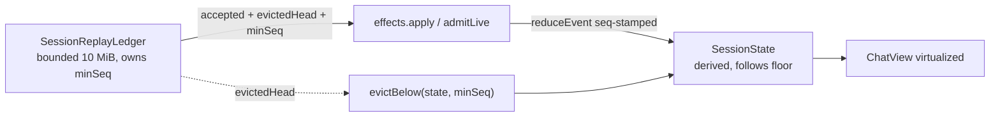
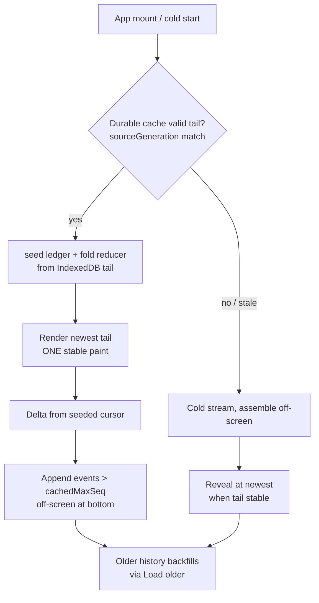

# Bounded hot transcript state — issue #48 client cut

**Date:** 2026-07-22
**Status:** Approved design
**Scope:** GitHub issue #48, client-first cut
**Baseline:** PR #53 (`deb6edec`) + #59 lifecycle shipped via PR #65
**Supersedes:** Phase 2 and Phase 3 of `2026-07-21-stable-bounded-session-transcripts-design.md`. Phase 1 (#59 lifecycle) shipped, stays authoritative.

## Headline invariant

No top-to-bottom visual replay in normal use.

Every load path renders newest tail as one stable paint.

Reconciliation runs off-screen.

## Relationship to prior design

Prior design approves combined #59 + #48 plan.

#59 lifecycle shipped via PR #65.

This design replaces prior #48 plan: Phase 2 (client resident ranges), Phase 3 (server source paging).

This design keeps prior spirit: bounded hot state, eviction as pagination, raw JSONL authority, `Load older` preserved.

Departures from prior #48 plan:

| Topic | Prior plan | This design |
|---|---|---|
| Eviction mechanism | Atomic 4-way transaction across ledger, persister, reducer, detail; rollback on failure | Single ledger cursor `retainedMinSeq`; derived state prunes to floor; no cross-structure transaction |
| Eviction UX | Evicted-range manifest + collapsed older-range marker | Reuse `Load older` path; invisible boundary; no new marker |
| Server source paging | Phase 3 streaming manifest + offset sidecar + checkpoints | Deferred to follow-up issue |
| Cold start | Initial loading or recovery until terminal | Seed durable cache; instant tail; delta reconcile; no visible replay; delayed skeleton |
| Retention budget | Single content-blind byte budget | Two-tier: chat kept generously, tool detail evicted first; content-aware selection guarantees readable turns |

Retained from prior design:

- Active-pin list.
- Viewport range and scroll-anchor pinning.
- Separate cap on oversized detail payloads.
- Preserved-client-state list.
- Error-handling cases.
- Replay-diagnostic observability: extend shipped `replay_diagnostic` (`browser-gateway.ts`, `browser-protocol.ts`). `ReplayActivity` / `ReplayTrigger` remain prior-design names, absent from shipped code.

## Current state (post #53, #65)

`session-replay-ledger.ts` bounds `bySeq` to 10 MiB. `trimRetained()` evicts oldest. `evictedHead` signals trim. `minSeq` exposes retained floor.

`replay-persist.ts` bounds in-memory buffer to 10 MiB.

`replay-cache.ts` bounds IndexedDB to 50 sessions, 10 MiB per session.

`event-reducer.ts` derived state unbounded: `messages`, `toolCalls`, `subagents`, `interactiveRequests`, subagent detail.

Ledger trims. Reducer retains all. Ledger↔reducer desync exists today.

Cold start streams tail visibly. Top-to-bottom replay appears on full app restart.

## Scope

In scope:

- Reducer and detail-state eviction (client).
- Two-tier retention: chat kept generously, tool detail evicted first; content-aware tail/cache/older selection guarantees readable turns.
- Lower byte defaults: tail hydrate `DEFAULT_TAIL_WINDOW_BYTES` 4 MiB → 1 MiB; purge ceiling `DEFAULT_REPLAY_RETENTION_BYTES` 10 MiB → 6 MiB.
- Cold-start seamless hydration (client).
- Server truncation parity: apply hot-store `truncateEvent` to persisted `Load older` pages.
- Message-content preservation: truncate tools only; whole-event cap message-aware; assistant text, reasoning, user text never dropped.
- Hot-window metrics.

Out of scope (follow-up issue):

- Server paged source hydration (streaming manifest / offset index). Whole-branch JSONL materialization stays. Per-event truncation parity stays in #48. Rationale under "Follow-up issue".

## Non-goals

- Delete raw JSONL.
- Summarize raw JSONL into replacement history.
- Change omp model-context compaction behavior.
- Use DOM virtualization as memory policy.
- Remove `Load older`.
- Treat routine eviction as transcript reset.
- Build MemGPT-style pinned decision/constraint ledger. Out of #48.

## Architecture — single cursor authority

`SessionReplayLedger` owns retained sequence window. Already exposes `minSeq`, `evictedHead`.

Add `minSeq` to `LedgerAdmission`.

On `evictedHead`, reducer prunes. Prune two-tier: tool detail to a tight `toolFloorSeq`, chat to a generous `chatFloorSeq`. See Reducer resident window — two-tier retention.

No 4-way atomic transaction. One cursor advance plus derived prune.

Model fixes existing ledger↔reducer desync by construction.

Covers replay path (`effects.apply(sessionId, result.accepted)`) and live path (`admitLive`). Both flow through ledger.

## Eviction rules

Thread `seq` into `reduceEvent`. Seq available at every call site: `effects.apply` accepted array, `useSessionState` fold, `coalesce-live-events`, `rehydrate-session`.

Stamp each derived entity with max-touch seq.

Message: one seq. Evict when `seq < floor`.

Tool call, subagent: span state. Key on max-touch seq (last mutating frame). Tool opened seq 100, result seq 5000 survives until 5000 below floor.

Never evict regardless of floor:

- Unresolved `interactiveRequests`.
- Active subagent runs until terminal.
- Active tool calls until terminal or terminal-error.
- Current user turn until terminal.
- Current assistant turn until terminal.
- `pendingPrompt`.
- Streaming message.

Viewport pin: currently-visible range and pending scroll anchor stay resident.

Resolved interactive requests, ended subagents evict by resolution/terminal seq.

Dangling-ref guard: surviving message renders from inlined summary. Never map lookup returning undefined.

Eviction priority: oldest tool detail before any chat. See Reducer resident window — two-tier retention.

## Reducer resident window — two-tier retention

Root problem: single byte budget content-blind. Tool salvo fills window. Readable chat evicts. Refresh shows tool wall. `Load older` returns more tool calls.

Chat cheap. Tools expensive. Whole conversation text small. One salvo large. Budget separately.

Chat tier: assistant text, reasoning, user text. Kept generously. Retain last N readable turns. `N` large. Effectively keep the conversation.

Tool tier: tool calls, tool output, tool detail. Own byte and count budget. Bounded tighter. Evicts first. Salvo collapses to bounded burst marker (count plus sequence range), not full detail.

Reducer holds a contiguous readable window over chat rows `[chatFloorSeq, maxSeq]`. Tool detail overlays a tighter window `[toolFloorSeq, maxSeq]`. `chatFloorSeq <= toolFloorSeq`.

`chatFloorSeq = min(chatBudgetFloor, viewportFloor)`. `chatBudgetFloor` = floor of last N readable turns.

Chat floor independent of ledger `minSeq`. Tool-heavy ledger window never evicts chat.

Eviction priority: drop oldest tool detail before any chat. Chat evicts only when chat tier alone exceeds chat budget.

`Load older`: fetched older pages extend `viewportFloor` below `chatBudgetFloor`. Window stays contiguous ascending. Older tool detail arrives bounded.

Scroll back toward tail: `viewportFloor` advances up. Older rows evict. `chatFloorSeq` never rises above current viewport top or pending scroll anchor.

Ledger `trimRetained()` byte-bounded, tool-dominated. Reducer retains readable chat below ledger floor. Reducer not strict subset of ledger `bySeq`.

Content-aware selection at every hydration point. Cold tail, durable cache, `Load older` guarantee last N readable turns. Selection always includes the newest complete readable turn, even when it exceeds the byte target. Selection walks back past tool bursts to include conversation. Tool bytes per window bounded. Shared `event-window.ts` selectors, server-side and client-side.

Result: refresh lands on conversation. `Load older` surfaces older readable turns. Tool detail reachable by expanding a burst or paging its sequence range.

## Byte accounting

Budgets count whole-event JSON bytes. `estimateSeqEventBytes` = `JSON.stringify(event)` UTF-8 length (`packages/shared/src/event-window.ts`). Tool output lives in `event.data`. Tool output counts.

Hot store truncates every event on insert: `truncateEvent(event, stringFieldLimit, maxEventDataSize)` (`memory-event-store.ts`). `DEFAULT_MAX_EVENT_DATA_SIZE = 20_000` bytes. Per-string-field caps. Arrays over 20 elements collapse to `[array truncated]`. Data over cap replaced with small scalars plus `__truncated: true`.

Whole-event cap context-blind today. #48 makes it message-aware. See Message-content preservation.

Cold tail (`DEFAULT_TAIL_WINDOW_BYTES = 4 MiB`) and live events carry truncated event data. One tool output contributes at most ~20 KB.

`Load older` pages below retained window currently bypass truncation. `loadPersistedSource` (`replay-coordinator.ts`) maps raw JSONL untruncated. Deep-history tool outputs count full raw size against page budget and client `DEFAULT_REPLAY_RETENTION_BYTES = 10 MiB`.

Fix, in #48: apply `truncateEvent` to persisted older pages. Tail and older history share one per-event cap. Budgets mean the same everywhere. Small server change. Distinct from deferred paged hydration.

Images and binary assets stay off these budgets. Separate `asset_register` / `pi-asset:<hash>` channel. Client asset budget `MAX_ASSET_BYTES = 1 MiB`, `MAX_ASSET_CHUNKS = 256`.

Raw JSONL keeps full untruncated output. Audit authority.

## Budget defaults

#48 lowers byte ceilings. Two-tier retention plus tool truncation make byte budgets bound tool detail and raw window, not readable chat.

Tail initial hydrate: `DEFAULT_TAIL_WINDOW_BYTES` 4 MiB → 1 MiB (`packages/shared/src/event-window.ts`). Within clamp `MIN_TAIL_WINDOW_BYTES` 256 KiB to `MAX_TAIL_WINDOW_BYTES` 8 MiB.

Tail governs first paint on cache-miss and server cold stream. Cache-hit cold start renders from the 6 MiB durable cache, not the tail. Older history and tool detail backfill off-screen to the purge ceiling.

Selection always includes the newest complete readable turn, even when it exceeds the tail target. First paint never clipped.

Purge ceiling: `DEFAULT_REPLAY_RETENTION_BYTES` 10 MiB → 6 MiB (`packages/client/src/lib/replay-retention.ts`). Applies to ledger `maxRetainedBytes`, persister, IndexedDB per-session.

Readable chat guaranteed by the two-tier chat budget (last N turns) and content-aware selection. Conversation text small, fits well under 6 MiB. Lower ceiling cuts tool-detail residency and memory footprint, not conversation.

Values are defaults. #48 metrics validate. Tune from high-water marks.

## Message-content preservation

Truncation targets tool output and tool args only.

Never truncate, never drop human-readable message content: assistant text, agent reasoning and thinking, user text.

`truncateStrings` already exempts assistant text via `assistant-text` context (`memory-event-store.ts`). Extend exemption to reasoning/thinking blocks and user (`role: "user"`) text.

`truncateEvent` whole-event cap (`DEFAULT_MAX_EVENT_DATA_SIZE = 20_000`) drops all non-scalar data when data exceeds cap. Context-blind. Drops large message content.

Fix, in #48: whole-event cap becomes message-aware. Never drops protected message content. Applies on live/tail path and persisted older-page path.

Large messages bound by eviction, not truncation. Oldest whole messages evict when window fills. Per-event truncation applies to tools only.

## Detail-payload cap

Server `truncateEvent` on both paths bounds tool output and tool args in `event.data`. Message content exempt (see Message-content preservation). Primary mechanism.

Client-side guard, defense-in-depth: cap derived detail reassembled across events beyond raw event bytes. Configured max. Retain bounded terminal summary.

## Cold-start seamless hydration

On app mount, active session: read durable cache. Validate `sourceGeneration`.

Cache hit: `seed()` ledger. Fold cached `{seq, event}[]` through `reduceEvent` (rehydrate path). Render newest tail as one paint. Issue delta from seeded cursor. Only events `> cachedMaxSeq` append at bottom.

Cache miss or stale generation: cold stream. Assemble off-screen. Reveal at newest when stable.

Cold tail and cache selection content-aware. Guarantee last N readable turns, not newest bytes. See Reducer resident window — two-tier retention.

Never seed stale generation. Silent wrong transcript worse than churn.

Gap UX: paint tail on local read resolve. Read exceeds ~150 ms threshold: show static bottom-anchored skeleton. Skeleton swaps once. Cache-miss path shows single calm load state, then one reveal. No spinner. No progressive fill.

Synergy: seq-tagging tags seeded reducer for free. Seed-from-cache reduces server whole-branch materialization to true cache-miss only.

Reuses shipped #59 machinery: `seedCached` (`useSessionReplayController.ts`), delta subscribe, reveal-when-stable. Trigger labels `cache_miss`, `initial_navigation` extend shipped `replay_diagnostic`. Prior-design `ReplayTrigger` enum absent from shipped code.

## Eviction UX

Evicted ranges reload through existing `Load older` cursor path.

Evicted history indistinguishable from never-loaded history.

`Load older` returns older readable turns. Tool detail bounded, expandable. Never a tool wall.

Eviction boundary invisible. No new marker widget.

Newest-tail and return-to-session stay seamless (#59).

Tradeoff, explicit: bounded memory implies background refetch on deep scroll-up past budget. Refetch uses invisible `Load older` backfill, never a clear.

## Preserved client state on eviction

Every routine eviction preserves:

- Maximum cursor.
- `sourceGeneration`.
- `hasMoreOlder`.
- `partialHead`.
- Scroll anchor and checkpoint.
- Newest tail.
- Active pinned state.
- `Load older` affordance.

## Failure mode designed against

Branch `backup/failed-bounded-replay-20260720` bounded state mid-stream.

Bounding broke in-flight replay and displayed messages. Commit chain patched recovery repeatedly. Attempt failed.

Hard invariant: eviction touches only settled history below floor.

Eviction never runs against in-flight replay window, active turn, pinned entity.

Eviction gated on ledger `status === "ready"`.

Dedicated regression replicates failed scenario: eviction during in-flight replay leaves in-flight window intact.

## Metrics

Client reports hot-window sizes and high-water marks over existing WebSocket channel.

Server folds client reports into `/api/health` beside `storeTrim`.

Extend shipped `replay_diagnostic` (`browser-gateway.ts`, `browser-protocol.ts`): payload-free, rate-limited, bounded cardinality. Prior-design `ReplayActivity` shape informs field set.

Fields:

- Ledger retained bytes, event count.
- Persister bytes.
- Reducer counts: `messages`, `toolCalls`, `subagents`, `interactiveRequests`.
- Detail bytes.
- Evictions count, high-water bytes.
- ChatView derivation duration.
- Hydration source: `memory` | `cache` | `stream`.
- Cold-start trigger.

Reports exclude transcript content, message text, tool arguments, images, raw events.

## Error handling

Cursor gap on `Load older`: reject non-contiguous page. Keep visible tail. Retry from retained cursor. No authority clear for one page failure.

Generation mismatch: reject stale frame or stale cache. Run source-reset recovery if replacement exists. Never seed stale cache.

Cache miss or stale: fall back to cold reveal-when-stable path.

## Testing (TDD)

Red-first:

- Long synthetic session: reducer sizes stay bounded as ledger evicts.
- Tool opened before floor, resolved after floor: survives correctly.
- Pinned active subagent and unresolved interactive request never evicted.
- Oversized detail field capped; terminal summary retained.
- `Load older` page truncated to at most ~20 KB per event, matching cold tail.
- Assistant message over 20 KB retained whole, not dropped, on tail and older page.
- Reasoning/thinking text and user text retained, never capped.
- Tool output over cap still truncated.
- Cache-hit cold start: one stable paint, zero intermediate DOM states.
- Cache-miss cold start: reveal-when-stable, no progressive fill.
- Delta after seed appends only events `> cachedMaxSeq`.
- Scroll into evicted range reloads via `Load older` with timeline continuity.
- Reconnect delta after eviction lands at newest, no visible clear.
- `/api/health` exposes new high-water marks.
- Regression: eviction during in-flight replay leaves in-flight window intact.
- Tool salvo does not evict chat. Refresh shows readable conversation, not tool wall.
- `Load older` after a salvo returns older readable turns, not more tool calls.
- Tool detail evicts before chat when over budget. Chat survives.
- Collapsed tool burst expands / pages its sequence range on demand.
- Newest complete readable turn rendered on first paint even when it exceeds the tail byte target.

## Acceptance mapping (issue #48)

Covered:

- One long session has bounded hot browser projection independent of total event count.
- Repeated older-page loads cannot grow client working memory without bound.
- Evicted ranges reloadable by stable sequence cursor. Timeline continuity preserved.
- Reconnect restores bounded checkpoint/tail then applies later events idempotently (shipped #59).
- Raw JSONL remains authoritative.
- Metrics expose hot-window limits and high-water marks.
- Readable conversation survives tool-heavy sessions. Refresh and `Load older` show chat, not a tool wall.

Deferred to follow-up issue:

- Page source hydration/replay rather than materializing whole large JSONL branch.

## Follow-up issue — server source paging

Title: Page server JSONL source hydration for tail and older requests.

Scope: prior design Phase 3. Streaming manifest with offset sidecar and checkpoints, OR bounded-memory streaming parse. Excludes per-event truncation parity; #48 truncates persisted older pages.

Deferral rationale:

- Server materialization is transient per-request spike. `MemoryEventStore` already caps hot buffer at 20,000 events.
- Client reducer is monotonic resident leak. Reported user pain browser-resident.
- Cold-start seed-from-cache reduces full server hydration to true cache-miss frequency.
- JSONL parent-pointer tree needs whole-file read for branch resolution absent a sidecar index.

## Implementation slices

Slice 1 — reducer eviction, two-tier:

- Add `minSeq` to `LedgerAdmission`.
- Thread `seq` into `reduceEvent`.
- Stamp entities with max-touch seq.
- Add `evictBelow(state, floorSeq)`.
- Two-tier floors: chat kept generously; tool detail evicted first; salvo collapses to bounded burst.
- Content-aware selection in `event-window.ts`: guarantee last N readable turns; bound tool bytes per window.
- Wire `evictedHead` to `evictBelow` in controller effects and live path.
- Add pins and viewport pin.
- Add detail-payload cap.
- Tests.

Slice 2 — cold-start hydration:

- Seed-from-cache with generation validation.
- Delta reconcile from seeded cursor.
- Delayed skeleton, reveal-when-stable.
- Tests.

Slice 3 — metrics:

- Client hot-window report over WebSocket.
- `/api/health` aggregation beside `storeTrim`.
- Tests.

Server paging: separate follow-up issue.

## Likely files

- `packages/client/src/lib/session-replay-ledger.ts` — add `minSeq` to admission.
- `packages/client/src/lib/event-reducer.ts` — seq threading, max-touch stamping, `evictBelow`, detail cap.
- `packages/client/src/hooks/useSessionReplayController.ts` — wire `evictedHead` to prune.
- `packages/client/src/hooks/useMessageHandler.ts` — live-path seq threading.
- `packages/client/src/lib/rehydrate-session.ts` — seed-from-cache fold.
- `packages/client/src/App.tsx` — cold-start seed, skeleton gate.
- `packages/client/src/components/ChatView.tsx` — bounded derivation, skeleton, collapsed tool-burst markers (reuse `groupToolBursts`).
- `packages/shared/src/event-window.ts` — content-aware selection: guarantee readable turns, never clip newest complete turn, bound tool bytes per window; `DEFAULT_TAIL_WINDOW_BYTES` 4 → 1 MiB.
- `packages/client/src/lib/replay-retention.ts` — `DEFAULT_REPLAY_RETENTION_BYTES` 10 → 6 MiB.
- `packages/server/src/replay-coordinator.ts` — apply `truncateEvent` to persisted `Load older` pages.
- `packages/server/src/memory-event-store.ts` — export/reuse `truncateEvent`; whole-event cap message-aware; exempt reasoning/thinking and user text.
- Server `/api/health` aggregation, shared metrics types.
- Client and shared unit tests. Desktop and mobile Playwright.
