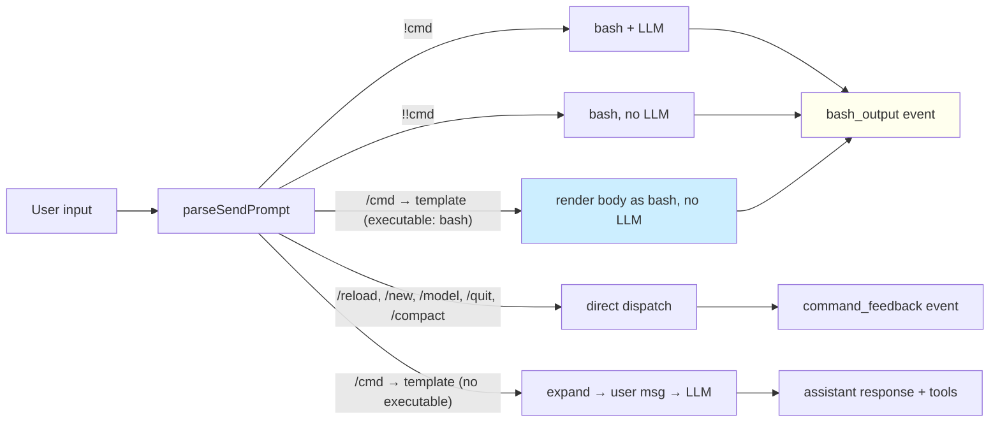

## Context

The dashboard's REST API is fully wrapped by the existing `pi-dashboard` skill, but every interaction goes through the LLM. For one-shot read-only operations ("status check, tell me what's running, show me the diff") this is wasteful — tokens, latency, and non-deterministic formatting on every read. Slash commands are the right ergonomic shape for one-shot ops, but pi's slash pipeline always routes through the LLM. This change adds the missing pipeline.

## Goals / Non-Goals

**Goals**

- Add a `/dashboard:*` namespace with consistent `<resource>-<verb>` naming.
- Introduce one new pipeline: slash command → bash → render in chat → no LLM. Reuse `handleBashCommand` and `bash_output` event verbatim.
- Frontmatter-driven mode selection (`executable: bash`). The convention is template-author-controlled, not hardcoded into the dispatcher.
- Backward compatibility: every existing prompt template continues to route through the LLM. The new pipeline is opt-in per template.
- Discoverability: the chat UI signals "ran locally — LLM not invoked" so users learn that read-only commands are free.
- The initial command set covers every read-only endpoint (LLM-free) and every single-shot mutation (LLM-bound for reasoning where needed).

**Non-Goals**

- A new event type. Reuse `bash_output`.
- A new bash execution path. Reuse `handleBashCommand`.
- A new server endpoint. Every command targets an existing REST endpoint via the existing helper script.
- ts-morph or template DSL. Frontmatter parsing is hand-rolled YAML-lite (the existing `readTemplate` already strips frontmatter — we promote that to a typed parser).
- Per-skill subdirectory scanning by the expander. Templates ship inside the existing skill's `commands/` dir and are surfaced via `pi.getCommands()` (which already enumerates skill-shipped commands).
- Auto-discovery of dashboard endpoints. The command set is hand-curated.

## The Five Pipelines (after this change)



The new pipeline (highlighted) shares the `bash_output` event with `!`/`!!`. The only client-side difference is the optional `data.source: "slash-exec"` field that triggers the "ran locally" footer.

## Naming Grammar

```
   /dashboard:<resource>-<verb>[-<modifier>] [args...]
        │           │             │
        │           │             └── optional, e.g. -all, -active, -here
        │           └── action verb (singular)
        └── resource family (singular noun)
```

Resource families:

| Family | Operates On | Examples |
|---|---|---|
| `server-*`   | The dashboard process itself | `server-health`, `server-config`, `server-tunnel-on` |
| `session-*`  | Individual pi sessions       | `session-list`, `session-tell`, `session-abort` |
| `proposal-*` | OpenSpec attachment per session | `proposal-attach`, `proposal-detach`, `proposal-archive` |
| `flow-*`     | Active flow on a session     | `flow-abort`, `flow-auto` |
| `git-*`      | Git ops on a cwd             | `git-branches`, `git-init`, `git-stash-pop` |
| `peer-*`     | Other dashboard servers (mDNS) | `peer-list`, `peer-scan` |
| `pin-*`      | Pinned directories           | `pin-list` |

**Why singular resource?** `session-list` reads as "session, list" — natural for autocomplete grouping. Plural (`sessions-list`) is grammatically redundant.

**Why hyphen between resource and verb?** The expander already aliases `:` → `-` (line 80 of `prompt-expander.ts`). `dashboard:session-list` resolves to file `dashboard-session-list.md`. Alternatives considered:

- `dashboard:session:list` — works (`replaceAll(":", "-")`) but visually implies 3-level nesting that doesn't exist.
- Flat naming (`dashboard:sessions`, `dashboard:tell`) — rejected. 30 commands without grouping is unscannable.

## Frontmatter Schema

```yaml
---
executable: bash              # opt-in flag. Only "bash" is supported in v1.
excludeFromContext: true      # default true when executable: bash. Optional.
description: "Display detailed info about a session without invoking the LLM."
---
<bash body>
```

Parser rules:

- The expander's existing frontmatter regex (`/^---\n[\s\S]*?\n---\n([\s\S]*)$/`) already extracts the body. We add a typed parser for the YAML-lite block in between (line-oriented `key: value`, no nesting, no lists). Only three keys are recognised; unknown keys are ignored (forward compat).
- `executable` accepts only the literal string `"bash"` in v1. Other values (e.g. `"node"`, `"python"`) are reserved for future expansion and treated as no-op (template falls back to LLM).
- `excludeFromContext` defaults to `true` when `executable: bash` is present (matches `!!` semantics, since the whole point is "don't burn LLM context"). Authors can override with `excludeFromContext: false` if they want the output captured for follow-up reasoning.
- `description` is purely cosmetic; surfaced in autocomplete tooltips (future enhancement, not part of v1).

## Argument Substitution

Today's `expandPromptTemplateFromDisk(...)` appends `argsString` after a blank line at the end of the template body. That works for LLM templates ("here are the user's args, figure them out") but is wrong for bash bodies — we need positional args.

Proposal: `pi.exec("sh", ["-c", body, "--", ...args])` where `args` is `argsString.trim().split(/\s+/)` after stripping empty tokens. This makes `$1`, `$2`, ... bind correctly inside the body.

```bash
# Template body:
ID="$1"
~/.pi/skills/pi-dashboard/scripts/dashboard-api.sh GET /api/sessions \
  | jq -r --arg id "$ID" '.data[] | select(.id | startswith($id))'

# User input:
/dashboard:session-info abc12345

# Resolved exec call:
pi.exec("sh", ["-c", "<body>", "--", "abc12345"])
```

**Quoting hazard**: `argsString.split(/\s+/)` doesn't honor quoted args. For v1 this is acceptable because every dashboard command takes simple identifiers (session ids, change names, branch names, paths). The one risky command is `session-tell <id> <text>` where `<text>` may contain spaces. That command is **not** in the LLM-free set — it's a regular slash template that hands off to the LLM precisely because text composition is a reasoning task. So the v1 quoting limit doesn't bite any LLM-free command.

**Optional named env**: bridge injects `PI_DASHBOARD_PORT` and `PI_DASHBOARD_BASE` from `~/.pi/dashboard/config.json` into the exec env so templates don't have to re-derive the port. This subsumes part of `dashboard-api.sh`'s setup logic.

## Decision: where do the templates live?

Three options:

```
   A) ~/.pi/prompts/                     B) .pi/skills/pi-dashboard/commands/    C) Inline in SKILL.md
   ────────────────                       ─────────────────────────              ─────────────────
   ~/.pi/prompts/dashboard-*.md          .pi/skills/pi-dashboard/                Single-file skill grows
                                            commands/dashboard-*.md             enormous; no per-command
   + Globally available                  + Ships with skill bundle              files; defeats slash
   + Zero install cost                   + Versioned with the codebase          command discovery.
   - 30 files in user's home dir         + skill-update updates them            REJECTED.
   - Disconnected from the skill         - Requires expander to find them
                                            via pi.getCommands() (already
                                            does this for top-level
                                            SKILL.md but NOT for nested
                                            command files).
```

**Recommendation: B**, with one clarifying behaviour change: `pi.getCommands()` (pi's command-discovery API used by the expander as a fallback in `prompt-expander.ts:90-97`) already enumerates skill-bundled commands. We confirm this works for the new `commands/` subdir; if not, the bridge's `pi.getCommands()` fallback handles the case via the existing path-fallback at line 95.

Concretely: the `package.json` of the skill (or its convention manifest) declares each command file. We follow whatever pattern existing skills use to declare auxiliary commands. (Investigation task: confirm this in §3.)

## Decision: how does the client know "this came from slash-exec"?

The chat renderer treats `bash_output` events identically today. The "ran locally — LLM not invoked" footer needs a signal that *this particular* `bash_output` is from an exec-mode template (not from `!` or `!!`).

Cleanest option: the bridge's `handleBashCommand` accepts an optional `source: "slash-exec"` parameter and includes it in the emitted event's `data` payload. Client renderer checks `data.source === "slash-exec"` to decide whether to draw the footer.

This is additive to the protocol — old clients that don't know about the field render exactly as today (no footer), new clients render the footer. No version bump needed.

## Decision: discoverability footer wording

Three drafts:

1. `ℹ ran locally — LLM not invoked`
2. `ℹ executed locally · 0 tokens · $0.00`
3. `ℹ /dashboard:session-info ran locally — no LLM call, no tokens used`

Option 1 is the cleanest. Option 2's "0 tokens / $0.00" is information-rich but invites bikeshedding ("what about API call latency?"). Option 3 is too long for a footer. Going with **option 1**.

## Initial command set classification

```
LLM-FREE (executable: bash)              LLM-BOUND (regular slash)
─────────────────────────────             ──────────────────────────
  server-health                            session-tell <id> <text>
  server-config                            session-abort-all
  server-tunnel-status                     session-spawn [cwd]
  session-list                             session-resume <id>
  session-list-active                      session-fork <id>
  session-list-here                        session-rename <id> <name>
  session-info <id>                        session-model <id> <p/m>
  session-diff <id>                        session-thinking <id> <lvl>
  proposal-archive                         session-abort <id>
  git-branches                             session-kill <id>
  peer-list                                session-hide <id>
  peer-scan                                session-unhide <id>
  pin-list                                 proposal-attach <id> <chg>
                                            proposal-detach <id>
                                            flow-abort <id>
                                            flow-auto <id>
                                            git-init [cwd]
                                            git-stash-pop [cwd]
                                            server-tunnel-on
                                            server-tunnel-off
```

**Selection rule**: an operation is LLM-free if (a) it is read-only OR has zero blast radius, (b) every input is a simple identifier (no free-form text), and (c) the result is a deterministic format. Any operation that requires judgment (which session to abort? which prompt text to send?) stays LLM-bound.

## Open Questions (deferred)

1. **Autocomplete grouping**. The dashboard's `CommandInput` already lists slash commands. Does it group by prefix (`dashboard:` → 30 hits)? If not, we may want a follow-up change for that ergonomic. Out of scope here.
2. **Default session id**. Should `<id>` arg be optional and default to "this session" via `PI_DASHBOARD_SESSION_ID` env? Punted to v2 — gather feedback first on whether users actually want to drive their own session via slash commands (the current expectation is they drive *other* sessions).
3. **Format options**. Some commands could benefit from `--format json|table|raw`. v1 hardcodes one format per template; v2 may add a frontmatter `format:` field.
4. **Template SDK**. If we end up writing 30 templates with similar curl+jq boilerplate, a shared snippet (sourced at top of each body) might emerge. Not designed for in v1; left to organic refactor after the initial set is shipped.

## Risks

- **Quoting in args** (mitigated above — no LLM-free command takes free-form text).
- **Frontmatter parser correctness**. Bad parser means bad commands. Mitigated by exhaustive unit tests on the parser (every valid combination + every malformed YAML case → falls back to LLM mode).
- **Dispatch ambiguity**. If `parseSendPrompt` is wrong about whether a template is exec-mode (e.g. fails to find the file → returns slash → LLM invocation), the worst case is a prompt the LLM doesn't understand. Acceptable; the LLM error is observable.
- **`pi.getCommands()` doesn't surface nested command files**. Investigation task in §3 of tasks.md. If pi's command discovery doesn't pick up `commands/*.md` from a skill subdir, fallback is to add a flat copy in `~/.pi/prompts/` (option A above) at install time.

## Migration & Rollout

This is purely additive. No migration. Existing slash commands continue to work. Users opt in by typing `/dashboard:*` after upgrading the bridge. The bridge handles the new pipeline; no client-side change is required for *minimum-viable* operation (the footer is a polish item that can ship in a follow-up if needed).
