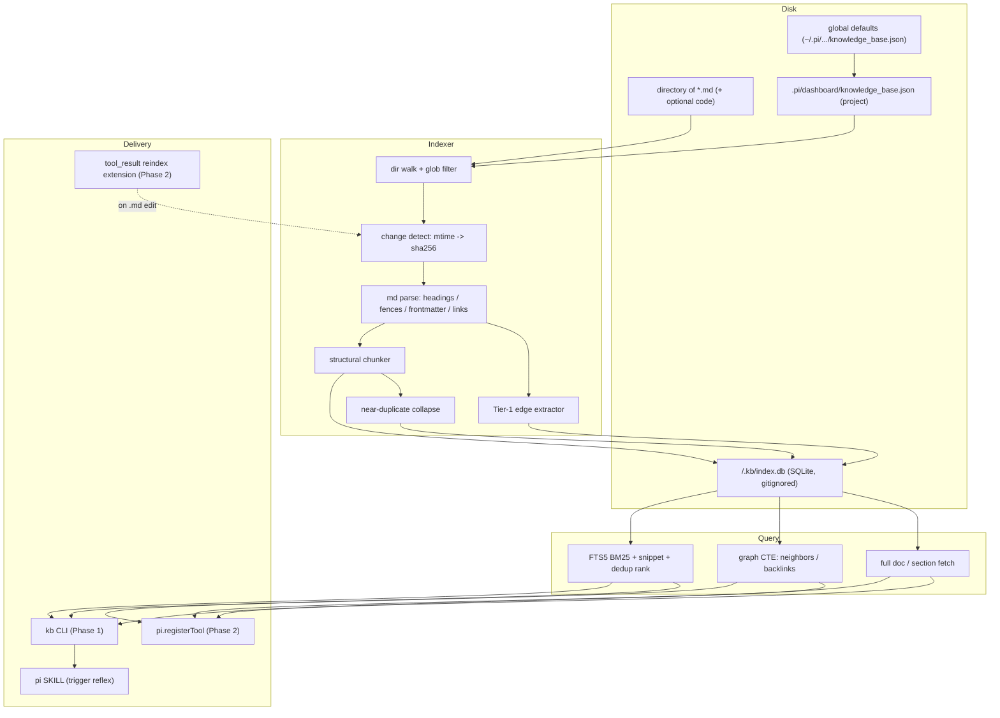

# Design — Markdown Knowledge Base

> Evidence for every decision below lives in [`research.md`](./research.md);
> section refs like (R §1.2) point there. Decision summary in
> [`proposal.md`](./proposal.md).

## 1. Architecture overview



## 2. Database schema

One SQLite file per indexed root (`<root>/.kb/index.db`), `PRAGMA
journal_mode=WAL` for read-during-reindex (R §3).

```sql
-- 2.1 SEARCH layer (FTS5 BM25; R §1.1)
CREATE VIRTUAL TABLE chunks USING fts5(
    root          UNINDEXED,   -- which configured root (multi-root support)
    path          UNINDEXED,   -- relative path, portable
    heading_path  UNINDEXED,   -- breadcrumb: "A > B > C"
    chunk_id      UNINDEXED,   -- stable id within file
    doc_type      UNINDEXED,   -- 'doc' | 'agents' | 'source-md' (filter/weight)
    body,                      -- breadcrumb + section text (tokenized)
    tokenize = 'porter unicode61'
);
-- Optional substring/typo companion, enabled by config (R §1.1 trigram):
-- CREATE VIRTUAL TABLE chunks_tri USING fts5(body, tokenize='trigram');

-- 2.2 CHANGE-DETECTION layer (R §3)
CREATE TABLE files (
    root        TEXT,
    path        TEXT,          -- relative
    mtime       REAL,
    sha256      TEXT,          -- content hash (dedup + change detect)
    PRIMARY KEY (root, path)
);

-- 2.3 GRAPH layer (Tier-1; R §4)
CREATE TABLE nodes (
    id    INTEGER PRIMARY KEY,
    type  TEXT,                -- 'file' | 'heading' | 'tag' | 'entity'
    name  TEXT,                -- canonical label (heading_path for headings)
    path  TEXT,                -- source file (nullable for abstract)
    UNIQUE(type, name)
);
CREATE TABLE edges (
    src     INTEGER REFERENCES nodes(id),
    dst     INTEGER REFERENCES nodes(id),
    rel     TEXT,              -- 'child_of'|'links_to'|'references'|'has_tag'
    weight  REAL DEFAULT 1,
    context TEXT,              -- optional reason/snippet
    PRIMARY KEY (src, dst, rel)
);
CREATE INDEX idx_edges_src ON edges(src);
CREATE INDEX idx_edges_dst ON edges(dst);  -- backlinks
```

**Why these tables, not FTS triggers:** FTS5 sync triggers keep an index in sync
with another *SQLite table*; here the source of truth is *files on disk*, so the
indexer drives sync via mtime→hash→reindex instead (R §3.2).

### 2.5 Storage abstraction — `KbStore` (engine isolation)

The chunker, graph extractor, search formatter, CLI, and SKILL talk to a small
interface, never to SQLite directly. This isolates the engine so a future
Turso/Tantivy backend (R §8) is a swap, not a rewrite.

```ts
export interface KbHit {
  root: string; path: string; headingPath: string; chunkId: string;
  score: number; snippet: string; nodeId?: number; akaPaths?: string[];
}
export interface KbStore {
  // indexing
  upsertFile(root: string, path: string, mtime: number, sha256: string): void;
  getFileState(root: string, path: string): { mtime: number; sha256: string } | null;
  deleteByPath(root: string, path: string): void;        // chunks + outbound edges
  indexChunk(c: ChunkRecord): void;
  addNode(n: NodeRecord): number;
  addEdge(e: EdgeRecord): void;
  prune(root: string, livePaths: Set<string>): void;     // purge removed files
  // query
  search(query: string, opts: SearchOpts): KbHit[];      // BM25 + dedup
  neighbors(node: string, depth: number, rel?: string): NodeRecord[];
  backlinks(node: string): NodeRecord[];
  getDoc(root: string, path: string, section?: string): string;
  // lifecycle
  begin(): void; commit(): void; rollback(): void; close(): void;
}
```

**Default backend:** `SqliteFtsStore` over **`node:sqlite`** (Node built-in;
FTS5 verified — zero deps). `better-sqlite3` is a drop-in fallback behind the
same interface if `node:sqlite` is unavailable. **Documented future backend:** `TursoFtsStore`
over `@tursodatabase/database` once it exits beta; maps `search` to `USING fts`
+ `fts_match`/`fts_score`/`fts_highlight` instead of `MATCH`/`bm25()`/`snippet()`
(R §8.2). Reference implementation for the port: `v1cc0/aimem` (R §8.4).
Non-goal here: implementing the Turso backend — only the interface boundary that
makes it possible later.

## 3. Structural chunking algorithm (R §2)

Implemented over an **mdast AST** (`unified` + `remark-parse`,
`remark-frontmatter`), not a raw-line walker — the AST gives heading depth,
`code` nodes, and `link` nodes directly, so fences are *structurally* un-splittable
(R §7).

1. Parse file to mdast; extract YAML frontmatter node → metadata (tags, entities).
2. Walk AST top-level nodes in order. `code` nodes are atomic — a `#` inside a
   fence is a code node, never a heading (R §2.3, R §7).
3. Open a new chunk at each `heading` node; close it at the next heading of
   equal-or-higher `depth`. Track `level` (1–6) and `parent_chunk_id`.
4. Compute `heading_path` breadcrumb; **prepend it to `body`** so leaf chunks
   match parent-only terms (R §2.3, validated R §2.2).
5. Merge a chunk shorter than `minChunkChars` up into its parent.
6. Split a leaf section longer than `maxChunkChars` at paragraph boundaries
   (never inside a fence).
7. If a file has < `minHeadingsForStructural` headings → one-row-per-file
   fallback (R §2.4; TreeSearch requires headings).

## 4. Tier-1 graph extraction (same parse pass; R §4.2)

| Source in markdown | Node(s) | Edge |
|---|---|---|
| Heading nesting | `heading` nodes | `child_of` (section → parent section/file) |
| File | `file` node | container for its heading nodes |
| `[[wikilink]]` | target `file`/`heading` | `links_to` |
| `[text](path.md)` | target `file` | `references` |
| Frontmatter `tags:` | `tag` nodes | `has_tag` |
| Frontmatter typed entities | `entity` nodes | typed rel from frontmatter |

Traversal (recursive CTE, R §4.1):

```sql
WITH RECURSIVE reach(id, depth) AS (
  SELECT id, 0 FROM nodes WHERE name = :node
  UNION
  SELECT e.dst, r.depth+1 FROM edges e JOIN reach r ON e.src = r.id
  WHERE r.depth < :maxDepth
)
SELECT DISTINCT n.* FROM reach JOIN nodes n USING(id);
```

`backlinks` = same with `e.dst`/`e.src` swapped (uses `idx_edges_dst`).

## 5. Incremental indexing (R §3.3)

```
for each *.md under root (respecting include/exclude globs):
  if mtime == files.mtime          -> skip (no read)
  else read + sha256
    if sha256 == files.sha256      -> update mtime only, skip reindex
    else                           -> DELETE chunks/edges WHERE path=?;
                                      re-chunk + re-extract + INSERT;
                                      UPSERT files row
paths in files but not on disk     -> DELETE chunks/edges/files rows
prune dangling edges to removed nodes
```

Wrap each root's pass in a transaction. `kb index --force` rebuilds from
scratch. Inbound edges from *other* files survive a single file's reindex
(keyed on the other file's path).

## 6. Near-duplicate dedup (the context-mode gap; R §2.2)

Two layers, both config-driven:

1. **Exact-content collapse** — chunks sharing a `sha256` (body hash) are
   collapsed to one representative in results; others recorded as `aka_paths`.
2. **Prefer-root ranking** — when configured `rootPriority` orders roots (e.g.
   specialized `agent-docs/` above template `judo-blueprint/agent-docs/`), the
   higher-priority copy wins the visible slot; the duplicate is suppressed or
   demoted.

This directly fixes the observed "every hit twice" wrinkle (R §2.2).

## 6b. Pluggable sources — `SourceResolver` (filesystem / npm / git / https)

The KB indexes not only local dirs but external doc repos. Same pattern as
`KbStore`: **resolution is separate from indexing.** A `SourceResolver` turns any
source into a local directory; the indexer never changes (it always sees local
dirs). Reuses pi's source model (`docs/packages.md`) and the repo's
`package-source-helpers.ts` (`parseSourceKind`, `computeIdentity` — R §8b).

```ts
export type KbSourceKind = "filesystem" | "npm" | "git" | "https";
export interface SourceSpec {
  kind: KbSourceKind; ref: string; priority?: number;
  subdir?: string;                 // index only this subpath of the source
  include?: string[]; exclude?: string[];
  pin?: string;                    // git @ref / npm @version (reproducibility)
  refresh?: "on-index" | "manual" | { ttlMs: number };
}
export interface ResolvedSource { localDir: string; identity: string; revision?: string; }
export interface SourceResolver {
  kind: KbSourceKind;
  resolve(src: SourceSpec, ctx: ResolveCtx): Promise<ResolvedSource>;
}
```

| Resolver | Resolution | Notes |
|---|---|---|
| `filesystem` | dir as-is (abs or project-relative) | trivial; `roots[]` legacy alias maps here |
| `npm` | installed pkg dir (`~/.pi/agent/npm/node_modules/<pkg>` → `.pi/npm/` → project `node_modules`); index `README` + `subdir` (default `docs`); install-if-missing optional via pi pkg manager | mirrors pi `npm:` source |
| `git` | clone/pull into `sourceCacheDir/<identity-hash>`, checkout `pin` ref, index `subdir` | network + cache; `kb index --refresh` reconciles ref |
| `https` | fetch file/tarball into cache, expand, index | network |

**Identity + dedup unchanged.** Each `ResolvedSource.localDir` becomes a
prioritized "root"; `computeIdentity` feeds the `(root, path)` key (§9.5), so
cross-root dedup + priority (§6) work identically across local and remote.

**Trust (TOFU).** First fetch of any remote source (`npm`/`git`/`https`) prompts
for confirmation, then records trust in `~/.pi/dashboard/kb-source-trust.json`
keyed by `sha256(canonical(SourceSpec))` — mirrors `worktree-init-trust.ts`
(R §8b). Lower risk than pi packages: KB **only reads markdown, never executes**
source code. Network fetch + arbitrary content still warrant trust-on-first-use.

**Caching + refresh.** Clones/installs cached under
`sourceCacheDir` (default `~/.pi/dashboard/kb/sources`). `refresh: "on-index"`
re-pulls each run; `"manual"` only on `kb index --refresh`; `{ttlMs}` re-pulls
when stale. `pin` freezes git ref / npm version for reproducibility.

## 7. Configuration — project + global layering

**Project:** `.pi/dashboard/knowledge_base.json`.
**Global default:** `~/.pi/dashboard/knowledge_base.json` (§9.3), used only when
no project file exists. Project file, when present, is used **whole** (not
deep-merged) unless a field is absent, in which case the global value fills it.
Mirrors the dashboard's existing `~/.pi/dashboard/` + `.pi/settings.json`
precedent (R §5.2, `worktree-init.ts`).

```jsonc
{
  "sources": [
    { "kind": "filesystem", "ref": "doc-example", "priority": 10 },  // higher = preferred on dup
    { "kind": "filesystem", "ref": "/abs/team-docs", "priority": 8 },
    { "kind": "npm", "ref": "npm:@earendil-works/pi-coding-agent", "subdir": "docs", "priority": 6 },
    { "kind": "git", "ref": "git:github.com/org/handbook", "pin": "v2", "subdir": "docs", "priority": 5, "refresh": "on-index" }
  ],
  // legacy: "roots": [{path,priority}] accepted as filesystem-source sugar
  "sourceCacheDir": "~/.pi/dashboard/kb/sources",
  "include": ["**/*.md"],
  "exclude": ["**/node_modules/**", "**/archive/**"],
  "extensions": [".md"],          // add ".py",".sh" to index code too
  "indexAgentsFiles": true,       // include AGENTS.md / CLAUDE.md (docType='agents')
  "includeSourceMarkdown": true,  // index *.md scattered in source dirs (docType='source-md')
  "maxFileCount": null,           // null = NO cap (per requirement #1)
  "maxDepth": null,               // null = unbounded
  "respectGitignore": true,
  "tokenizer": "porter unicode61",
  "trigram": false,               // enable substring/typo companion table
  "chunking": {
    "minHeadingsForStructural": 1,
    "minChunkChars": 120,
    "maxChunkChars": 4000,
    "breadcrumbInBody": true
  },
  "dedup": {
    "exactContentCollapse": true,
    "preferHigherPriorityRoot": true
  },
  "graph": { "wikilinks": true, "headingTree": true, "frontmatter": true },
  "directoryLevelAgents": {       // §6d — OPT-IN, default OFF
    "enabled": false,             // surface nearest descendant AGENTS.md for a path
    "claudeMd": true,            // also recognize CLAUDE.md
    "mode": "pull",              // "pull" (kb agents tool) | "push" (auto on tool_call)
    "fallbackManifest": true      // if no AGENTS.md on path, emit KB-generated manifest
  },
  "ranking": {                    // Tier A — lexical, on by default (§6c)
    "fieldWeights": { "headingPath": 10.0, "heading": 3.0, "body": 1.0 },  // BM25F
    "proximityBoost": true,       // NEAR/in-order boost
    "diversity": { "enabled": true, "lambda": 0.7 }  // lexical MMR
  },
  "expand": {                     // Tier B — structural, on by default (§6c)
    "parent": true,               // return parent section/file with child hit
    "graph": false               // pull neighbors/backlinks into result set
  },
  "rerank": {                     // Tier C — OPTIONAL, OFF by default
    "enabled": false,             // cross-encoder rerank of BM25 top-k
    "model": "ms-marco-MiniLM-L-6-v2",  // optional dep; no vector index needed
    "candidateK": 50
  },
  "queryExpansion": {             // Tier C — OPTIONAL, OFF by default
    "mode": "off"                 // "off" | "prf" (lexical RM3) | "agent"
  },
  "dbPath": ".pi/dashboard/kb/index.db"  // ONE DB per project, spans all roots
}
```

**One DB per project, not per root.** Dedup is cross-root (R §2.2: duplicates
spanned `agent-docs/` vs `judo-blueprint/agent-docs/`), so the index MUST be a
single SQLite file covering every configured root; per-root DBs cannot dedup
across roots. Default `dbPath` = `.pi/dashboard/kb/index.db` (project-local,
gitignored, alongside the config). Global config default lives at
`~/.pi/dashboard/knowledge_base.json` (symmetric with the project path; matches
the dashboard's existing `~/.pi/dashboard/` usage).

Defaults chosen to match validated behaviour (R §2.2) and user requirements:
**no file cap**, structural chunking on, dedup on, Tier-1 graph on, trigram off,
ranking (BM25F + proximity + MMR) on, parent-expand on, rerank + query-expansion
off (opt-in).

## 6c. Retrieval pipeline — reliability features (R §8c)

Search runs as a staged pipeline; each stage is config-gated so the lexical
baseline always works and quality features layer on top.

```
query
  -> [optional] queryExpansion (PRF / agent)             # Tier C, off
  -> FTS5 MATCH + BM25F field weights (ranking.fieldWeights)  # Tier A
  -> proximity / in-order boost (ranking.proximityBoost)      # Tier A
  -> cross-root dedup (§6) + lexical MMR diversity (ranking.diversity)  # Tier A
  -> [optional] cross-encoder rerank top-k (rerank.*)    # Tier C, off
  -> [optional] parent/graph expansion (expand.*)        # Tier B
  -> ranked KbHit[]
```

**Tier A (on):** BM25F via FTS5 weighted `bm25()`; proximity via `NEAR`/subsequence
boost; **lexical** MMR (token-overlap diversity, no vectors) to suppress
near-duplicates beyond exact-content dedup. **Tier B (on):** `expand.parent`
returns the child hit's parent section/file for context (we store
`parent_chunk_id` + `child_of` edges — nearly free); `expand.graph` optionally
pulls neighbors/backlinks. **Tier C (OFF, opt-in flags):** cross-encoder rerank
of BM25 top-k (no vector index; needs an optional model dep) and query expansion
(lexical PRF, synonym/glossary, or **agent reformulation**). **Tier D
(deferred):** hybrid BM25+vector with a **router** (not naive RRF blend — R §1.2)
lands with the future vector `KbStore` backend (R §8, §8c).

**Benchmark-driven notes (R §2.5):** BM25F gave the biggest measured lift
(P@1 0.55→0.80) — ship it on. Paraphrase is the lexical ceiling: BM25F
Recall@10 **0.11** on disjoint-vocabulary queries; **query expansion recovers it
to 1.00** (no model), so `queryExpansion` is the primary paraphrase mitigation
before vectors — prefer **agent reformulation** (the caller is an LLM) or a
curated glossary; lexical PRF and trigram measured **no** paraphrase help.
**Cross-encoder rerank is NOT a paraphrase fix** — it only reorders candidates
BM25 already retrieved (useless when Recall@10=0.11); it improves precision on
retrieved sets, not recall. Local model runtime is non-trivial on x64 mac
(no native ONNX) — keep rerank/vectors strictly optional.

## 6d. Directory-level AGENTS.md + agents-doc indexing (R §8d)

Two related, **opt-in** capabilities. pi natively loads `AGENTS.md`/`CLAUDE.md`
only by walking **up** from cwd at startup (R §8d: `usage.md`, `sdk.md`); it does
**not** surface *descendant* / nearest-to-target docs as the agent works in a
subtree. dox fills this by instructing a manual root→target walk. The KB can fill
it deterministically.

**(1) Index AGENTS.md + source-level markdown** (`indexAgentsFiles`,
`includeSourceMarkdown`). `AGENTS.md`/`CLAUDE.md` and `*.md` scattered in source
dirs (not just doc roots) become searchable chunks tagged `doc_type`
(`doc` | `agents` | `source-md`). Search can filter/weight by type
(`kb search --doc-type agents`), so instruction files are findable without
polluting prose search, and source-co-located notes join the KB. Cheap — just
include-glob + a tag column; no new mechanism.

**(2) Directory-level AGENTS.md presentation** (`directoryLevelAgents`, default
OFF). Surfaces the **nearest applicable** `AGENTS.md` for a target path — the
missing descendant half of pi's up-walk — even for projects that never formally
adopted a dox tree, as long as directory-level `AGENTS.md` exist.
- `mode: "pull"` (default): a `kb agents <path>` tool/command returns the
  applicable AGENTS.md chain (root→nearest), on demand. Pull-aligned (§5.3).
- `mode: "push"`: an extension surfaces the nearest AGENTS.md on `tool_call`
  touching a path. Same context-cost caveats as any push (R §5.3); opt-in only.
- `fallbackManifest`: when no AGENTS.md exists on the path, emit the
  KB-generated routing manifest instead (the dox-pattern synthesis, R §8d) so
  the agent still gets a local map.

**(3) DOX row enforcement** (`doxEnforcement`, default OFF) — the *write* half of
dox, folded into the Phase-2 `tool_result` hook (§8.2) so there is **one hook,
two jobs**, never two competing extensions. Job 1 reindexes on `.md` edits
(above). Job 2: on a `write`/`edit` to a *non-markdown source* file, locate the
nearest `AGENTS.md`; if it has no row for that path, or the row's tracked
source-hash is stale, emit a single bounded, deduped nudge naming the edited path
+ the nearest `AGENTS.md`. Editing an `AGENTS.md` clears the staleness flags for
the rows it touched (no repeat nudge). Staleness store = a sidecar map
`source-path → acknowledged-source-hash`, mirroring the KB `files`-table sha256
approach (§5). Row *content* authoring stays with the LLM (the nudge prompts it,
or it calls a `kb agents`/registered tool) — the hook detects + nudges, it does
not silently write caveman rows. Cold start: if the path has **no** `AGENTS.md`
anywhere (treeless project), the nudge instead points the agent at `kb dox init`
(4) rather than naming a row to update.

**(4) DOX tree scaffolding** (`kb dox init`, on-demand command) — bootstraps a
DOX tree on a project that has none (dox's *"Initialize DOX tree for this project
now"* as one command). Placement is **deterministic**, consuming the
`convert-docs-to-inplace-agents` design §2 heuristic (package-root `AGENTS.md`
always; push deeper into a coherent sub-area at ≥~10 documented files; cap ~40–50
rows/file). It reuses the indexer's directory walk + gitignore, creates one
`AGENTS.md` per chosen sub-area, and seeds each row with its **path** column
filled; the **purpose** column is left for the LLM to author in caveman style
(the command never invents purposes — same detect-don't-write rule as the hook).
Idempotent: existing `AGENTS.md` are never clobbered; reruns add only missing
files/rows. `--dry-run` prints the planned tree without writing.

**(5) DOX tree health-check** (`kb dox lint`, on-demand command) — the batch /
on-demand counterpart to the event-driven Phase-2 nudge (§8.2). Adapts the
"Lint" operation from karpathy's LLM-maintained-wiki pattern
(<https://gist.github.com/karpathy/442a6bf555914893e9891c11519de94f>) to the DOX
tree: a periodic audit that catches accumulated drift the per-edit hook misses.
Deterministic, pull-only, no LLM extraction (stays inside the Tier-1 boundary).
Reuses the indexer walk + `files`-table sha256 + the Phase-2 staleness sidecar.
Reports: **stale rows** (tracked source-hash drifted from disk), **orphan rows**
(row path no longer exists → prune candidate), **missing rows** (source file in an
area with no AGENTS.md row), **missing companion** (file past the size/LOC
threshold but no `<file>.agent.md`), **broken pointer-map links** (root→area path
that does not resolve), **over-threshold areas** (AGENTS.md past the row cap that
should sub-split). `--json` for CI gates; `--fix` performs only the deterministic
subset (prune orphan rows, insert missing **path-only** rows) and leaves purpose
authoring to the LLM — same detect-don't-write rule as `kb dox init` and the hook.

This makes the KB the deterministic engine for the dox "read the local contract
before editing", "update the local contract after editing", "bootstrap the
contract on a treeless project", **and** "audit the contract for drift" behaviors
— borrowing dox's pattern without a hand-maintained tree (R §8d verdict). Worth
it: (1) is pure upside (more searchable docs, tagged); (2) closes a real pi gap
(no descendant-AGENTS loading); (3) keeps the dox tree fresh; (4) creates one
from nothing; (5) catches accumulated drift in one CI-friendly pass — all opt-in
so they never impose cost on projects that don't want them.

## 8. Delivery surfaces

### 8.1 Phase 1 — CLI + SKILL

CLI shipped as a **publishable npm package** `@blackbelt-technology/pi-dashboard-kb`
(packages/kb), library + `kb` bin (mirrors the repo's 6 published packages —
adds a 7th; release pipeline must include it, see proposal Impact):

| Command | Output |
|---|---|
| `kb init [--global] [--source <ref>]... [--dry-run] [--force]` | scaffold + validate `knowledge_base.json` (project default; `--global` writes `~/.pi/dashboard/`); seeds defaults + `sources[]`; gitignores `dbPath`; never clobbers without `--force` (§7) |
| `kb index [--root <r>] [--force]` | counts: files scanned/changed/chunks/edges |
| `kb search "<q>" [--limit N] [--json] [--root r] [--expand-parent] [--expand-graph] [--rerank] [--expand-query]` | ranked `{path,heading_path,score,snippet,node_id,aka_paths,parent?}` |
| `kb neighbors "<node>" [--depth N] [--rel r]` | connected nodes |
| `kb backlinks "<node>"` | inbound-edge nodes |
| `kb get <path> [--section <heading_path>]` | full doc/section |
| `kb agents <path>` | directory-level AGENTS.md chain (root→nearest) for a path; falls back to manifest if none (§6d) |
| `kb dox init [--dry-run]` | scaffold a DOX `AGENTS.md` tree (placement per convert-docs §2); seeds path rows, leaves purposes for the LLM; idempotent, never clobbers (§6d (4)) |
| `kb dox lint [--json] [--fix]` | audit DOX tree: stale/orphan/missing rows, missing `<file>.agent.md` companions, broken pointer-map links, over-threshold areas; `--json` for CI; `--fix` does deterministic subset only (prune orphans, add path-only rows) (§6d (5)) |
| `kb eval [--golden <file>]` | retrieval metrics: P@K, Recall@K, MRR, nDCG@K |

`kb search` also accepts `--doc-type doc|agents|source-md` to filter by source
type (§6d).

`search` auto-runs incremental index first (R §1.2 on-demand freshness) unless
`--no-reindex`. `--rerank` and `--expand-query` are the optional Tier-C flags
(default off, config-gated; `--rerank` requires the optional reranker model).

SKILL `.pi/skills/kb-search/SKILL.md` — the trigger lever (R §5.3). Description
shaped as an instruction: *"Search the local markdown KB BEFORE answering from
memory or asking the user; use on any unknown term/decision/error."* Body = the
retrieve-then-iterate procedure (search → read top hits → walk graph → cite).

SKILL `.pi/skills/kb-setup/SKILL.md` — the setup lever. Trigger-shaped
description fires on setup intent (*"set up the knowledge base", "init kb
config", "configure the markdown KB", "index my docs"*). Body = the bring-up
procedure: detect existing config (project → global → none) → choose scope +
`sources[]` → run `kb init` → satisfy TOFU trust for remote sources → `kb index`
→ smoke `kb search` to verify. Convention split (R §5.3): the SKILL carries the
procedure + trigger reflex; `kb init` carries the testable config-writing
mechanism (validated against `doc-example/`). Both SKILLs packaged in
`packages/kb`, isolated from the repo `.pi/skills` until installed.

### 8.2 Phase 2 — native tool + reindex hook

- `pi.registerTool` for `kb_search`/`kb_neighbors`/`kb_get` — in-process, typed
  Zod/TypeBox schema, structured JSON, dashboard-rendered (R §5.1, §5.3).
- Isolated standalone extension (image-fit precedent, R §5.1):
  ```ts
  pi.on("tool_result", async (event, ctx) => {
    if (!["write","edit"].includes(event.toolName)) return;
    const p = event.input?.path;
    if (!p) return;
    if (p.endsWith(".md")) {
      scheduleReindex(p, ctx.cwd);            // Job 1: debounced + hash-gated
      if (isAgentsMd(p)) clearStaleFlags(p);  // edited AGENTS.md → clear its rows
    } else if (doxEnforcement) {
      maybeNudgeStaleRow(p, ctx);             // Job 2: source edit → nudge nearest AGENTS.md
    }
  });
  ```
  One hook, two jobs (§6d (3)–(4)); on a treeless path the Job-2 nudge points the
  agent at `kb dox init`. **Must not** live in `src/extension/bridge.ts`
  (R §5.2 footguns). Verify `tool_result` is exposed before relying on it
  (R §5.1, retry-tracker lesson).

## 9. Resolved design decisions

1. **Language/runtime = TypeScript** (repo-native ESM; `tsx`/jiti/bun), parser =
   `unified`/`remark` mdast (R §7). **Binding = `node:sqlite`** (Node 22.5+/24
   built-in; **verified FTS5 + weighted `bm25()` + `snippet()` work**, 2026-06-23)
   — **zero new dependencies, no native build, no heal-script**. Requires
   `--experimental-sqlite` flag on current Node. `better-sqlite3` is the documented
   fallback if a target runtime lacks `node:sqlite` — trivial swap behind `KbStore`
   (§2.5). Storage isolated behind `KbStore` so Turso/Tantivy stays a future swap
   too (R §8). (Supersedes earlier better-sqlite3-primary note.)
2. **Packaging = publishable npm package** `@blackbelt-technology/pi-dashboard-kb`
   (`packages/kb`), library + `kb` bin. Becomes the repo's 7th published package;
   the release pipeline (`npm publish -ws`) must include it.
3. **Global config path = `~/.pi/dashboard/knowledge_base.json`** (symmetric with
   project `.pi/dashboard/knowledge_base.json`; matches dashboard
   `~/.pi/dashboard/` precedent).
4. **DB location = one DB per project at `.pi/dashboard/kb/index.db`**, spanning
   all configured roots (required for cross-root dedup — §7), gitignored.
5. **Multi-root identity** = `(root, path)`. Dedup collapses by body sha256
   across roots; winner = highest `priority`; tie → first-configured root order.
   Duplicate paths recorded as `aka_paths` on the surviving hit (§6).
6. **Wikilink resolution** = basename-first: `[[name]]` → `name.md`; tiebreak
   same-root → same-dir → higher-priority root; still ambiguous → `links_to`
   edges to all candidates at weight `1/n`; no match → create an **unresolved**
   node so backlinks resolve when the target later appears. Mirrors
   `command-handler.ts` file-mention ranking (R §5.2).
7. **Scope = both Phase 1 (CLI+SKILL) and Phase 2 (registerTool + `tool_result`
   reindex extension) ship in THIS change.** Phase 2 built as an isolated
   standalone extension, never in `src/extension/bridge.ts` (R §5.2).
8. **Pluggable sources** = config generalized `roots[]` → `sources[]` with a
   `kind` discriminator + `SourceResolver` abstraction (§6b). **All four
   resolvers** (`filesystem`, `npm`, `git`, `https`) implemented in this change.
   Remote sources gated by TOFU trust (`~/.pi/dashboard/kb-source-trust.json`);
   pinning + `refresh` policy + `kb index --refresh` supported. KB reads markdown
   only — never executes source code.

Remaining (implementation-time, non-blocking): debounce window for the
`tool_result` reindex; exact gitignore wiring for `.pi/dashboard/kb/`; default
`subdir` per npm/git source.

## 10. Verification strategy

All against `doc-example/` (691 md, R §2.2):

- Chunking: `interceptors.md` (26 headings) splits into per-section chunks with
  correct breadcrumbs; Java fences never split.
- Dedup: a query that matched twice under context-mode (R §2.2) returns the
  preferred-root copy once, with the duplicate in `aka_paths`.
- Graph: `neighbors` from an interceptor section reaches its parent guide;
  `backlinks` to a README finds the sections that link it.
- Search precision: the four validated queries (R §2.2) land on the same correct
  sections.
- Incremental: edit one `.md`, reindex touches only that file's chunks/edges;
  delete one, its rows are purged; `--force` rebuilds identically.
- Ranking: a golden `query -> expected-section` set built from `doc-example/`
  (incl. the 4 validated queries, R §2.2); `kb eval` reports P@K/Recall@K/MRR/
  nDCG@K. BM25F + proximity + MMR must not regress the golden metrics; gate
  changes on them (R §8c Tier E). Toggling `--rerank` must not error without the
  optional model present (Tier C off-by-default).
