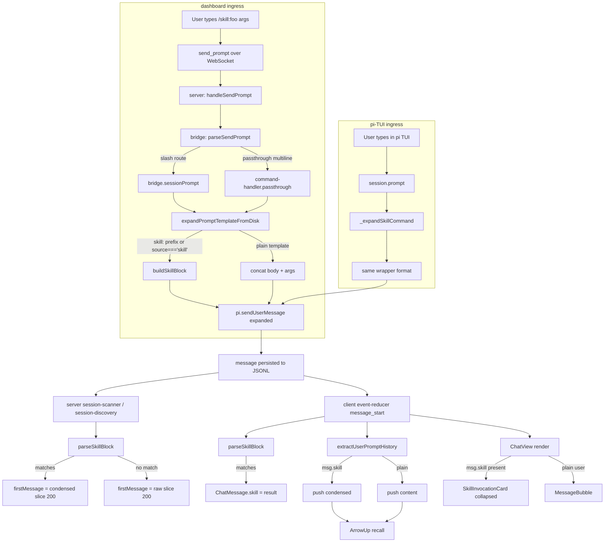

# Design — render-skill-invocations-collapsibly

## Context

The dashboard's chat panel renders persisted user messages from the session JSONL via the event-reducer's `message_start` handler. When a user types `/skill:foo args` in the dashboard chat input, the bridge expands the skill **before** sending to pi, so the persisted message contains the expanded body (without the `<skill>` wrapper that pi's own expander would produce). When the same `/skill:foo args` is typed in pi's TUI (single-line, with a space), pi's `_expandSkillCommand` produces a `<skill name="foo" location="…">\nReferences are relative to …\n\nbody\n</skill>\n\nargs` wrapper, which the regex `parseSkillBlock` can recover. The dashboard's expander does not wrap, so dashboard-typed skill turns are unrecoverable.

This change unifies the two ingress paths to pi's wrapper format and adds a client-side parser, renderer, and up-arrow handler, plus a server-side `firstMessage` extraction step, all backed by a single shared parser in `packages/shared`.

## Architecture



## The wrapper format (canonical, byte-exact)

This is pi's own output, copied byte-for-byte. The dashboard expander aligns to this exact shape so `parseSkillBlock` works against both ingress paths.

```
<skill name="${name}" location="${filePath}">\n
References are relative to ${baseDir}.\n
\n
${body}\n
</skill>${args ? "\n\n" + args : ""}
```

Where:
- `name` — the bare skill name (without the `skill:` prefix). For `/skill:openspec-explore`, `name = "openspec-explore"`.
- `filePath` — absolute path to `SKILL.md`. Whatever the bridge resolved (local `.pi/skills/<name>/SKILL.md` or via `pi.getCommands()` fallback for installed package skills).
- `baseDir` — `dirname(filePath)`. Pi calls this the skill's `baseDir`.
- `body` — `stripFrontmatter(readFileSync(filePath, "utf-8")).trim()`. Pi's `stripFrontmatter` and the dashboard's existing `readTemplate` regex `^---\n[\s\S]*?\n---\n([\s\S]*)$` are byte-identical for any file that begins with `---\n`. Validation harness `/tmp/parity-check.mjs` confirmed identical output on the canonical fixture (`openspec-explore/SKILL.md`, 8709 bytes body).
- `args` — the user's text after the skill name, trimmed. May contain newlines.

## The parser contract

```ts
// packages/shared/src/skill-block-parser.ts

export interface SkillBlock {
  name: string;
  location: string;
  body: string;
  args: string | undefined;
  /** "/skill:" + name + (args ? " " + args : "") */
  condensed: string;
}

export function parseSkillBlock(text: string): SkillBlock | null;
export function buildSkillBlock(args: {
  name: string;
  filePath: string;
  baseDir: string;
  body: string;
  userArgs?: string;
}): string;
```

Regex (anchored, non-greedy body, optional trailing args):

```js
/^<skill name="([^"]+)" location="([^"]+)">\n([\s\S]*?)\n<\/skill>(?:\n\n([\s\S]+))?$/
```

Anchors `^` and `$` are essential: they prevent mid-document `<skill>`-text from matching. The non-greedy `[\s\S]*?` plus the `(?:\n\n…)?$` tail forces the regex engine to extend the match to the **last** valid `\n</skill>(\n\nargs)?$` boundary — bodies containing literal `</skill>` text (e.g. SKILL.md docs that mention skills) do not terminate prematurely. Edge case validated on `/tmp/edge-cases.mjs`: 9/9 pass including documentation containing `<skill name="example">…</skill>` literal text inside the body.

## Touchpoints

| Layer | File | Change |
|---|---|---|
| shared | `packages/shared/src/skill-block-parser.ts` | NEW. Pure exports `parseSkillBlock` + `buildSkillBlock`. ~50 LOC incl. tests. |
| extension | `packages/extension/src/prompt-expander.ts` | MOD. After resolving `filePath`, when the matched key starts with `skill:` or the `pi.getCommands()` fallback returned `source: "skill"`, wrap via `buildSkillBlock`. Plain templates fall through. |
| server | `packages/server/src/session-discovery.ts` | MOD. Inside the user-message branch of `extractFirstMessage`, run `parseSkillBlock(text)`; if matched set `firstMessage = block.condensed.slice(0, 200)`, else current logic. |
| server | `packages/server/src/session-scanner.ts` | MOD. Same change as session-discovery. |
| client | `packages/client/src/lib/event-reducer.ts` | MOD. In `message_start` user handler after extracting `text`, run `parseSkillBlock`; on match stamp `skill: { name, location, body, args }` on the new `ChatMessage`. |
| client | `packages/client/src/lib/message-history.ts` | MOD. In `extractUserPromptHistory`, when iterating user messages, prefer `block.condensed` from `parseSkillBlock(content)` over raw `content`. |
| client | `packages/client/src/components/SkillInvocationCard.tsx` | NEW. ~80 LOC. Renders header + collapsible body + 4 copy buttons. |
| client | `packages/client/src/components/ChatView.tsx` | MOD. `msg.role === "user"` branch checks `msg.skill`; routes to `SkillInvocationCard` when present. |
| client | `packages/client/src/lib/event-reducer.ts` | MOD (type). Add optional `skill?: SkillBlock` to `ChatMessage` interface. |

## Up-arrow recall: why condensed-only

`CommandInput`'s history is a `string[]` derived by `extractUserPromptHistory(messages)`. By replacing each skill-matched entry with its condensed form, the existing `setText(historyList[idx])` call inserts `/skill:foo args` into the textarea. Zero changes to `CommandInput`. Existing tests in `__tests__/CommandInput.test.tsx` use plain-text fixtures and remain green; new tests in `__tests__/message-history.test.ts` cover the parsing path.

Rejected: a "double-tap ↑ to expand" escape hatch. The whole point of the change is "don't paste back walls of text"; an escape hatch defeats that. Users who genuinely want the expanded body have "Copy as Markdown" on the user bubble.

## Card visual contract

```
┌─ SkillInvocationCard (collapsed, default) ─────────────────────┐
│ 🔧  /skill:openspec-explore continue with X            [▸]    │
│                                                                │
│  [⏰ 14:32]                          [⌃] [📋] [/]  [⑂]        │
└────────────────────────────────────────────────────────────────┘

┌─ SkillInvocationCard (expanded) ───────────────────────────────┐
│ 🔧  /skill:openspec-explore continue with X            [▾]    │
│ ───────────────────────────────────────────────────────────── │
│  Enter explore mode. Think deeply. Visualize freely. ...      │
│  [skill body, full markdown rendering]                         │
│ ───────────────────────────────────────────────────────────── │
│  args: continue with X                                         │
│ ───────────────────────────────────────────────────────────── │
│  [⏰ 14:32]                          [⌃] [📋] [/]  [⑂]        │
└────────────────────────────────────────────────────────────────┘
```

- Distinct border tint and `border-l-purple-400` (or similar — pick from existing palette) so the card is visually different from regular user bubbles which use `border-l-blue-400`.
- The full `/skill:name args` is always visible in the header, never truncated, so users learn the slash form by seeing it.
- Toggle is per-instance React `useState`; not persisted, no localStorage.
- The body re-uses `MarkdownContent` so all existing markdown features (mermaid, math, code highlighting, links) work.

## Four copy buttons

Existing two buttons preserve their semantic exactly. Two new ones cover the use cases that emerged during smoke test ("how do I copy just my message?").

| Button | icon | source | semantic |
|---|---|---|---|
| Copy as Markdown | `mdiContentCopy` | raw `content` | unchanged: "what was actually sent" — the full `<skill>...</skill>` envelope |
| Copy as plain text | `mdiTextBox` | rendered DOM `innerText` | unchanged: roughly the body |
| Copy as command | `mdiSlashForward` | `block.condensed` | NEW: "what to type to invoke again" |
| Copy as message | `mdiMessageOutline` | `block.args` | NEW: "just my user-typed message" — hidden when `args === undefined` |

Why this set: smoke testing the v1 (three buttons) revealed that the most common reader use case — "I want to quote what I asked" — was not directly served. "Copy as Markdown" gave the full XML wrapper; "Copy as plain text" gave the body + args concatenated. Neither isolates the user's message. "Copy as message" closes that gap.

Visibility rules: "Copy as message" only renders when `block.args` is non-empty. The other three render whenever `msg.skill` is set; on regular `MessageBubble` none of them render (the bubble keeps its own existing two-button setup).

## Validation that no consumer breaks

The full sweep enumerated every reader of user-message content. Each was checked against the new wrapped format:

| Consumer | Behavior under change | Status |
|---|---|---|
| `ChatView` user-bubble render | Routes to `SkillInvocationCard` when `msg.skill` set | NEW PATH |
| `MessageBubble` copy buttons | Unchanged for non-skill messages | safe |
| `extractUserPromptHistory` | Prefers `block.condensed` over `content` | NEW PATH |
| `event-reducer message_start` | Stamps `msg.skill` if regex matches | NEW PATH |
| `event-reducer message_update` (assistant only) | Not reached for user messages | safe |
| `event-reducer lastUserIdx` (turnIndex assignment) | Filters by `role === "user"`; content irrelevant | safe |
| `event-reducer reorderToolCardsForAssistantMessage` | Operates on assistant messages | safe |
| `state-replay.ts` | Emits `message_start` with raw content; reducer stamps on receipt | safe |
| `session-scanner.ts` `firstMessage` | NEW: parses before truncating | NEW PATH |
| `session-discovery.ts` `firstMessage` | NEW: parses before truncating | NEW PATH |
| `session-display-name.ts` | Reads pre-condensed `firstMessage` | unchanged |
| `session-grouping.ts filterByQuery` | Reads `firstMessage`; condensed string still contains skill name + args | unchanged |
| Compaction (pi-side) | Reads expanded body as input to summarizer; never rewrites user content | safe |
| Fork-from-message | Uses `entryId`, not `content` | safe |
| `bridge-context.ts entry filter` | Reads user content for context inclusion; format-agnostic | safe |
| `pi.sendUserMessage` (bridge → pi) | Same content shape pi already produces | safe |
| Bash output ingress (`! command`) | Format `$ cmd\n${output}` — never matches skill regex | safe |

## Risks

```
R1. Pre-existing dashboard skill turns (no wrapper) cannot be recovered
    → ACCEPTED. The chat still renders them as today (walls of body
      text); ↑ recall still gives the wall. Only NEW dashboard skill
      turns benefit. Real-world session sweep showed effectively zero
      pre-existing wrapped data anyway, so the asymmetry is short-lived.

R2. Pathological SKILL.md body containing literal "\n</skill>\n\n…"
    → ACCEPTED. Adversarial only; structurally improbable. The regex
      best-effort parses such bodies but may cut at the first inner
      </skill>. SKILL.md authors are trusted (skills run code).

R3. pi may upstream-fix its multi-line bug
    → MUTUALLY COMPATIBLE. Today /skill:foo\nargs in pi-TUI fails to
      expand and persists raw. After our change the dashboard handles
      multi-line correctly via the existing dashboard regex which
      splits on \s+. If pi later fixes its expander, both sides will
      produce the same wrapper format — no work needed.

R4. SKILL.md without YAML frontmatter
    → SAFE. pi's stripFrontmatter and the dashboard's readTemplate
      both fall through to "use raw content trimmed" when frontmatter
      is absent. Both produce identical output. Local sweep confirmed
      all 21 .pi/skills have frontmatter; spec allows either.

R5. The new SkillInvocationCard duplicates MessageBubble plumbing
    → ACCEPTED for v1. If we ever need a third "X-invocation card"
      (prompt-template), refactor to a shared base. Until then, ~80
      LOC of focused code is clearer than premature abstraction.
```

## Test plan

```
shared/__tests__/skill-block-parser.test.ts                  NEW
  - parseSkillBlock matches well-formed wrapper with args
  - parseSkillBlock matches wrapper without args
  - parseSkillBlock returns null on plain text
  - parseSkillBlock returns null on partial wrapper (truncated)
  - parseSkillBlock handles body containing literal <skill> text
  - parseSkillBlock handles multiline args
  - condensed format: with args / without args
  - buildSkillBlock + parseSkillBlock round-trips
  - buildSkillBlock byte-matches pi's _expandSkillCommand output
    (fixture: real openspec-explore SKILL.md, args="continue with X")

extension/__tests__/prompt-expander.test.ts                  ADD
  - /skill:foo args wraps in <skill> with body+args
  - /skill:foo (no args) wraps in <skill> without trailing \n\nargs
  - /opsx:continue (prompt template) emits unwrapped body (no change)
  - body byte-equals pi's stripFrontmatter output

server/__tests__/session-discovery-skill-firstmessage.test.ts NEW
  - JSONL with first user message = wrapped <skill> → firstMessage = condensed
  - JSONL with first user message = plain text → firstMessage = raw[:200]
  - JSONL with wrapped <skill> longer than 200 chars → condensed[:200]

client/lib/__tests__/event-reducer-skill-stamp.test.ts       NEW
  - message_start with wrapped content → msg.skill is set
  - message_start with plain text → msg.skill undefined
  - msg.content remains raw expanded text in both cases

client/lib/__tests__/message-history.test.ts                 ADD
  - user msg with skill stamp → history entry = "/skill:foo args"
  - user msg with skill stamp + no args → history entry = "/skill:foo"
  - mixed conversation: condensed entries + plain entries newest-first

client/components/__tests__/SkillInvocationCard.test.tsx     NEW
  - Renders collapsed by default, header shows "/skill:foo args"
  - Click chevron → body becomes visible
  - Four copy buttons present (Copy as message hidden when args undefined)
  - Copy-as-command button copies condensed string
  - Copy-as-markdown button copies raw <skill>...</skill> content
```

## Migration

None required. The format change is forward-only:
- New dashboard sessions produce wrapped content from this commit forward.
- Old sessions (wrapped or unwrapped) continue to read correctly: `parseSkillBlock` returns `null` for unwrapped content, falling through to today's render path.
- `firstMessage` is recomputed from the JSONL on every server start, so old sessions naturally gain the condensed `firstMessage` after a restart.

## Decision log

```
Q1. Wrap in bridge?                      YES   (validated)
Q2. Skills only for v1?                  YES   (validated)
Q3. firstMessage parse client or server? SERVER (revised after
     discovering 200-char truncation cuts the wrapper)
Q4. ↑ recall behavior?                   CONDENSED-ONLY
Q5. Add a third copy button?             YES, "Copy as command"
Q6. Feature flag / kill switch?          NO
Q7. Default expanded or collapsed?       COLLAPSED
Q8. Card distinguishability?             Distinct border tint, wrench icon,
                                          full /skill:name args always visible
```
