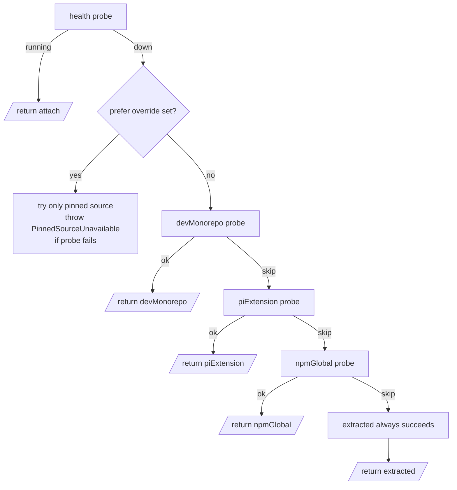
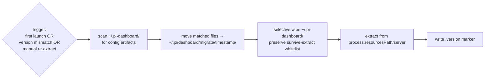
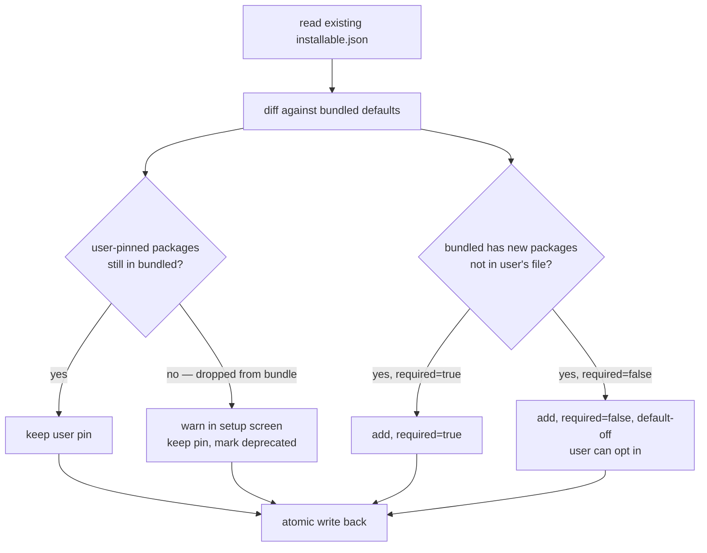
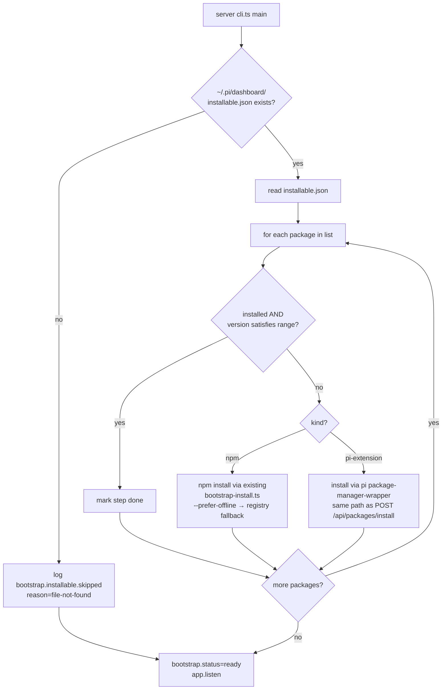
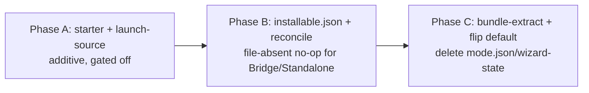

# Design — Simplify Electron Bootstrap via Derived State

## Goals

1. Delete persistent startup-decision state (`mode.json`, `isFirstRun`).
2. Make "who started the server?" runtime-readable (`DASHBOARD_STARTER` + `/api/health.starter`).
3. Collapse five branching paths into one resolver returning a discriminated `LaunchSource`.
4. Move package installation from Electron wizard time to server bootstrap time.
5. Preserve dev-mode workflow (extension installed from project dir).

## Non-Goals

- Replacing the existing `bootstrap-state.ts` event protocol.
- Changing pi's extension manifest format.
- Reducing the runtime size of `~/.pi-dashboard/` (orthogonal concern; tracked in `manage-node-runtime-updates`).

## LaunchSource Abstraction

```ts
type LaunchSource =
  | { kind: "attach";      url: string; starter: "Bridge" | "Standalone" | "Electron" }
  | { kind: "devMonorepo"; cliPath: string; cwd: string }    // repo root
  | { kind: "piExtension"; cliPath: string; cwd: string }    // ext dir or its sibling
  | { kind: "npmGlobal";   cliPath: string; cwd: string }    // npm prefix
  | { kind: "extracted";   cliPath: string; cwd: string }    // ~/.pi-dashboard/
```

Resolver signature:

```ts
function selectLaunchSource(opts: {
  isPackaged: boolean;
  cwd: string;
  preferOverride: SourceKind | null;     // from DASHBOARD_PREFER_SOURCE
  bundledPiVersion: string;              // from electron resources
  health: HealthProbe;                   // injectable for tests
}): Promise<LaunchSource>;
```

Pure aside from injected probes. Tests inject fakes; production wires real fs/health/which probes.

### Resolution sequence



### Per-source probe contracts

| Source | Probe |
|---|---|
| `attach` | `health.starter` populated AND health probe returns 200 within 1 s |
| `devMonorepo` | `!app.isPackaged AND existsSync(<cwd>/packages/server/src/cli.ts) AND existsSync(<cwd>/packages/extension/src/bridge.ts)` |
| `piExtension` | `~/.pi/agent/settings.json` parses AND has at least one `extensions[].path` resolving to a directory containing `bridge.ts` AND `require.resolve('@blackbelt-technology/pi-dashboard-server/package.json', {paths:[extDir, parentNodeModules]})` succeeds AND server's package.json `version >= bundledPiVersion` AND `pi --version >= bundledPiVersion` |
| `npmGlobal` | `which pi-dashboard` returns a path AND `realpathSync(path)` not under `process.resourcesPath` AND `pi-dashboard --version` returns version `>= bundledPiVersion` |
| `extracted` | always returns true (fallback) |

Each probe is timeout-bounded (`piExtension` and `npmGlobal` each capped at **3 s** for `--version` — raised from an initial 1 s estimate after measuring cold-Windows + WSL `pi.cmd` invocations in the 1.5–2.5 s range). Failure of any non-fatal probe falls through; `extracted` always wins last.

### Spawn primitive

Uniform across `devMonorepo`, `piExtension`, `npmGlobal`, `extracted`:

```ts
spawn(process.execPath, [
  "--import", resolveJitiImport(),         // existing helper
  shouldUrlWrapEntry(loader) ? toFileUrl(cliPath) : cliPath,
  "--port", String(config.port),
  "--pi-port", String(config.piPort),
], {
  cwd: source.cwd,
  env: { ...process.env, DASHBOARD_STARTER: "Electron" },
  detached: true,
  stdio: ["ignore", logFd, logFd],
});
```

The `cwd` differs per source (repo root / ext dir / npm prefix / `~/.pi-dashboard/`). Everything else is identical.

## DASHBOARD_STARTER Contract

| Setter | Value |
|---|---|
| `packages/extension/src/server-launcher.ts` (bridge auto-spawn) | `"Bridge"` |
| `packages/server/src/cli.ts` direct invocation (`pi-dashboard start`) | `"Standalone"` (default when env unset) |
| `packages/electron/src/lib/launch-source.ts` (any non-attach kind) | `"Electron"` |

Reader: `packages/server/src/cli.ts` reads `process.env.DASHBOARD_STARTER` once at boot, validates against the enum, defaults to `"Standalone"` when unset OR when set to an unrecognized value (warning logged for the latter). Stored in `bootstrap-state` and exposed via `/api/health.starter`. The companion field `/api/health.pid` carries `process.pid` to enable the lifecycle ownership rule below.

### Lifecycle ownership rule

```
Electron may stop server iff:
  health.starter === "Electron"
  AND health.pid === storedSpawnedPid (the pid Electron itself spawned)
```

The pid match prevents "second Electron instance attached to first Electron's server kills it on its own quit" race. Implemented by storing `serverPid` in Electron's in-memory state at spawn time; on quit, compare against `health.pid`. **Implementation note**: the `pid` field is added (or asserted-existing) by task 2.4; if today's `/api/health` already exposes it, that task becomes a passing test pin.

## Bundle Extraction

### Version marker

`~/.pi-dashboard/.version` — single line, exact version string of the bundle that wrote the directory (e.g. `0.5.0`). Mismatch against `app.getVersion()` → re-extract.

### Migration on extract



Matched config patterns: `*config*`, `mode.json`, `recommended-wizard.json`, `api-key.json`, `*.log` (skipped — not configs but flagged for selective preservation if desired). Move rather than copy keeps disk usage flat.

### Bundle source path

The extraction source is **`<process.resourcesPath>/server/`**, not the bare `process.resourcesPath`. The Electron `resources/` directory contains `app.asar` (a file), `node/`, `offline-packages/`, icon files, etc. — a recursive `cpSync` of the whole dir would `opendir(app.asar)` and fail with `ENOTDIR`.

Only `<resourcesPath>/server/` has the layout the runtime expects (synthetic `package.json` + `node_modules/@blackbelt-technology/{pi-dashboard-server,...}`), produced by `packages/electron/scripts/bundle-server.mjs` and bundled via `forge.config.ts#extraResource`. The `cliPath = <managedDir>/node_modules/@blackbelt-technology/pi-dashboard-server/src/cli.ts` resolves only when `<resourcesPath>/server/` is the cpSync source.

The companion file `<resourcesPath>/installable-defaults.json` (when bundled) sits at the **top level** of `resourcesPath`, not under `server/`, and is read independently of the extraction step.

### Runtime baseline install (jiti chicken-and-egg)

The bundled `resources/server/` deliberately does **not** ship `@mariozechner/pi-coding-agent` (and therefore does not ship jiti either). The justification lives in `packages/electron/scripts/bundle-server.mjs`: pi/tsx/openspec come from the offline cacache (`offline-packages.json` + `offline-packages/`) which `installStandalone()` extracts into `~/.pi-dashboard/` on first run. Bundling pi inside `resources/server/` would duplicate it (~10 MB) and risk version drift against the cacache pin.

But the spawned server is TypeScript source. Booting it requires `node --import <jiti-register> <cliPath>`. So jiti must exist *before* the spawn, which means it must be installed *before* `spawnFromSource()` runs. `bootstrap-install-from-list.ts` (Phase B) cannot satisfy this requirement — it executes inside the already-spawned server, after jiti is needed.

Resolution: `resolveExtracted()` calls `installStandalone()` (from `packages/electron/src/lib/dependency-installer.ts`) immediately after `extractBundle()` succeeds. This populates `~/.pi-dashboard/node_modules/@mariozechner/pi-coding-agent/...` (with its bundled jiti) so the subsequent `spawnFromSource()` can resolve the loader. The call is gated by `didExtract === true` so it runs once per Electron version bump, not on every launch. `installStandalone()` is itself idempotent (skips packages already present).

Responsibility split:

| Layer | Installs | When |
|---|---|---|
| `installStandalone()` (Electron main, pre-spawn) | runtime baseline: pi-coding-agent, tsx, openspec | inside `resolveExtracted` after `extractBundle` |
| `bootstrap-install-from-list.ts` (server, post-spawn) | additional packages from `~/.pi/dashboard/installable.json` | server bootstrap, before `app.listen` |

The two layers do not overlap: the baseline is the minimum needed to *boot* the server; the installable list is the user-configured set of dashboard extensions. Both are necessary; the order (baseline → boot → reconcile) is fixed.

Jiti resolution at spawn time uses `resolveJitiFromAnchor(source.cliPath)` rather than `resolveJitiImport()`. The latter anchors on `process.argv[1]`, which inside packaged Electron is empty or a flag (not a script path with a node_modules tree). The former accepts an explicit anchor file; `cliPath` always sits inside a real `node_modules` tree (managed for `extracted`, repo for `devMonorepo`, pi's tree for `piExtension`/`npmGlobal`).

### Workspace symlink materialization (Docker build only)

Npm workspaces inside `resources/server/` create symlinks under `node_modules/@blackbelt-technology/*` pointing back to `/build/packages/<name>/`. These symlinks must be replaced with real copies before the bundle ships, because:

- On Windows ZIP extraction, the absolute Linux path is invalid — the entry becomes a broken symlink.
- On first launch, `cpSync(recursive:true)` walks into `@blackbelt-technology/`, hits the broken entry, calls `opendir` on it, and fails with `ENOTDIR` — surfacing as the same error class as the bundle-source bug above, but with a different culprit path.

`packages/electron/scripts/docker-make.sh` materializes every symlink under `node_modules/@blackbelt-technology/*` (not a hardcoded subset) so any new workspace dependency added to `packages/server/package.json` is auto-handled. Each replacement logs a line; targets that don't resolve to a directory are left as-is with a warning.

### Survive-extract whitelist

The wipe step is **not** `rm -rf`. The whitelist is a single exported constant in `bundle-extract.ts`:

```ts
export const SURVIVE_EXTRACT_DIRS = [
  "node",          // managed Node runtime (manage-node-runtime-updates)
  "node-pending",  // staged Node runtime awaiting swap-on-start
  "node-old",      // post-swap retired Node runtime, cleaned by the next start
] as const;
```

Wipe walks `readdirSync(managedDir)` and removes every entry whose name is not in the whitelist. The list is the single coordination point with `manage-node-runtime-updates` (and any future change that wants to persist state across an Electron version bump). Adding to it requires only a constant edit; deleting from it deliberately destroys state, so removals must be coordinated with the owning capability.

**Rationale**: the alternative (move managed Node out of `~/.pi-dashboard/`) would force `manage-node-runtime-updates` to track a different path and lose the "all Electron-managed binaries live in one place" property. A whitelist keeps responsibility colocated with `bundle-extract.ts`, which is the only writer to `~/.pi-dashboard/` from Electron's side.

### Re-extract trigger

`POST /api/electron/reextract` (Electron-only, returns 403 when `health.starter !== "Electron"`). Server returns 202 immediately; Electron schedules its own restart with re-extraction. UI exposes via Doctor "Re-extract bundled runtime" button. Endpoint named `reextract` (not `reinstall`) to disambiguate from package-level reinstall flows that already exist under `/api/packages/*`.

## installable.json

### Location

`~/.pi/dashboard/installable.json` — shared across all starters. Sits next to existing `config.json` in the dashboard config home.

### Per-starter behavior

The file is the source of truth for "what should be installed" but not every starter writes it.

| Starter | Reads | Writes (creates if absent) |
|---|---|---|
| Electron | yes (server bootstrap reconciles) | yes — `bundle-extract` seeds defaults from the bundled `installable-defaults.json` shipped in `process.resourcesPath` |
| Bridge | yes (server bootstrap reconciles when present) | **no** — absence is normal, reconcile is a no-op (single log line, ready transition immediate) |
| Standalone | yes (server bootstrap reconciles when present) | **no** — absence is normal; user can hand-edit the file and restart, or use `pi-dashboard install --seed-from-bundle` (out of scope for this change; tracked separately) |

This preserves today's behavior on machines that never run Electron: a Bridge auto-spawn does not magically start installing packages. The behavioral change is opt-in either through Electron (which seeds the file) or through explicit user action (which hand-edits or uses a future seed CLI command).

### Schema

```jsonc
{
  "version": "0.5.0",                     // bundle version at last write
  "packages": [
    { "name": "@mariozechner/pi-coding-agent", "version": "^0.70.0", "required": true,
      "kind": "npm" },
    { "name": "tsx",                            "version": "^4.0.0",  "required": true,
      "kind": "npm" },
    { "name": "@fission-ai/openspec",           "version": "*",       "required": false,
      "kind": "npm" },
    { "name": "@blackbelt/recommended-extensions", "version": "*",    "required": false,
      "kind": "pi-extension" }
  ]
}
```

`kind` discriminates: `"npm"` packages install via npm; `"pi-extension"` install via the pi package-manager-wrapper code path the frontend already uses.

### Merge on upgrade



### Required vs optional

`required: true` packages cannot be unselected; setup screen shows them as locked checkboxes. `required: false` are user-editable. The setup screen lists current state and offers a toggle UI before the install loop starts.

## Server Bootstrap Reconciliation



The "file absent" branch is the load-bearing piece for non-Electron starters: a fresh Bridge auto-spawn on a machine that never saw Electron sees no file, no-ops, and binds in the same time it does today.

Progress events flow through existing `bootstrap-state.ts` (one event per package start/done/error). Existing `BootstrapBanner.tsx` UI in the client renders these; for Electron's setup screen the same WebSocket events drive the per-package rows.

### Failure handling

- Any `required: true` package fails → bootstrap aborts with structured error; server does not bind. Setup screen shows error + retry button.
- Any `required: false` package fails → log + emit error event, mark package as "failed", continue. Server binds, user can retry the failed package from settings UI.

## Setup Screen Repurposing

The current wizard window becomes a generic "first launch / upgrade / reinstall" progress screen. Replaced sub-screens:

| Old sub-screen | Replacement |
|---|---|
| "Choose mode" (standalone vs power-user) | gone — derived from launch source |
| "Install dependencies" progress | reused for bootstrap progress, now driven by server WS events |
| "Recommended extensions" picker | replaced by `installable.json` package selection (locked-required + togglable-optional rows) |
| "API key" prompt | unchanged — independent gate via existing `isApiKeyConfigured()` flag, shown post-bootstrap if needed |

## Doctor Refactor

Replace the single "Wizard status" row with three concrete rows:

| Row | Source |
|---|---|
| Launch source | last `selectLaunchSource()` result, e.g. `"piExtension (cli.ts: ~/.pi/...)"` |
| Server starter | `health.starter` |
| Installable list | `<X> required, <Y> optional, <Z> failed` from server bootstrap-state |

Doctor's existing managed-Node-runtime row (introduced by `embed-managed-node-runtime`) is unchanged but only meaningful when source is `extracted`.

## Code Layout (target)

```
packages/electron/src/lib/
├── launch-source.ts       NEW — selectLaunchSource + spawnFromSource + DASHBOARD_PREFER_SOURCE parser
├── bundle-extract.ts      NEW — needsExtraction + migrateConfigs + extractBundle
├── doctor.ts              MODIFIED — three new rows, drop wizard-status row
├── server-lifecycle.ts    MODIFIED — kill only when starter==Electron && pid match
├── update-checker.ts      MODIFIED — derive strategy from health.starter
├── main.ts                MODIFIED — collapse to selectLaunchSource → spawn → openWindow
├── wizard-state.ts        DELETED
└── power-user-install.ts  DELETED

packages/server/src/
├── cli.ts                 MODIFIED — read DASHBOARD_STARTER; await bootstrap reconcile
├── bootstrap-state.ts     MODIFIED — track installable.json reconcile progress
├── bootstrap-install-from-list.ts  NEW — orchestrates installable.json reconcile
└── routes/system-routes.ts MODIFIED — /api/health.starter; POST /api/electron/reinstall

packages/shared/src/
└── installable-list.ts    NEW — schema, read/write, merge

packages/extension/src/
└── server-launcher.ts     MODIFIED — set DASHBOARD_STARTER=Bridge on spawn
```

## Phasing & Implementation Order

Lands as one proposal but in three phases on the feature branch. Each phase passes CI standalone; the codebase remains shippable between phases. Phase boundaries map onto tasks.md sections.



### Phase A — additive starter + launch source

- Add `DashboardStarter` enum, `parseDashboardStarter`.
- `DASHBOARD_STARTER` stamped by all three spawners (Bridge, Standalone, Electron). Server reads + exposes via `/api/health.starter`.
- Add `/api/health.pid` (or assert-existing).
- Add `selectLaunchSource()` resolver and `spawnFromSource()` primitive. Wire behind `LAUNCH_SOURCE_V2` env flag, default **off**. When off, Electron continues running the legacy `decideStartupAction` path; when on, the new resolver is exercised (used in CI and dev to validate behavior parity).
- No deletions, no UI changes, no `mode.json` removal.

### Phase B — installable.json + reconcile

- Add `packages/shared/src/installable-list.ts` (schema, read/write, merge).
- Add `packages/server/src/bootstrap-install-from-list.ts`.
- `cli.ts` awaits reconcile before `app.listen`. **File-absent path is a no-op log line** — critical for Bridge/Standalone parity.
- Setup screen UI work for package-selection sub-screen lands here, but is reachable only when Electron's `LAUNCH_SOURCE_V2` flag is on (still gated).

### Phase C — cutover and deletions

- Flip `LAUNCH_SOURCE_V2` default to **on**.
- Wire `bundle-extract` into `extracted` source. Survive-extract whitelist active.
- `POST /api/electron/reextract` endpoint live.
- Repurpose wizard renderer; delete `wizard-state.ts` + `power-user-install.ts` + `mode.json` IPC paths; archive `electron-startup-splash` and `electron-wizard-smart-detection`.
- CHANGELOG migration entry, `docs/electron-bootstrap-flow.md` rewrite, release-note text.

The `LAUNCH_SOURCE_V2` env flag is removed in a follow-up change once phase C has been in production for one release without regressions; the flag is a phasing scaffold, not a permanent feature toggle.

## Test Surface

### Pure helpers (high coverage)

- `selectLaunchSource` — 5 source × 4 probe-result cases, plus override pin-success and pin-fail
- `decideExtractionAction` — version match / mismatch / first run / manual trigger
- `mergeInstallableList` — keep-pin / drop-pin-warn / add-new-required / add-new-optional
- `classifyStarter` — env present / absent / invalid value
- `decideShutdownOnQuit` — starter × pid-match matrix (4 cases)

### Integration

- Cross-platform spawn from each source kind on a fixture managed dir
- `~/.pi/dashboard/migrate/<ts>/` actually receives moved configs on extract
- Reinstall endpoint gated by `health.starter` (403 from Bridge/Standalone)
- Bridge auto-start sets `DASHBOARD_STARTER=Bridge` (existing `server-launcher.test.ts` extended)

## Migration Plan

### For existing v0.4.x users

```
First launch of new version
  → Electron detects ~/.pi-dashboard/ exists AND no .version file
  → triggers bundle-extract first-run path
  → moves mode.json + recommended-wizard.json + api-key.json + *config* →
    ~/.pi/dashboard/migrate/2026-05-04T10-00-00Z/
  → wipes ~/.pi-dashboard/ (note: api-key.json is also archived; user may
    re-enter or copy-back from migrate/)
  → extracts bundled resources, writes .version=0.5.0
  → server bootstrap reads ~/.pi/dashboard/installable.json (creates if absent)
  → installs missing packages
  → opens main window
```

Release note documents:

- Where configs went (`~/.pi/dashboard/migrate/<timestamp>/`)
- That `~/.pi-dashboard/` is now Electron-bundle-managed only
- That `installable.json` lives at `~/.pi/dashboard/` and is editable
- That `mode.json` is gone (no replacement; behavior derived)

### For existing extension/standalone users

No migration. Their startup paths are unchanged — bridge spawn and CLI spawn still resolve `cli.ts` via `resolveServerCliPath()`. They simply gain `DASHBOARD_STARTER` stamping and the `installable.json` reconciliation on next server start.

## Risks & Mitigations

| Risk | Mitigation |
|---|---|
| Per-launch probe latency | Cache probe result for Electron process lifetime. `which pi` cost ~10–50 ms; `pi --version` ~100–300 ms; total budget < 500 ms cold, < 50 ms warm. |
| Pinned `DASHBOARD_PREFER_SOURCE` unavailable | Setup screen shows typed error; offers one-click revert to default precedence; Doctor row goes red. |
| Server bootstrap install latency blocks ready | Setup screen shows live progress; cancel button falls back to "skip optional packages". Required packages have no skip. |
| Race: two Electron instances launch | Existing single-instance lock (`packages/electron/src/main.ts`) already enforces. Second instance forwarded to first; doesn't reach selectLaunchSource. |
| Race: bridge auto-spawns while Electron's spawn is in-flight | Health-probe-then-spawn already idempotent. Whichever wins races, the loser's spawn fails to bind port and emits "port in use" → loser falls through to `attach`. |
| User had `~/.pi-dashboard/api-key.json` | Archived to `~/.pi/dashboard/migrate/<ts>/`. Doctor row prompts to re-enter. Documented in release note. |
| Extension v0.4.x clones still in use | Bridge `server-launcher.ts` keeps `resolveServerCliPath()` fallback to dev-repo path; new code only adds the `DASHBOARD_STARTER=Bridge` stamp. |

## Open Questions Tracked During Implementation

- Should `installable.json` track a `lastInstalled` timestamp per package for staleness UX? Defer — out of scope for this change.
- Should Doctor offer "Migrate back from `~/.pi/dashboard/migrate/`"? Defer — manual copy is fine for v0.5.0.
- Should `DASHBOARD_STARTER` value `"Dev"` exist as a fourth enum? **No** — devMonorepo source still spawns with starter `Electron` (or `Standalone` if invoked via CLI). The starter answers "who owns lifecycle"; the source answers "where do binaries live". Decoupled deliberately.
