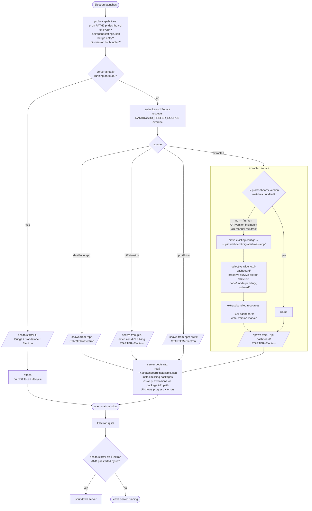
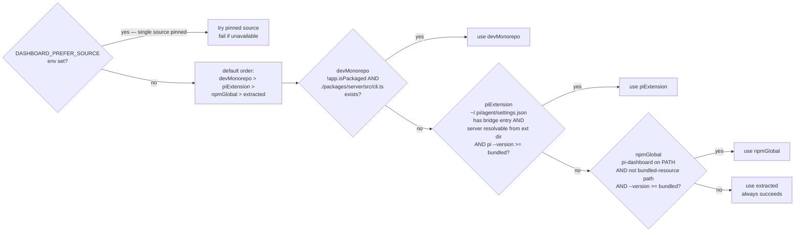
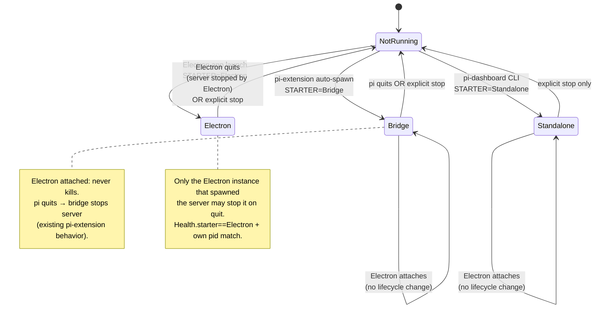

## Why

The Electron bootstrap encodes startup decisions in `~/.pi-dashboard/mode.json` plus `isFirstRun()`. Both are persistent state that re-encodes facts already discoverable from the filesystem (`which pi`, `which pi-dashboard`, `pi --version`, presence of bridge extension entry in `~/.pi/agent/settings.json`). The flag carries two orthogonal concerns — "has the wizard run?" and "which install path owns this?" — and the second is purely a re-encoding of `which`. Recent Windows bring-up (commits `ada80b4`, `27e3ca6`, `87486b7`, `0d7631d`) had to bolt idempotent reconciliation onto the flag-driven flow because the flag-only path got it wrong; the result is a mix of stored decisions and per-launch reality probes that disagree under drift.

The model also lacks a runtime-readable signal for *who started the server*. Today that is implicit in `mode.json` (read at start time) and lost at runtime — the server cannot answer "should I shut down when Electron quits?" without reaching back into Electron's local files. Bridge-started, Standalone-started, and Electron-started servers all look identical from `/api/health`.

This change replaces stored decisions with derived-on-launch capability probes plus an explicit `DASHBOARD_STARTER` env var stamped on every server spawn and exposed via `/api/health.starter`. The Electron startup collapses into a single `selectLaunchSource()` decision over five precedence-ordered sources, each resolving a `cli.ts` path and a runtime cwd. The server bootstrap reads `~/.pi/dashboard/installable.json` and reconciles missing packages before binding, replacing wizard-time installation. `mode.json` is deleted; `isFirstRun()`, `decideStartupAction()`, and `runPowerUserManagedInstall()` go with it.

## Workflow Overview

## Source Precedence

## DASHBOARD_STARTER Lifecycle

## What Changes

- Add `DASHBOARD_STARTER` env var, set by every spawn site to one of `"Bridge"`, `"Standalone"`, `"Electron"`. Server reads on boot, exposes via `/api/health.starter`. Used by Electron lifecycle to decide "stop on quit?".
- Add `packages/electron/src/lib/launch-source.ts` with the pure resolver `selectLaunchSource()` returning a discriminated `LaunchSource` union over five kinds: `attach`, `devMonorepo`, `piExtension`, `npmGlobal`, `extracted`. Spawn uniform via `node --import <jiti> <cliPath>` for all non-attach kinds.
- Add `DASHBOARD_PREFER_SOURCE` env var (`"dev" | "piExtension" | "npmGlobal" | "extracted"`) overriding precedence. Default order: `devMonorepo > piExtension > npmGlobal > extracted`. Pinned source that is unavailable raises a typed error visible in Doctor and the setup screen.
- Add `packages/electron/src/lib/bundle-extract.ts` with `needsExtraction()` (compares `~/.pi-dashboard/.version` against bundled), `migrateConfigs()` (move existing `~/.pi-dashboard/*config*` → `~/.pi/dashboard/migrate/<ISO-timestamp>/`), and `extractBundle()` (selective wipe + re-extract + write marker). Triggered on version mismatch OR manual "Re-extract bundle" button OR first launch. **Survive-extract whitelist**: top-level entries `node/`, `node-pending/`, `node-old/` (managed Node runtime owned by the `manage-node-runtime-updates` change) are preserved across extraction; everything else under `~/.pi-dashboard/` is wiped. The whitelist is a single exported constant in `bundle-extract.ts` so other changes touching `~/.pi-dashboard/` can extend it.
- Add `packages/shared/src/installable-list.ts` with schema, read/write at `~/.pi/dashboard/installable.json`, and merge-on-upgrade helper. Schema: `{ version, packages: [{ name, version, required }] }`. Required packages cannot be unselected; non-required can.
- Add `packages/server/src/bootstrap-install-from-list.ts` invoked by `cli.ts` before `app.listen`. Reads `~/.pi/dashboard/installable.json`, installs missing packages plus the pi extensions configured by the frontend's package-install code path. Server reports progress via existing `bootstrap-state.ts` until `bootstrap.status === "ready"`; only then accepts traffic. **If the file is absent**, reconcile is a no-op (single log line `bootstrap.installable.skipped reason=file-not-found`); the server transitions straight to `ready`. Default seeding of `installable.json` from a bundled list happens **only** in Electron's `bundle-extract` flow, never on Bridge or Standalone boot — those starters keep today's behavior of not auto-installing anything.
- Modify `packages/server/src/cli.ts`: parse `DASHBOARD_STARTER` from env, default `"Standalone"` if unset (CLI direct invocation case); invalid values fall back to `"Standalone"` with a warning log. Wire `starter` into `bootstrap-state` and `/api/health`.
- Modify `packages/server/src/routes/system-routes.ts`: ensure `/api/health` exposes `pid` (`process.pid`) alongside `starter`. The pid field is consumed by Electron's lifecycle ownership rule ("only the starter, with pid match, may stop on quit"). If the field is already present today, the modification is a no-op assertion via test.
- Modify `packages/extension/src/server-launcher.ts`: pass `DASHBOARD_STARTER=Bridge` when spawning the server.
- Modify `packages/electron/src/main.ts`: collapse the `firstRun` × `decideStartupAction` branching to a single `selectLaunchSource() → spawnFromSource() → openWindow()` path. Setup screen reused for extraction + bootstrap progress + errors. Wizard concept retired.
- Modify `packages/electron/src/lib/server-lifecycle.ts`: on Electron quit, only stop the server when `health.starter === "Electron"` AND `health.pid === storedSpawnedPid`. Drop `mode.json` reads.
- Modify `packages/electron/src/lib/doctor.ts`: replace the "Wizard status" row with three concrete rows — `Launch source: <kind>`, `Server starter: <starter>`, `Installable list: <package count>`.
- Modify `packages/electron/src/lib/update-checker.ts`: derive update strategy from `health.starter` instead of `mode.json`.
- Delete `packages/electron/src/lib/wizard-state.ts` (`isFirstRun`, `readModeFile`, `writeModeFile`).
- Delete `packages/electron/src/lib/power-user-install.ts` (`decideStartupAction`, `runPowerUserManagedInstall`).
- Delete IPC paths writing `mode.json` from `wizard-ipc.ts`.

## Capabilities

### New Capabilities

- `electron-launch-source`: governs the discriminated `LaunchSource` resolution including dev-monorepo detection (`!app.isPackaged AND ./packages/server/src/cli.ts exists`), pi-extension probe (settings.json read + sibling resolve + version gate), npm-global probe (`which pi-dashboard` + non-bundled-path check + version gate), `DASHBOARD_PREFER_SOURCE` override, and the uniform spawn primitive that stamps `DASHBOARD_STARTER`.
- `electron-bundle-extract`: governs the version-marker-driven extraction lifecycle of `~/.pi-dashboard/`, including config migration to `~/.pi/dashboard/migrate/<timestamp>/`, **selective wipe with the survive-extract whitelist (`node/`, `node-pending/`, `node-old/`)**, re-extraction on mismatch, and the manual "Re-extract bundle" trigger.
- `dashboard-starter-identity`: governs the `DASHBOARD_STARTER` env contract, server-side persistence into `bootstrap-state`, exposure via `/api/health.starter` and `/api/health.pid`, and the lifecycle ownership rule "only the starter, with pid match, may stop on quit".
- `installable-list`: governs the `~/.pi/dashboard/installable.json` schema, merge-on-upgrade semantics, server-side bootstrap reconciliation (no-op when file absent), and the frontend setup-screen UX for selecting/showing packages.

### Removed Capabilities

- `first-run-wizard` (existing capability in `openspec/specs/first-run-wizard/`): the wizard concept retires. `mode.json`, `isFirstRun()`, and `decideStartupAction()` are deleted. The unified setup screen renders extraction + bootstrap progress only when work is needed; otherwise the main window opens immediately.

## Supersession

This change supersedes the following active changes. Each SHALL be archived with rationale rather than implemented:

- `electron-startup-splash`: the splash window concept is replaced by the unified setup screen wired to server bootstrap progress.
- `electron-wizard-smart-detection`: `decideStartupAction` and the wizard branching matrix are deleted entirely.

This change is compatible with `manage-node-runtime-updates` (managed Node copy stays inside the `extracted` source path) and `fix-windows-electron-zip-install` (landed Windows install fixes carry forward unchanged).

## NSIS Removal

The NSIS installer (`.exe` setup wizard, produced by `@felixrieseberg/electron-forge-maker-nsis`) is removed as part of this simplification. Rationale:

- **Cross-build incompatibility**: NSIS cannot run outside a native Windows host (requires Wine for the uninstaller-extractor step). It is the only artifact that blocks fully reproducible cross-platform builds from macOS/Linux via Docker.
- **Redundancy**: Windows users are served by the `.zip` bundle (self-contained, no install step) and the `portable.exe` (single-file runner). The NSIS installer adds an extra uninstall registry entry and a start-menu shortcut but provides no functional benefit over zip extraction.
- **Maintenance cost**: The installer requires pinning `productName`, `appId`, `shortcutName`, and `uninstallDisplayName` explicitly to work around `electron-builder`'s default install-dir derivation from the npm package name (see change: `fix-electron-windows-installer-and-server-bootstrap` D2). This bespoke config is a recurring source of breakage.
- **Bootstrap model change**: With the new `extracted` source path, Electron manages its own `~/.pi-dashboard/` directory and handles first-run setup entirely inside the app. A system-level NSIS installer that writes to `Program Files` is architecturally at odds with the per-user managed-dir model.

### What replaces the NSIS installer

| Before | After |
|---|---|
| `pi-dashboard-Setup-<version>.exe` (NSIS) | ❌ removed |
| `PI-Dashboard-win32-x64.zip` | ✅ kept — primary Windows distribution |
| `PI-Dashboard-portable.exe` | ✅ kept — 7-Zip SFX single-file runner (no NSIS dependency) |

Users currently using the NSIS installer should switch to the `.zip` bundle: extract to any directory, run `PI Dashboard.exe`. The app manages its own install state in `~/.pi-dashboard/` and `~/.pi/dashboard/` — no system-level installation required.

### Files changed

- `packages/electron/forge.config.ts`: remove the `@felixrieseberg/electron-forge-maker-nsis` maker entry.
- `packages/electron/package.json`: remove `@felixrieseberg/electron-forge-maker-nsis` devDependency.
- `packages/electron/scripts/docker-make.sh`: remove `electron-builder --win portable` step (portable `.exe` is now built via Forge zip maker, not electron-builder — or keep as-is if portable is still wanted).
- `.github/workflows/publish.yml`: remove NSIS artifact upload step; update release-notes to document zip as primary Windows install method.
- `docs/electron-build-methods.md`: update Windows row to remove NSIS column.

## Build-Script Hardening (incidental)

While validating the post-NSIS Windows ZIP build pipeline locally on macOS, several pre-existing build-script defects surfaced. They are not caused by this change, but block the cross-platform smoke test (Phase C task 11.2). Fixing them is in scope because the Windows ZIP path is now the only Windows artifact and must build reliably for every release.

### What was broken

1. **Forge `Finalizing package` failed with `EACCES`** on macOS → Docker cross-builds. Files copied from the host bind-mount carried `com.apple.quarantine` extended attributes (`@` flag in `ls -la`), and Docker Desktop's filesystem virtualisation (gRPC FUSE / VirtioFS) translated those xattrs into broken Linux read perms inside the container. Symptom: random files (`vitest.config.ts`, `tsconfig.tsbuildinfo`, `package.json`) failed to open during forge's asar pack step.
2. **Rollup native binary mismatch.** The host's `node_modules` carries `@rollup/rollup-darwin-arm64` (or `-win32-x64`) but Docker is Linux x64 and needs `@rollup/rollup-linux-x64-gnu`. Forge's Vite plugin failed at startup. (Tracked upstream: [npm/cli#4828](https://github.com/npm/cli/issues/4828).)
3. **Stale interrupted-build artifacts.** Aborted runs left files in `out/` with `--w-------` mode, blocking the next forge run with `EACCES`.
4. **Test/lint configs and TS build cache shipped in the runtime bundle.** `vitest.config.ts`, `eslint.config.js`, `tsconfig.tsbuildinfo`, etc. were copied into `resources/server/` even though they're never executed at runtime. They added bundle weight and were the primary EACCES victims.

### Files added

- `packages/electron/scripts/build-windows-zip.sh` — dedicated Windows-ZIP build pipeline (web client → server bundle → npm install → Node.js download → forge package → zip → portable.exe). Auto-detects host: native execution on Windows, Docker cross-compile on macOS/Linux.

### Files modified

- `packages/electron/scripts/bundle-server.mjs`: strips test/lint configs (`vitest.config.*`, `vite.config.*`, `eslint.config.*`, `.eslintrc.*`) and TypeScript build cache (`*.tsbuildinfo`) recursively from the bundle. Test files don't belong in production runtime regardless of EACCES.
- `packages/electron/scripts/docker-make.sh`:
  - Pre-emptive `chmod -R u+rwX,go+rX /build/packages /build/node_modules` at container entry to neutralise any residual perm issues.
  - Defensive cleanup of stale `out/PI-Dashboard-*` dirs from interrupted runs.
  - Targeted `npm install --no-save` of Linux-platform optional deps (`@rollup/rollup-linux-x64-gnu`, `@swc/core-linux-x64-gnu`) without deleting the host's existing macOS/Windows variants. Avoids the previous bug where wiping platform packages inside the bind-mounted container also broke the host.

### Why these changes are in scope here

The NSIS removal made the Windows ZIP path the sole Windows distribution. Phase C task 11.2 (cross-platform smoke) requires a working ZIP build from a non-Windows host. Without these fixes, the smoke test cannot pass. They are minimal, targeted, and do not introduce new behaviour — only restore the build pipeline to a workable state on the supported host matrix.

## Impact

- **Files added**: `packages/electron/src/lib/launch-source.ts`, `packages/electron/src/lib/bundle-extract.ts`, `packages/shared/src/installable-list.ts`, `packages/server/src/bootstrap-install-from-list.ts`, plus per-file unit tests.
- **Files deleted**: `packages/electron/src/lib/wizard-state.ts`, `packages/electron/src/lib/power-user-install.ts`, mode-related branches in `wizard-ipc.ts`.
- **Files modified**: `packages/electron/src/main.ts`, `packages/electron/src/lib/server-lifecycle.ts`, `packages/electron/src/lib/doctor.ts`, `packages/electron/src/lib/update-checker.ts`, `packages/server/src/cli.ts`, `packages/server/src/bootstrap-state.ts`, `packages/server/src/routes/system-routes.ts`, `packages/extension/src/server-launcher.ts`, `packages/electron/forge.config.ts`.
- **APIs**: `/api/health` gains `starter` and `pid` fields (the latter exposed for the lifecycle ownership rule; if `pid` already exists today, no schema change). New REST endpoint `POST /api/electron/reextract` (Electron-only, gated by `health.starter === "Electron"`, returns 403 otherwise) triggers re-extraction. New WS event class consumed by setup screen for bootstrap-install progress (reuses existing `bootstrap-state` event types). Endpoint deliberately named `reextract` (not `reinstall`) because it re-extracts the Electron-bundled resources; package-level reinstall flows through the existing package-management API.
- **Env vars**: `DASHBOARD_STARTER` (set by spawner, required), `DASHBOARD_PREFER_SOURCE` (optional override).
- **Migration**: existing users on `~/.pi-dashboard/` from older versions are handled by `bundle-extract` first-run path: any file matching `*config*` (and the well-known `mode.json`, `recommended-wizard.json`, `api-key.json`) is moved to `~/.pi/dashboard/migrate/<ISO-timestamp>/` before wipe. Release note documents the new locations and the migrate directory's existence.
- **Compatibility**: `mode.json` files left from earlier installs are ignored (the migrate step archives them). No hot-upgrade path required — Electron version bump triggers natural extract on next launch.
- **Risk**: per-launch capability probe latency. `which pi` + `pi --version` + `~/.pi/agent/settings.json` parse + `require.resolve` totals ~50–500 ms on cold launch (Windows worst case). Mitigation: results cached for the Electron process lifetime; not repeated per call. The `pi --version` and `pi-dashboard --version` probes have a **3 s timeout** each (raised from initial 1 s estimate to accommodate cold Windows / WSL invocations); timeout falls through to the next source.
- **Risk**: pinned `DASHBOARD_PREFER_SOURCE` referencing an unavailable source. Mitigation: typed error surfaced in setup screen with one-click fallback to default precedence.
- **Risk**: server bootstrap install latency blocks "ready". On a clean managed install with empty cache this can take 30–120 s. Mitigation: setup screen shows live per-package progress; cache-extraction primes the install; user can cancel and fall back to in-place reuse if any package previously installed.
- **Out of scope**: changing pi's extension format, switching package managers, replacing the existing `bootstrap-state.ts` event protocol, refactoring server-side spawn machinery for non-bootstrap operations.
- **NSIS removal risk**: users who relied on the NSIS uninstaller to clean up old installs will need to manually delete `~/.pi-dashboard/` and `~/.pi/dashboard/` if they want a clean slate. The migration step already archives old configs to `~/.pi/dashboard/migrate/<timestamp>/`, which limits leftover state.

## Implementation Phasing

The change lands as one proposal but tasks.md groups work into three phases that each leave the codebase healthy on its own. Implementation can land phase-by-phase on a feature branch with separate review passes; phase C is the only one that deletes the old code paths.

- **Phase A — additive starter + launch source.** Add `DashboardStarter` type, `DASHBOARD_STARTER` env stamping in all three spawners, `/api/health.starter` + `/api/health.pid` exposure, and `selectLaunchSource()` resolver behind a `LAUNCH_SOURCE_V2` env flag (default off). Old `mode.json` + `decideStartupAction` paths still run when the flag is off. No user-visible change.
- **Phase B — installable.json reconcile.** Add `installable-list.ts`, `bootstrap-install-from-list.ts`, and the merge-on-upgrade helpers. Server reads file when present, no-ops when absent. Bridge/Standalone unaffected. Electron still uses old wizard path; the new file is written only in dev-mode test fixtures. No user-visible change.
- **Phase C — cutover and deletions.** Flip `LAUNCH_SOURCE_V2` default to on, wire `bundle-extract` into `extracted` source, repurpose setup screen, delete `wizard-state.ts` + `power-user-install.ts` + `mode.json` IPC paths, archive superseded changes. User-visible change happens here; release-note migration guidance ships with this phase.
