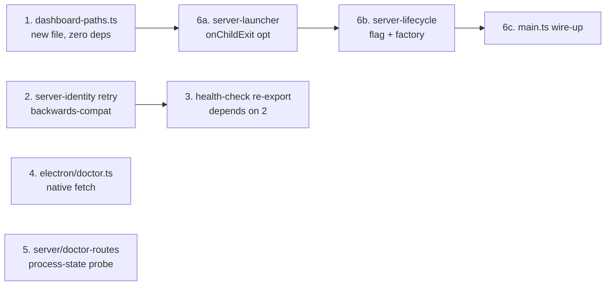

# Design — harvest-bootstrap-survivor-fixes

## Decision context

Branch `new_bootstap_mess` commit `9a984c37` ("WIP: bootstrap / install /
recovery debugging") landed five live-debugged fixes against a running
Electron app. The commit message itself catalogs them. Cross-referenced
against the `eliminate-electron-runtime-install` proposal's KEEP /
DELETE table, **two of the five** fix code that survives elimination;
the other three fix code that elimination deletes wholesale.

This design captures the survival classification and the wire-up shape
for the gnarliest survivor (server watchdog), which on the branch is a
pure factory with no caller — adoption requires API changes in
`shared/server-launcher.ts` and corresponding plumbing in
`electron/main.ts`.

## Goals

1. Adopt every surviving fix without coupling to deleted machinery.
2. Preserve every existing call signature so no audit-style sweep of
   call sites is needed.
3. Keep each cherry-pick a single self-contained commit so reverts are
   surgical.
4. Make the watchdog crash-detection actually fire (branch ships a
   factory with no caller).

## Non-goals

- Slim the wizard. Defer to `eliminate-electron-runtime-install`.
- Land the loading-page reinstall affordances. Deleted by elimination.
- Touch `~/.pi-dashboard/` runtime install code. Deleted by elimination.
- Solve PATH probing on macOS .app launches. Already fixed in HEAD
  commit `21ea68a1` (cold-launch probe cascade).

## Five cherry-picks — sequence and dependency



Cherry-picks 1–5 are independent of each other except for the
2 → 3 ordering. Cherry-pick 6 is the only one with cross-package
dependency (shared + electron).

## Cherry-pick 6 — the gnarly part

### Current shape (HEAD)

```
main.ts
  └─ spawnFromSource(source, config)
       └─ launchDashboardServer(opts)
            └─ child = spawn(...)             ◄── ChildProcess scoped
                                                   to launcher
            └─ readiness loop
            └─ return { childPid, reportedPid, healthOk: true }
                                                   ◄── ChildProcess
                                                       discarded here
```

`main.ts` has only the PID. No way to attach a post-readiness
`child.on('exit', …)` handler.

### Branch shape (factory present, no caller)

```
server-lifecycle.ts
  └─ makeServerWatchdog({ isGraceful, log, onCrash })
       └─ returns (code, signal) => void

(nothing calls makeServerWatchdog)
```

### Proposed shape (this change)

```
main.ts
  └─ before-quit:
       setGracefulShutdownInProgress(true)
  └─ spawnFromSource(source, config, {
       onChildExit: makeServerWatchdog({
         isGraceful: isGracefulShutdownInProgress,
         log: appendDashboardLog,
         onCrash: (code, signal) =>
           showLoadingPage(mainWindow, serverUrl),
       })
     })
       └─ launchDashboardServer(opts) with opts.onChildExit
            └─ child.on('exit', opts.onChildExit)   ◄── attached
            └─ readiness loop
            └─ return { childPid, reportedPid, healthOk: true }
```

### Why `onChildExit` belongs in shared, not Electron-only

Standalone arm (`pi-dashboard start`) also benefits from crash detection
on its child server — currently a CLI restart relies on the user
re-running the command. Bridge arm: the bridge extension owns the
child, has its own reconnect loop, doesn't need it (but won't break if
the option is omitted).

Result: `onChildExit` is a generic opt-in feature on
`launchDashboardServer`. Each starter wires its own handler.

### Why a flag and not a CrashEmitter

`gracefulShutdownInProgress` is module-private state set by exactly two
edges (`before-quit`, programmatic restart) and read by exactly one
edge (the watchdog callback). A boolean is the minimum mechanism. An
emitter would invert control without adding capability.

### Why `onCrash` may throw

`onCrash` calls `showLoadingPage(mainWindow, serverUrl)`. If
`mainWindow` was closed before the watchdog fires (race during quit),
the call can throw. The factory catches and logs to avoid
unhandled-rejection during shutdown. Test coverage asserts the swallow.

### Test seams

- `makeServerWatchdog` is pure — three injected deps, no fs/process
  access. All branches (graceful / crashed / onCrash-throws) covered
  without booting Electron.
- `launchDashboardServer` `onChildExit` plumbing uses the existing
  `_spawnNodeScript` test seam — inject a fake `ChildProcess` (EventEmitter
  + `pid` + `exitCode = null` initially), emit `exit` after readiness,
  assert the option was called with correct args.
- `setGracefulShutdownInProgress` accessors are themselves a seam — no
  monkey-patching needed.

## Migration

- No data migration. No on-disk format change.
- `health-check.ts` collapsing to a re-export keeps the import path
  `./health-check.js` working for any caller in
  `packages/electron/src/lib/`.
- `dashboard-paths.ts` is additive. Existing `MANAGED_DIR` constants in
  `server-lifecycle.ts` etc. remain valid; only `readServerLogTail`'s
  path switches to the new helper.

## Open questions

- **Q1.** Should standalone arm (`pi-dashboard start`) install its own
  watchdog handler immediately as part of this change, or defer? Argue
  for **defer**: standalone arm has no UI-driven recovery surface
  equivalent to "show loading page"; the CLI just exits when the child
  dies. Watchdog logging would be the only effect, which can be wired
  later when the CLI grows a respawn loop.

- **Q2.** Should the `eliminate-electron-runtime-install` proposal be
  rebased on top of this change, or vice versa? Argue for **this
  lands first, elimination rebases**: this change is small (~150 LOC
  net), well-tested, and fixes user-facing defects today. Elimination
  is large (~3500 LOC delete) and should ride a clean base.

- **Q3.** Does the branch's "accumulated WIP" elsewhere
  (`audit-log.ts`, `legacy-cleanup.ts`, `clean-install-smoke.test.ts`,
  etc.) contain other survivors not covered here? Possible. Out of
  scope for this proposal; can be a follow-up.

## Alternatives considered

### A. Adopt the branch wholesale

Rejected. Branch mixes 3 fixes against soon-to-be-deleted code with 2
fixes against surviving code, plus 600+ LOC of wizard.html rewrite that
elimination undoes. Net work to land elimination afterwards would
include un-doing most of the WIP commit.

### B. Wait for `eliminate-electron-runtime-install` to land, then cherry-pick

Rejected. Five real defects in HEAD today, including a guaranteed
self-deadlock in `/api/doctor` under load. Elimination is a multi-week
change. Survivor fixes have no reason to wait.

### C. PID-poll watchdog instead of `onChildExit` callback

Considered. `setInterval(2s, () => process.kill(pid, 0))` would avoid
the `server-launcher.ts` API change. Rejected because (a) 2 s polling
lag during crashes, (b) no `code`/`signal` info, (c) any future
multi-server-per-process refactor needs the callback anyway. Cost of
the API change is ~15 LOC and one new option in `LaunchOpts`.
