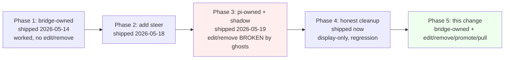
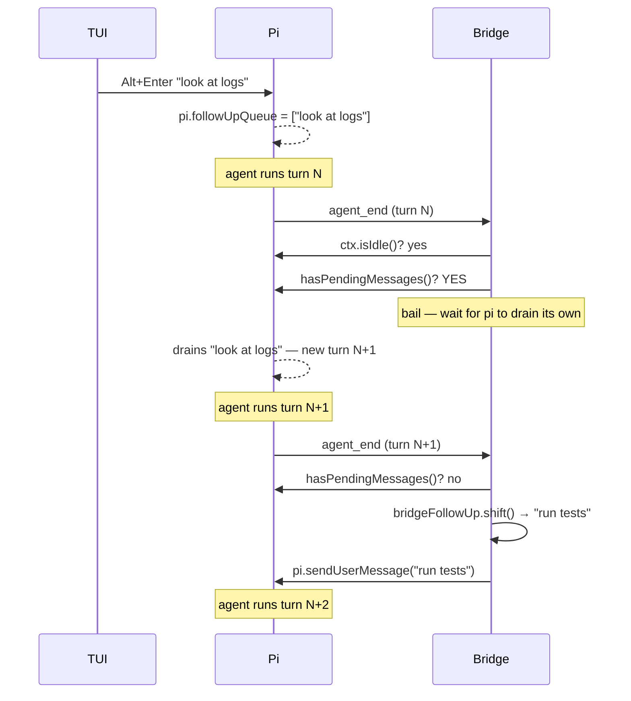

# Design — bridge-owned-followup-queue

## Goal

Give dashboard follow-up queue real edit/remove/promote/pull-to-editor affordances by reviving Phase 1's architecture (bridge owns the buffer; pi never sees it until drain), now layered on top of the cleanup from `honest-mid-turn-queue-surface`. Steer stays pi-owned + display-only.

## Context — why we landed here



Phase 3 was the wrong direction. Phase 3 assumed pi would expose queue mutation to extensions. Pi never did and never will (verified through 0.76.0). This change synthesizes Phase 1 (working architecture) + Phase 2 (steer visibility) + adds Phase 3's missing affordances on top of Phase 1's bridge-owned model where they're trivially safe.

## Decisions

### D1. Bridge holds the follow-up queue; pi never sees dashboard follow-ups until drain

**Decision**: When `command-handler.ts`'s `sessionPrompt` arm receives `delivery === "followUp"` while `getBridgeState().isAgentStreaming === true`, the bridge SHALL push the text into `bridgeFollowUp: string[]` and emit `queue_update`. It SHALL NOT call `pi.sendUserMessage(text, { deliverAs: "followUp" })`. When `isAgentStreaming === false` (idle), the bridge SHALL skip the buffer and call `pi.sendUserMessage(text)` directly — fresh-turn semantics, identical to today.

**Why**: pi's ExtensionAPI exposes no queue mutation. The only way to give users edit/remove/promote without ghost duplicates is to keep the queue local. Phase 1 already proved this works.

**Trade-off**: TUI users won't see dashboard-queued follow-ups in TUI's footer (pi doesn't have them). Symmetric: dashboard already doesn't see TUI-queued follow-ups (today's shadow model is TUI-blind for the ADD side). Net: both surfaces show their own queue, neither shows the other. Acceptable per user direction.

### D2. Drain loop runs on `agent_end`, with pop-before-send + idle gate + one-per-tick

**Decision**: A new `drainFollowupQueue()` function subscribes to pi's `agent_end` event. Body:

```ts
async function drainFollowupQueue(): Promise<void> {
  // Pre-flight gates — any failure: bail, retry on next agent_end.
  if (!ctx.isIdle()) return;
  if (typeof pi.hasPendingMessages === "function" && pi.hasPendingMessages()) return;
  if (bridgeFollowUp.length === 0) return;

  // STEP 1 — POP FIRST. Once shifted, the entry exists only on this stack frame.
  //          If anything throws below, the entry is GONE. By design.
  const entry = bridgeFollowUp.shift()!;

  // STEP 2 — Emit queue_update immediately so the wire reflects the pop BEFORE
  //          the pi call. UI updates first; pi call is fire-and-forget.
  emitQueueUpdate();

  // STEP 3 — Hand to pi. Fresh turn (no deliverAs); pi runs as a normal user prompt.
  try {
    (pi.sendUserMessage as any)(entry);
  } catch (err) {
    console.warn("[dashboard] drainFollowupQueue: pi.sendUserMessage threw — entry lost:", err);
    // INTENTIONAL no re-push. User accepted the trade.
  }

  // STEP 4 — One entry per agent_end. Pi is busy now; the next agent_end will
  //          re-call us for the next entry. Natural serialization.
}
```

**Why this exact shape**:

- **Idle gate** at top: `agent_end` can fire spuriously (multiple subscribers, retry chains). Without the gate we'd drain into a busy pi → undefined behavior.
- **TUI coexistence** via `pi.hasPendingMessages()`: TUI may have queued follow-ups in pi's real queue. Let pi drain those first (it does so naturally between turns). Bridge waits its turn. Avoids interleaving with pi's own queue drain.
- **Pop FIRST, then emit, then send**: matches the user's "always clear the bridge when it sends to pi" safety invariant. State machine is:
  - Before: `[a, b, c]` in bridge, `_` in pi.
  - During step 1: `[b, c]` in bridge, `a` on call stack.
  - During step 3: `[b, c]` in bridge, pi receives `a`.
  - After: `[b, c]` in bridge, pi running `a` as fresh turn.
  - At no point does ANY state claim `a` is both in bridge AND in pi.
- **One-per-agent_end**: lets pi's normal lifecycle serialize the drain. Avoids racing N sendUserMessage calls when pi is mid-spin-up of the first one.
- **Catch + drop**: re-queueing on pi error would create a double-send risk if the exception fires after pi already accepted the message internally but before we got our response. Better to drop than double-ship.

### D3. Mutation handlers (edit / remove / promote / clear / pull) mutate the bridge buffer, never call pi

**Decision**: All five mutation messages SHALL be handled by manipulating `bridgeFollowUp` directly + emitting `queue_update`. No `pi.sendUserMessage`, no `pi.clear*Queue`, no anything-on-pi. The bridge owns the data; mutation is trivial.

```ts
// bridge handlers (sketch):

case "edit_followup_entry": {
  const { index, text } = msg;
  if (index < 0 || index >= bridgeFollowUp.length) {
    emit({ command: "edit_followup_entry", status: "error", message: "Index out of range" });
    return;
  }
  bridgeFollowUp[index] = text;
  emitQueueUpdate();
  return;
}

case "remove_followup_entry": {
  const { index } = msg;
  if (index < 0 || index >= bridgeFollowUp.length) { /* error */ return; }
  bridgeFollowUp.splice(index, 1);
  emitQueueUpdate();
  return;
}

case "promote_followup_entry": {
  const { index } = msg;
  if (index <= 0 || index >= bridgeFollowUp.length) return;  // no-op for 0 or invalid
  const [entry] = bridgeFollowUp.splice(index, 1);
  bridgeFollowUp.unshift(entry);
  emitQueueUpdate();
  return;
}

case "clear_followup_entries": {
  if (msg.indices === "all") {
    if (bridgeFollowUp.length > 0) {
      bridgeFollowUp = [];
      emitQueueUpdate();
    }
  } else {
    // sort descending so splice doesn't shift indices we haven't visited
    const sorted = [...msg.indices].sort((a, b) => b - a);
    for (const i of sorted) {
      if (i >= 0 && i < bridgeFollowUp.length) bridgeFollowUp.splice(i, 1);
    }
    emitQueueUpdate();
  }
  return;
}

case "pull_followup_to_editor": {
  const { index } = msg;
  if (index < 0 || index >= bridgeFollowUp.length) return;
  const [entry] = bridgeFollowUp.splice(index, 1);
  emitQueueUpdate();
  // Round-trip back through the server to the originating client
  connection.send({ type: "followup_pulled", sessionId, text: entry });
  return;
}
```

**Why a single `clear_followup_entries` rather than reviving the old `clear_followup_slot`**: the deleted name had `slot` semantics (capacity-1 lie). The new name accurately covers both selective and bulk clear, with `indices: number[] | "all"` as the discriminant. Lets the UI's "Clear all" button reuse the same wire type as future per-multi-select clears.

### D4. Pull-to-editor is the ONLY path that combines remove + draft hydrate

**Decision**: `pull_followup_to_editor { index }` is the dedicated wire message for "I want this entry back in my editor." Bridge splices the entry, emits `queue_update`, sends `followup_pulled { sessionId, text }` over the wire. Client reducer hydrates `setDraftForSelected`.

**Why not just splice client-side after sending `remove_followup_entry`?**: race condition. The client doesn't have the text after `remove_followup_entry` fires; it would need to capture the text at click-time and shove it into the draft regardless of whether the server processed the remove. If the remove fails (session not found, etc.), the client has put text in the draft and assumed the entry is gone — UI lies.

The round-trip ensures: `followup_pulled` is the bridge's CONFIRMATION that the entry was removed AND tells the client what text to hydrate. If the remove silently fails (session missing), no `followup_pulled` fires, draft stays unchanged. Atomic.

**Why not piggyback on the Stop button** (the deleted `wrappedHandleAbort` yank-to-draft)?: Stop applies to the whole session and was the wrong granularity. Pull-to-editor is per-entry: "I want THIS one back." Stop stays bare-abort.

### D5. Steer queue is untouched (display-only, pi-owned, inline ghost bubbles)

**Decision**: This change does NOT add edit/remove/promote/pull on steer. The steer queue stays as today: pi owns it, bridge shadow tracks it via `recordSteerSent` + drain-by-matcher, `ChatView` renders inline ghost bubbles, no buttons.

**Why**: steer drains every 1-15 seconds (every `turn_end`). The window in which a user could meaningfully cancel/edit a steer is too short to justify the UI surface. Phase 1 didn't have steer at all; Phase 3 added a steer ✕ that was always a no-op (deleted in the prior change). Pi-TUI also has no per-steer edit. Skipping this matches both pi-TUI and Phase 1 reality.

If a future user demand justifies it, a separate change can either (a) move steer to bridge-owned too, or (b) wait for upstream pi to expose `clearSteeringQueue`. Out of scope here.

### D6. Bridge buffer is in-memory only — does NOT persist across reload

**Decision**: `bridgeFollowUp` lives in the bridge's per-session closure. On `/reload`, dashboard restart, pi crash, or any other bridge process restart, the buffer is empty on next initialization. The user re-types if they want.

**Why**: persistence requires a serialization format, a storage location, and recovery semantics. Phase 1 explicitly chose in-memory only as the simpler trade. Pi's real queue is also in-memory only — same semantics, same loss surface.

**Mitigation**: `/reload` is rare. Most users won't hit this. The QueuePanel's "Clear all" gives users explicit control; lack of automatic persistence is symmetric with pi's own queue behavior.

### D7. Drain order vs pi's own queue at `agent_end`

**Decision**: When `agent_end` fires, the bridge's drain loop checks `pi.hasPendingMessages()` first. If TRUE, the bridge bails — pi will drain its own queue (TUI items) and emit a subsequent `agent_end`. On that subsequent `agent_end`, `hasPendingMessages()` returns FALSE, and the bridge proceeds.



**Why**: pi's natural queue drain happens via its own internal continuation flow — it's atomic with the turn boundary. If the bridge raced its own send into the same window, pi might enqueue it into its now-non-empty queue (becoming a queued-after-drain item instead of a fresh turn), or interleave unpredictably with pi's own continuation. The hasPendingMessages guard avoids this entirely.

### D8. Optimistic vs canonical chip — no optimistic chips

**Decision**: When the user types Alt+Enter, the client sends `send_prompt { delivery: "followUp" }`. The client does NOT optimistically add to its local `pendingQueues.followUp`. The chip appears only after the bridge's `queue_update` round-trip.

**Why**: prior changes (Phase 3) already settled on "no optimistic chip, server cache is canonical." We inherit that decision. The latency from Alt+Enter → chip is <50ms on local WS; users perceive it as instant.

If users complain about perceived lag, a future change can add an optimistic-then-reconcile layer. Out of scope here.

## Risks

### R1 — bridge crash with non-empty buffer loses queued items

Already documented in Phase 1. User can re-type. Same risk surface as pi's own queue.

### R2 — race: user clicks ✕ during drain

Sequence: bridge starts drainFollowupQueue, pops entry, emits queue_update with shorter list. Client clicks ✕ on what it thought was index 0 but is now index -1.

Mitigation: bridge handlers validate `index >= 0 && index < bridgeFollowUp.length`. Stale clicks are silently dropped + `command_feedback` event tells the client. Worst case: user clicks ✕, nothing happens visibly because the entry is already gone. Tolerable.

### R3 — pi.sendUserMessage throws synchronously after our pop

Entry is lost (per pop-before-send invariant). User must re-type. Logged warning is the only trace.

Possible: extend the warning to be a `command_feedback` event the client surfaces as a toast: "Queued message lost on drain: '<truncated>'. Re-send?"

Defer to follow-up if telemetry shows this happens.

### R4 — agent_end fires multiple times in a row (subagent / retry / compaction)

Each fire calls `drainFollowupQueue`. Idle gate + hasPendingMessages gate handle most cases. One residual: between `ctx.isIdle()` returning true and `pi.sendUserMessage` actually starting the new turn, another `agent_end` could fire. If we're already mid-drain (in our `try` block), the second drain would race.

Mitigation: simple boolean lock — `isDraining: boolean`. Set true at start of `drainFollowupQueue`, false at end (including finally clause). Re-entrant calls return early.

```ts
let isDraining = false;
async function drainFollowupQueue() {
  if (isDraining) return;
  isDraining = true;
  try {
    // ... existing logic ...
  } finally {
    isDraining = false;
  }
}
```

### R5 — `recordFollowupSent` semantic flip

The old shadow recorded what pi RECEIVED. The new buffer records what pi WILL receive (eventually). Anyone reading the function name might be confused.

Mitigation: rename to `bufferFollowupSend` AND update all 3 call sites + the test mocks. Single PR-wide rename. Documented in the spec delta.

### R6 — reconnect during drain

If the bridge connection drops while `bridgeFollowUp = [a, b]` and we just popped `a` and are about to send it, the new connection won't get the post-pop `queue_update` until we replay. Race-tolerant: on reconnect, the bridge re-emits the current snapshot. If the send to pi succeeded, `a` is now in pi (will appear in chat). If the send threw, `a` is lost. Either way the post-reconnect state is honest.

## Out of scope

- Steer mutation (edit/remove/promote on steer entries). Drains too fast to matter. Future change can revisit.
- Persistence of `bridgeFollowUp` across reload. Phase 1 trade. Future change can add `~/.pi/dashboard/queue-checkpoint.json`-style storage if telemetry warrants.
- TUI showing dashboard-queued follow-ups. Requires upstream pi PR to support cross-actor queue introspection. Out of reach.
- Multi-select clear in the UI. Wire message supports `indices: number[]`; UI v1 ships with bulk "Clear all" only. Multi-select per-entry checkboxes can come later without protocol change.
- Image attachments in queued follow-ups. Phase 1 covered text-only chips with images carrying through invisibly. We preserve that — `images` carried in the wire, not rendered in the chip, sent to pi on drain.
- "Pull all to editor" multi-entry pull. Single-entry pull only. User who wants multiple should pull repeatedly (each yields a `\n\n`-joined append via the reducer logic). Documented in the spec.
