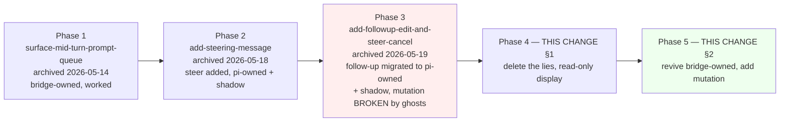
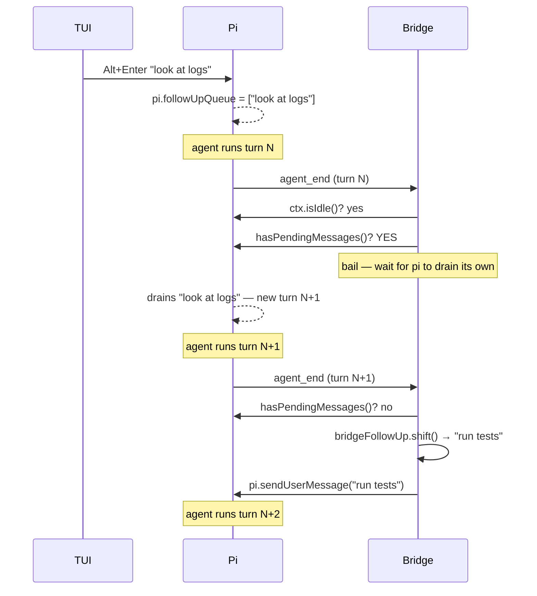

# Design — rework-mid-turn-prompt-queue

## Goal

End the multi-phase ghost-factory saga of `mid-turn-prompt-queue` by:

1. Locking in the deletion of broken Phase-3 pi-mutation surface (§1, already in WC).
2. Reviving Phase-1's bridge-owned follow-up architecture (§2, to build).
3. Layering per-entry edit/remove/promote/pull-to-editor on top of the bridge-owned buffer, where they are trivially safe.
4. Documenting steer-on-bridge as a permanent NO.

## Phase history



Phase 3 was the wrong direction. Phase 3 assumed pi would expose queue mutation to extensions. Pi never did and never will (verified through 0.76.0). This change synthesizes:

- **Phase 1's architecture** for follow-up (bridge owns the buffer, never forwards to pi until drain).
- **Phase 2's steer visibility** (steer still pi-owned + display-only; never bridge-owned, see D5).
- **Phase 3's affordances** (edit/remove/promote) on top of Phase 1's bridge-owned model — where they're trivially safe.
- **One new affordance**: pull-to-editor (per-entry "give me this entry back as draft text"). Replaces the deleted yank-to-draft-on-Stop behavior.

## What pi actually exposes at 0.76.0 (verified)

Source-checked against `node_modules/@earendil-works/pi-coding-agent@0.76.0` at the dashboard's install path. The relevant `.d.ts` files are `dist/core/extensions/types.d.ts` and `node_modules/@earendil-works/pi-agent-core/dist/agent.d.ts`.

### On the `pi` ExtensionAPI handed to extensions (verified `extensions/types.d.ts:1076-1099`)

| Method | Status | Use in this change |
|---|---|---|
| `pi.sendUserMessage(content, {deliverAs?: "steer"\|"followUp"})` | ✅ exposed | Used in two places: (a) command-handler idle path — direct send, fresh turn; (b) drain loop — single send per `agent_end`, no `deliverAs`. |
| `pi.abort()` (also `ctx.abort()`) | ✅ exposed | Stop button. Does NOT touch queues (verified `Agent.abort()` source). |
| `pi.hasPendingMessages()` | ✅ exposed at 0.76.0 | TUI-coexistence gate in the drain loop. Returns true when pi's real queue has items (TUI-sent). |
| `pi.clearSteeringQueue` | ❌ NOT exposed | Never called. |
| `pi.clearFollowUpQueue` | ❌ NOT exposed | Never called. |
| `pi.clearAllQueues` | ❌ NOT exposed | Never called. |
| `pi.getSteeringMessages` / `getFollowUpMessages` | ❌ NOT exposed | Bridge maintains its own buffer + shadow; no introspection of pi's queue. |
| `ctx.sessionManager` for queues | ❌ none | `SessionManager` has session-CRUD only. |

### Inside pi-coding-agent (NOT reachable from extensions)

Verified `pi-agent-core/dist/agent.d.ts:84-88`: `clearSteeringQueue()`, `clearFollowUpQueue()`, `clearAllQueues()` exist on the inner `Agent` class. The wall between Agent-internals and the ExtensionAPI is the entire reason this change exists.

## Decisions

### D1. Bridge holds the follow-up queue; pi never sees dashboard follow-ups until drain

**Decision.** When `command-handler.ts`'s `sessionPrompt` arm receives `delivery === "followUp"` with `getBridgeState().isAgentStreaming === true`, the bridge SHALL push the text into `bridgeFollowUp: string[]` and emit `queue_update`. It SHALL NOT call `pi.sendUserMessage(text, { deliverAs: "followUp" })`. When idle, the bridge SHALL skip the buffer and call `pi.sendUserMessage(text)` directly — fresh-turn semantics, identical to today.

**Why.** Pi's ExtensionAPI exposes no queue mutation. The only way to give users edit/remove/promote without ghost duplicates is to keep the queue local. Phase 1 already proved this works.

**Trade-off.** TUI users won't see dashboard-queued follow-ups in TUI's footer (pi has no knowledge of them). Symmetric: dashboard already doesn't see TUI-queued follow-ups via the ADD side (the shadow only recorded what the bridge itself sent). Net: each surface shows its own queue, neither shows the other. Acceptable per user direction.

### D2. Drain loop runs on `agent_end`, with pop-before-send + idle gate + TUI gate + one-per-tick + re-entrancy lock

**Decision.** A new `drainFollowupQueue()` function subscribes to pi's `agent_end` event. Body:

```ts
let isDraining = false;

async function drainFollowupQueue(): Promise<void> {
  if (isDraining) return;
  isDraining = true;
  try {
    if (!ctx.isIdle()) return;
    if (typeof pi.hasPendingMessages === "function" && pi.hasPendingMessages()) return;
    if (bridgeFollowUp.length === 0) return;

    // STEP 1 — POP FIRST. Once shifted, the entry exists only on this stack frame.
    //          If anything throws below, the entry is GONE. By design.
    const entry = bridgeFollowUp.shift()!;

    // STEP 2 — Emit queue_update immediately so wire reflects the pop
    //          BEFORE the pi call. UI updates first.
    emitQueueUpdate();

    // STEP 3 — Hand to pi. Fresh turn (no deliverAs); pi runs as a normal user prompt.
    try {
      (pi.sendUserMessage as any)(entry);
    } catch (err) {
      console.warn("[dashboard] drainFollowupQueue: pi.sendUserMessage threw — entry lost:", err);
      // INTENTIONAL no re-push. User accepted the trade.
    }

    // STEP 4 — One entry per agent_end. Pi is busy now; the next agent_end
    //          will re-call us for the next entry. Natural serialization.
  } finally {
    isDraining = false;
  }
}
```

Subscribe via `queueMicrotask(drainFollowupQueue)` from the existing `agent_end` arm so retry-tracker / usage-limit-orderer run first.

**Why this exact shape.**

- **Re-entrancy lock first**: `agent_end` can fire multiple times in quick succession (subagent / retry / compaction). Without the lock, two synchronous fires could both pass the gates, both shift, both call `sendUserMessage`. The lock guarantees a single drain frame per `agent_end`.
- **Idle gate**: spurious `agent_end` can fire mid-subagent-end. Without the gate we'd drain into a busy pi → undefined behavior.
- **TUI coexistence gate** via `pi.hasPendingMessages()` (now exposed at 0.76.0): TUI may have queued follow-ups in pi's real queue. Let pi drain those first; bridge waits its turn. Avoids interleaving with pi's natural queue drain.
- **Pop FIRST, then emit, then send**: this is the user-requested safety invariant. State machine:
  - Before: `[a, b, c]` in bridge, `_` in pi.
  - During step 1: `[b, c]` in bridge, `a` on call stack.
  - During step 3: `[b, c]` in bridge, pi receives `a`.
  - After: `[b, c]` in bridge, pi running `a` as fresh turn.
  - At no point does ANY state claim `a` is both in bridge AND in pi.
- **One-per-agent_end**: pi's own lifecycle serializes the drain. Avoids racing N sendUserMessage calls when pi is mid-spin-up of the first one.
- **Catch + drop**: re-queueing on pi error would risk a double-send if the exception fires after pi already accepted the message internally but before we got our response. Better to drop than double-ship.

### D3. Mutation handlers mutate `bridgeFollowUp` only — never call pi

**Decision.** Each of `edit_followup_entry`, `remove_followup_entry`, `promote_followup_entry`, `clear_followup_entries` SHALL be handled by manipulating `bridgeFollowUp` directly + emitting `queue_update`. No `pi.sendUserMessage`, no `pi.clear*Queue`, no any-pi-method. The bridge owns the data; mutation is trivial.

```ts
// bridge handlers (full sketch):

case "edit_followup_entry": {
  const { index, text } = msg;
  if (index < 0 || index >= bridgeFollowUp.length) {
    emit({ command: "edit_followup_entry", status: "error", message: "Index out of range" });
    return;
  }
  bridgeFollowUp[index] = text;
  emitQueueUpdate();
  return;
}

case "remove_followup_entry": {
  const { index } = msg;
  if (index < 0 || index >= bridgeFollowUp.length) { emit(error); return; }
  bridgeFollowUp.splice(index, 1);
  emitQueueUpdate();
  return;
}

case "promote_followup_entry": {
  const { index } = msg;
  if (index <= 0 || index >= bridgeFollowUp.length) return;  // no-op for 0 or invalid; no emit
  const [entry] = bridgeFollowUp.splice(index, 1);
  bridgeFollowUp.unshift(entry);
  emitQueueUpdate();
  return;
}

case "clear_followup_entries": {
  if (msg.indices === "all") {
    if (bridgeFollowUp.length > 0) {
      bridgeFollowUp = [];
      emitQueueUpdate();
    }
  } else {
    const sorted = [...msg.indices].sort((a, b) => b - a); // descending to avoid shift drift
    for (const i of sorted) {
      if (i >= 0 && i < bridgeFollowUp.length) bridgeFollowUp.splice(i, 1);
    }
    emitQueueUpdate();
  }
  return;
}

case "pull_followup_to_editor": {
  const { index } = msg;
  if (index < 0 || index >= bridgeFollowUp.length) { emit(error); return; }
  const [entry] = bridgeFollowUp.splice(index, 1);
  emitQueueUpdate();
  connection.send({ type: "followup_pulled", sessionId, text: entry });
  return;
}
```

**Why `clear_followup_entries` not `clear_followup_slot`.** The deleted `_slot` name baked in capacity-1 lie semantics. The new name accurately covers selective (`indices: number[]`) + bulk-clear (`indices: "all"`) via a single discriminant.

### D4. Pull-to-editor is the ONLY path that combines remove + draft-hydrate

**Decision.** `pull_followup_to_editor { sessionId, index }` is the dedicated wire message. Bridge splices the entry, emits `queue_update`, sends `followup_pulled { sessionId, text }` over the wire. Client reducer hydrates `setDraftForSession`.

**Why not just splice client-side after `remove_followup_entry`.** Race condition. The client doesn't have the text after `remove_followup_entry` fires; it would need to capture text at click-time and force it into the draft regardless of whether the server processed the remove. If the remove silently fails (session missing), the client has put text in the draft and assumed the entry is gone → UI lies.

The round-trip ensures: `followup_pulled` is the bridge's CONFIRMATION that the entry was removed AND tells the client what text to hydrate. If the remove silently fails, no `followup_pulled` fires; draft stays unchanged. Atomic.

**Why not piggyback on Stop button (the deleted `wrappedHandleAbort` yank-to-draft).** Stop applies to the whole session and was the wrong granularity. Pull-to-editor is per-entry: "I want THIS one back." Stop stays bare-abort.

### D5. Steer queue is PERMANENTLY pi-owned + display-only (HARD NO on bridge-owned-steer)

**Decision.** This change does NOT add any mutation surface for steer. The steer queue stays as today: pi owns it, bridge shadow tracks via `recordSteerSent` + drain-by-`message_start`-matcher, `ChatView.tsx:506-558` renders inline ghost bubbles, no buttons.

This change ALSO does not track a future "bridge-owned-steer" change as a TODO. The decision is permanent.

**Why permanent.** Steer drains every 1-15 seconds at every `turn_end`. The window in which a user could meaningfully cancel/edit a steer entry is too short to justify the UI surface. Pi-TUI also has no per-steer edit. Phase 1 didn't have steer at all; Phase 3's steer-cancel button (deleted in §1) was always a no-op on pi anyway. Per user direction: "steer will never live on bridge: too fast for that."

If a future change disproves this (e.g. via demand for "pause this steer for 30 seconds then send" semantics), it will need its own proposal grounded in actual user telemetry; not a placeholder TODO.

### D6. Bridge buffer is in-memory only — does NOT persist across reload

**Decision.** `bridgeFollowUp` lives in the bridge's per-session closure. On `/reload`, dashboard restart, pi crash, or any other bridge process restart, the buffer initializes empty. The user re-types if they want.

**Why.** Persistence requires serialization format, storage location, recovery semantics, conflict handling. Phase 1 explicitly chose in-memory only as the simpler trade. Pi's real queue is also in-memory — same semantics, same loss surface.

**Mitigation.** `/reload` is rare. Most users won't hit it. The "Clear all" affordance gives users explicit control; lack of automatic persistence is symmetric with pi's own queue behavior.

### D7. Drain order vs pi's own queue at `agent_end`

**Decision.** When `agent_end` fires, the drain loop checks `pi.hasPendingMessages()` first. If TRUE, the bridge bails — pi will drain its own queue (TUI items) and emit a subsequent `agent_end`. On that subsequent `agent_end`, `hasPendingMessages()` returns FALSE, and the bridge proceeds.



**Why.** Pi's natural queue drain happens via its own internal continuation flow — atomic with the turn boundary. If the bridge raced its own send into the same window, pi might enqueue it into its now-non-empty queue (becoming a queued-after-drain item instead of a fresh turn), or interleave unpredictably with pi's own continuation. The `hasPendingMessages` guard avoids this entirely.

### D8. No optimistic chip on the client — server cache is canonical

**Decision.** Alt+Enter sends `send_prompt { delivery: "followUp" }`. The client does NOT optimistically add to `pendingQueues.followUp`. The chip appears only after the bridge's `queue_update` round-trip.

**Why.** Prior phases settled on "server cache is canonical". We inherit. Latency from Alt+Enter → chip is <50 ms on local WS; users perceive it as instant. If telemetry later shows perceived lag, a future change can add an optimistic-then-reconcile layer — out of scope here.

### D9. Drain-by-`message_start`-matcher: keep, document

**Decision.** Keep the existing drain-by-matcher in `bridge.ts:1097` (region around `extractUserMessageText` + the splice). After this change it has reduced reason-to-fire for follow-up entries (since dashboard-buffered follow-ups never enter pi's queue), but it remains necessary for:

- Steer entries (which still flow through `pi.sendUserMessage(_, {deliverAs:"steer"})` → pi's steerQueue → `message_start`).
- TUI-queued follow-ups that drain through pi's natural queue and emit `message_start`. The matcher tries to splice from `bridgeFollowUp` but the entry isn't there, so `indexOf` returns -1 and the splice is a no-op. Harmless.
- Future-proofing: any code path that calls `pi.sendUserMessage(_, {deliverAs:"followUp"})` directly (none exist in our codebase after §2) would still produce correctly-tracked entries.

**Why not delete.** It's defense-in-depth. Cost is one `indexOf` per `message_start`. Document the new "harmless no-op on TUI follow-ups" branch.

## Risks

### R1 — Bridge crash with non-empty buffer loses queued items

Already documented in Phase 1 + D6. User can re-type. Same risk surface as pi's own queue. Acceptable.

### R2 — Stale-click race during drain

Bridge starts drainFollowupQueue, pops entry, emits queue_update with shorter list. Client clicks ✕ on what it thought was index 0 but is now index -1 (because shift happened).

Mitigation: bridge handlers validate `index >= 0 && index < bridgeFollowUp.length`. Stale clicks are silently dropped + `command_feedback { status: "error", message: "Index out of range" }` tells the client. Worst case: user clicks ✕, nothing happens visibly because the entry is already gone. Tolerable.

**Alternative considered**: id-based mutation (like Phase 1's `PendingPrompt {id, text}`). Pros: stale-click-safe (id doesn't change when buffer shifts). Cons: requires bridge to mint + track ids, requires UI to read ids instead of indices, requires extra plumbing for `pull_followup_to_editor` (id→text lookup at splice time). Rejected for v1 of this change — index-based with validation is simpler and the failure mode is benign.

### R3 — pi.sendUserMessage throws synchronously after our pop

Entry is lost (per pop-before-send invariant). User must re-type. Logged warning is the only trace.

Possible future enhancement: extend the warning to a `command_feedback` event the client surfaces as a toast — "Queued message lost on drain: '<truncated>'. Re-send?" Defer to follow-up if telemetry shows this happens.

### R4 — `agent_end` fires multiple times in a row

Re-entrancy lock (D2 step 1) handles synchronous re-entry. For async re-entry (microtask queueMicrotask gap), the lock still holds because we only clear it in `finally`, and the awaited `pi.sendUserMessage` is wrapped in try/catch inside the lock.

### R5 — `recordFollowupSent` → `bufferFollowupSend` rename + semantic flip

The old function records what pi RECEIVED. The new function records what pi WILL receive (eventually). Anyone reading the function name might be confused.

Mitigation: rename to `bufferFollowupSend` AND update all call sites in one atomic edit. Document the flip in the function's JSDoc and in `docs/file-index-extension.md`. The rename + caller-site change must land in the SAME commit; intermediate state would have double-push (caller pushes via new function name, then the now-shadow-semantics push happens too).

### R6 — Reconnect during drain

If the WS connection drops while `bridgeFollowUp = [a, b]` and we just popped `a` and are about to send it, the new connection won't get the post-pop `queue_update` until we replay. Race-tolerant: on reconnect, the bridge re-emits the current snapshot. If the send to pi succeeded, `a` is now in pi (will appear in chat). If the send threw, `a` is lost. Either way the post-reconnect state is honest.

### R7 — Drain-matcher false splice for TUI-queued follow-ups

The existing matcher at `bridge.ts:1097` looks up incoming `message_start` text in `bridgeFollowUp` and splices on hit. For TUI-queued follow-ups, the text is NOT in `bridgeFollowUp`, so `indexOf` returns -1 and the splice is a no-op. Safe.

But: if a user happens to type the SAME text on dashboard (buffered in `bridgeFollowUp`) and on TUI (in pi's queue), and pi drains the TUI one first, the matcher could spuriously splice the bridge's pending entry on the TUI's `message_start`. The dashboard would then have its entry "vanish" without being sent.

Mitigation: this is a corner case (same exact text from two surfaces in the same turn). Accept and document. A future change could disambiguate via nonce, but cost > benefit.

## Out of scope

- **Bridge-owned steer.** Permanent NO (D5). Steer drains too fast for mutation UI to matter.
- **Persistence of `bridgeFollowUp` across reload.** Phase 1 trade (D6). Future change can add `~/.pi/dashboard/queue-checkpoint.json`-style storage if telemetry warrants.
- **TUI showing dashboard-queued follow-ups.** Requires upstream pi PR for cross-actor queue introspection. Out of reach.
- **Multi-select clear UI.** Wire message supports `indices: number[]`; UI v1 ships with bulk "Clear all" only. Multi-select per-entry checkboxes can come later without protocol change.
- **Image attachments in queued follow-ups.** Phase 1 covered text-only chips with images carrying through invisibly. Preserve: `images` carried in the `edit_followup_entry` wire shape (optional), not rendered in the chip, sent to pi on drain.
- **"Pull all to editor" multi-entry pull.** Single-entry pull only. User who wants multiple should pull repeatedly (each yields a `\n\n`-joined append via the reducer logic).
- **Re-introducing `pi.clearFollowUpQueue` as an optimization once upstream exposes it.** Bridge-owned model is correct without it. Worth nothing.
- **Optimistic chip on send.** D8. Server cache stays canonical.
