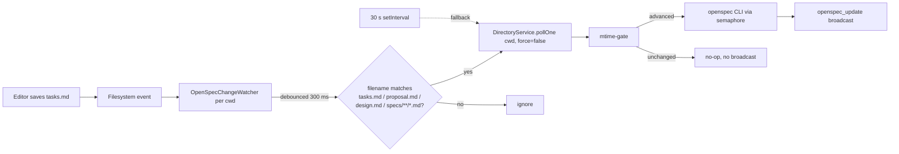

# Design

## Considered alternatives

| Option | Pros | Cons | Decision |
|---|---|---|---|
| **A. Lower `pollIntervalSeconds` default to 5 s** | One-line change | Reintroduces CPU burst (Node-startup × N changes × cwds) — exactly what `optimize-openspec-poll-burst` set out to kill. mtime-gate skips spawns but still does N stat calls + timer fanout every 5 s. | Reject. |
| **B. Adaptive poll: 2 s when viewed, 30 s otherwise** | No new fs.watch surface. Reuses `viewedSessionTracker`. | Still polls (CPU). "Viewed" is a session concept, edits happen across many cwds. Worst-case still ~2 s, not ≤ 1 s. Two cadences = two race conditions. | Reject. |
| **C. fs.watch per cwd, debounced, calls existing `pollOne(cwd, false)`** | Push-on-edit (≤ 1 s p95). Reuses existing mtime-gate + semaphore + broadcast. No CPU when idle. Node 22 recursive watch works on all 3 platforms. Periodic poll stays as fallback. | One descriptor per known cwd (small N). EMFILE possible on huge monorepos — handled by silent degrade to poll. Network FS may miss events — same fallback. | **Accept.** |
| **D. inotify / chokidar dependency** | Battle-tested. | New dep. Node 22's built-in `fs.watch({recursive:true})` is sufficient. | Reject. |

## Architecture



The watcher is a **trigger**. All gating, dedup, concurrency, and broadcast logic stays in `DirectoryService`. The mtime-gate is the canonical "did something actually change" check — a duplicate fs.watch event after the same edit is naturally absorbed.

## Module: `OpenSpecChangeWatcher`

`packages/server/src/openspec-change-watcher.ts`

```ts
export interface OpenSpecChangeWatcher {
  attach(cwd: string): void;
  detach(cwd: string): void;
  detachAll(): void;
}

export interface OpenSpecChangeWatcherDeps {
  onChange: (cwd: string) => void; // calls DirectoryService.pollOne(cwd, false)
  debounceMs?: number;             // default 300
  logger?: (msg: string) => void;  // DEBUG-gated
}

export function createOpenSpecChangeWatcher(
  deps: OpenSpecChangeWatcherDeps
): OpenSpecChangeWatcher;
```

Behavior:

1. `attach(cwd)`:
   - Compute `watchRoot = join(cwd, "openspec", "changes")`.
   - If watcher already attached for this cwd → no-op.
   - `fs.watch(watchRoot, { recursive: true, persistent: false })` wrapped in try/catch.
     - On ENOENT (no `openspec/changes/` yet): record cwd as "deferred"; retry on next `attach()` call. No background polling — the periodic OpenSpec poll already covers this case.
     - On EMFILE / other watcher errors: log once, mark cwd as "degraded"; do not retry. Periodic poll covers correctness.
   - Watcher event handler:
     - Filename filter: `tasks.md`, `proposal.md`, `design.md`, or `*.md` under any `specs/` subtree.
     - On match: reset/start per-cwd debounce timer (300 ms default).
     - On timer fire: call `deps.onChange(cwd)`.
2. `detach(cwd)`: closes watcher, clears debounce timer.
3. `detachAll()`: detaches every attached cwd. Called on graceful shutdown.

Filename filter regex (operates on the relative path the watcher event provides):

```
^(?:tasks\.md|proposal\.md|design\.md|specs(?:\/.*)?\.md)$
```

Edge cases:

- **Symlinked cwds**: rely on `safeRealpathSync` normalization already performed by `DirectoryService` upstream.
- **Watcher fires after detach (race)**: guard with `attached.has(cwd)` check inside the handler.
- **Many rapid edits (file format auto-save loop)**: debounce coalesces. Trailing-edge fire is what we want (poll after the *last* edit in the burst).
- **Rename / atomic write (editor saves via tmp + rename)**: fs.watch emits `rename` event with the same filename match → triggers poll. ✓

## Wiring in `DirectoryService`

- Inject `OpenSpecChangeWatcher` via constructor (optional, allows test stub).
- `onDirectoryAdded(cwd)` → after existing immediate-poll path, call `watcher.attach(cwd)`.
- `onDirectoryRemoved(cwd)` (or wherever a known cwd is forgotten — pinned-dir delete, session ending + no other cwds) → `watcher.detach(cwd)`.
- Server shutdown → `watcher.detachAll()`.

The existing `refreshOpenSpec(cwd)` REST/WS path (browser-clicked) is unchanged. The watcher path uses `pollOne(cwd, false)` — same as periodic — so mtime-gate semantics are preserved end-to-end.

## Performance & resource budget

- One `fs.watch` descriptor per known cwd. Typical dev workstation: 3–10 known cwds → 3–10 descriptors.
- Recursive watch on `openspec/changes/` is bounded by the change-folder fanout (typically < 50 dirs). Far below default `fs.inotify.max_user_watches`.
- No timers when idle (debounce only armed during an active edit burst).
- Watcher CPU on edit: one regex match + one `clearTimeout`/`setTimeout`. Negligible.

## Testing strategy (TDD)

1. **Unit: filename filter** — table-driven on the regex. Includes `tasks.md`, `proposal.md`, `design.md`, `specs/foo/spec.md`, and negative cases (`README.md`, `.openspec.yaml`, `specs/foo/bar.txt`).
2. **Unit: debounce** — fake timers; three rapid `onEvent` calls within 300 ms → exactly one `onChange` call after timer fires.
3. **Integration: real fs.watch** — tmp dir with `openspec/changes/foo/tasks.md`, attach watcher with a spy `onChange`, write to file, assert `onChange(cwd)` called within ≤ 1 s. Skip on CI platforms with known fs.watch flakiness if necessary (mark with `it.skipIf(...)`).
4. **Integration: missing `openspec/changes/` dir** — attach to a cwd without the dir, assert no throw, periodic poll path unaffected.
5. **Regression**: mtime-gate dedup still applies — back-to-back watcher fires for the same `tasks.md` mtime trigger only one CLI spawn (verified via spawn-counter mock).

## Rollout

- No config flag. Always-on. The watcher fails silently if the platform/FS can't support it — correctness is guaranteed by the existing periodic poll.
- No CHANGELOG entry user-visible beyond "OpenSpec task counter and stepper now update within 1 s of editing tasks.md."
