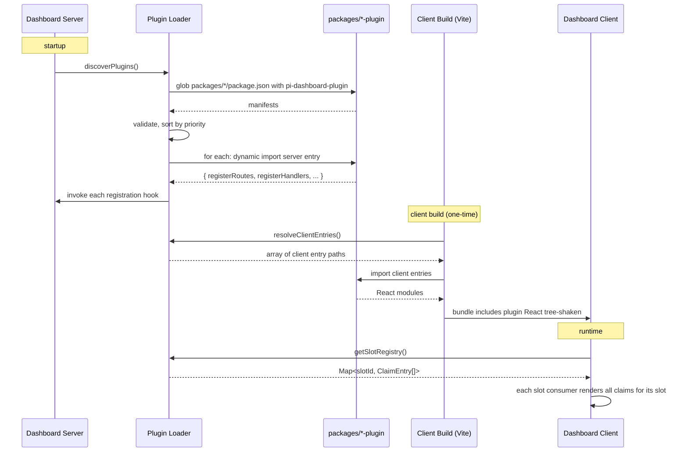

## Context

The dashboard's `App.tsx` is 1437 lines. Of those, a substantial portion is conditional rendering for OpenSpec and pi-flows-related views (`ArchiveBrowserView`, `SpecsBrowserView`, `OpenSpecPreview`, `FlowAgentDetail`, `FlowArchitectDetail`, `FlowDashboard`, `FlowArchitect`, `FlowSummary`, `FlowYamlPreview`). The session card has direct imports of `OpenSpecActivityBadge`, `FlowActivityBadge`, `SessionOpenSpecActions`, `SessionFlowActions`. The session list has `FolderOpenSpecSection`. Across the codebase, ~65 client+server files reference OpenSpec; ~12 client files reference Flow rendering.

Adding a new first-party concept (ragger, judo, custom RAG explorer, etc.) means editing the same `App.tsx` conditional, growing the same `SessionCard.tsx` import list, accreting more imports in `SessionList.tsx`. The dashboard is becoming a feature dump.

The companion proposal `extension-ui-system` introduced a descriptor protocol for *third-party* UI declaration. That handles "extension X wants a footer-segment showing live state" cleanly. It does *not* handle "OpenSpec wants its own full-screen content view with a file tree, syntax-highlighted diffs, optimistic task editing, and 409 conflict handling." Forcing that through descriptors would require either an enormous schema or losing fidelity.

The clean answer: **two tiers, one slot contract.**

### Current dashboard layout (scan results)

```
   App.tsx (1437 LOC)
   │
   ├─ Sidebar (SessionList)
   │   ├─ FolderOpenSpecSection         ← OPENSPEC: per-folder collapsible
   │   └─ SessionCard
   │       ├─ OpenSpecActivityBadge     ← OPENSPEC: badge in card
   │       ├─ FlowActivityBadge         ← FLOWS:    badge in card
   │       ├─ SessionOpenSpecActions    ← OPENSPEC: attach/detach action bar
   │       └─ SessionFlowActions        ← FLOWS:    flow launcher action bar
   │
   └─ Content area
       ├─ Conditional content (mutually exclusive):
       │   ├─ ArchiveBrowserView        ← OPENSPEC
       │   ├─ SpecsBrowserView          ← OPENSPEC
       │   ├─ OpenSpecPreview           ← OPENSPEC
       │   ├─ MarkdownPreviewView       ← OPENSPEC + others
       │   ├─ FlowYamlPreview           ← FLOWS
       │   ├─ FlowArchitectDetail       ← FLOWS
       │   ├─ FlowAgentDetail           ← FLOWS
       │   ├─ FileDiffView              ← session-scoped
       │   └─ ChatView                  ← default
       ├─ Sticky content header:
       │   ├─ FlowArchitect             ← FLOWS
       │   └─ FlowDashboard             ← FLOWS
       ├─ FlowSummary                   ← FLOWS: inline footer
       └─ TasksPopover                  ← OPENSPEC: anchored popover
```

## Goals / Non-Goals

**Goals**

- A single slot taxonomy that both first-party plugins (React) and third-party extensions (descriptors) target.
- A plugin loader that lets first-party plugins live as monorepo packages with their own server, client, and bridge contributions.
- Removal of OpenSpec and pi-flows knowledge from `App.tsx`, `SessionCard.tsx`, `SessionList.tsx`. The shell knows about *slots*; only plugins know about specific features.
- Plugins may be removed or replaced without modifying the shell. The dashboard works without OpenSpec or Flows plugins (degrades gracefully — those slots are simply empty).
- Build integration is automatic — adding a `pi-dashboard-plugin` manifest to a monorepo package is sufficient for it to be discovered, loaded, and bundled.

**Non-Goals**

- Webview-style sandboxing. First-party plugins are trusted; they live in the same repo and pass the same review.
- Hot plugin reload. Plugin changes require server restart and `npm run build` (same as today's client changes).
- Loading remote/third-party plugin packages from npm at runtime. First-party means co-located in this monorepo. Third-party UI extension stays descriptor-only via `extension-ui-system`.
- Replacing the descriptor protocol. `extension-ui-system` continues to handle third-party UI declaration unchanged.
- Migrating concrete features. OpenSpec and Flows extractions are separate changes (`extract-openspec-as-plugin`, `extract-flows-as-plugin`).

## The two-tier rendering model

```
   ┌────────────────────────────────────────────────────────────────┐
   │ Layer 3: Concrete contributors                                 │
   │   - openspec-plugin (first-party React + server)               │
   │   - flows-plugin   (first-party React)                         │
   │   - third-party extensions (descriptor-only via               │
   │     extension-ui-system probe)                                │
   └────────────────────────────────────────────────────────────────┘
        ▲                                ▲
        │ React component                │ descriptor (data only)
        │                                │
   ┌────────────────────────────────────────────────────────────────┐
   │ Layer 2: dashboard-shell-slots (the SLOTS contract)            │
   │   - frozen taxonomy of named regions                           │
   │   - each slot declares accepted payload type                   │
   │   - some slots accept React only; some accept React or         │
   │     descriptor; some accept descriptor only                    │
   └────────────────────────────────────────────────────────────────┘
        ▲                                ▲
        │ first-party plugin             │ third-party extension
        │ React registration             │ descriptor registration
        │                                │
   ┌──────────────────────────────────┐  ┌──────────────────────────┐
   │ Layer 1a: dashboard-plugin-      │  │ Layer 1b: extension-ui-   │
   │           loader                 │  │           system           │
   │   - manifest discovery           │  │   - ui:list-modules probe   │
   │   - package bundling             │  │   - ext_ui_decorator        │
   │   - slot React registration      │  │   - server cache + replay   │
   │   - server-side hooks            │  │   - namespace collision     │
   └──────────────────────────────────┘  └──────────────────────────┘
```

Two adapters into one slot contract. First-party plugins are trusted and rich (React, full app context); third-party extensions are sandboxed and constrained (descriptors, serializable data). Both fill the same regions; the shell doesn't care which.

## Slot taxonomy (frozen for v0.x)

Each slot has a fixed payload contract. Slots accept either React components (`R`), descriptors (`D`), or both (`R+D`).

| Slot id | Accepts | Multiplicity | Lifetime | Notes |
|---|---|---|---|---|
| `sidebar-folder-section` | R | many per folder | persistent | Collapsible block above session list per workspace |
| `session-card-badge` | R+D | many per session | persistent | Compact info chip; descriptor variant uses `kind: "agent-metric"` shape |
| `session-card-action-bar` | R+D | many per session | persistent | Action buttons; descriptor variant uses `kind: "session-card-action-bar"` |
| `content-view` | R+D | one active per session | persistent | Full-screen content; descriptor variant uses `kind: "management-modal"` opened as content view, or new `kind: "content-view-data"` |
| `content-header-sticky` | R+D | many per session | persistent | Sticks above content-view; descriptor variant uses `kind: "breadcrumb"` |
| `content-inline-footer` | R | many per session | persistent | React-only (rich; pi-flows summary case) |
| `anchored-popover` | R | one at a time | one-shot | Popover anchored to a triggering UI element |
| `command-route` | R | many globally | persistent | Maps a slash command or URL route to a `content-view` |
| `settings-section` | R+D | many globally | persistent | A section in the Settings page. React for first-party plugins (rich UI). Descriptor variant carries a JSON Schema (RJSF, Phase 4) or a simple `UiField` form (Phase 1) for third-party extensions. |
| `tool-renderer` | R | many globally | persistent | A custom React component rendering a specific `tool_call` by tool name. Replaces today's hardcoded `tool-renderers/registry.ts`. Each claim names a `toolName` and exports a component implementing the existing `ToolRenderer` signature. |
| `management-modal` | D | many globally | one-shot | (existing — `extension-ui-system`) |
| `footer-segment` | D | many per session | persistent | (existing — `extension-ui-system`) |
| `agent-metric` | D | one per agent | persistent | (existing — `extension-ui-system`) |
| `breadcrumb` | D | many per session | persistent | (existing — `extension-ui-system`) |
| `gate` | D | many per flow | persistent | (existing — `extension-ui-system`) |
| `toast` | D | many globally | one-shot | (existing — `extension-ui-system`) |
| `rjsf-form` | D | many globally | one-shot | (existing — `extension-ui-system` Phase 4) |

**Conflict rules:**
- Multiplicity "one active per session" (e.g. `content-view`): the active route picks the winner. Multiple registrations claim distinct route patterns; collisions on the same pattern are a load-time error.
- Multiplicity "one at a time" (e.g. `anchored-popover`): the most-recently-shown popover replaces the previous; previous is dismissed.
- Multiplicity "many" slots: all registrations render; ordering is by plugin manifest `priority` (number, lower = earlier), then alphabetical by plugin id for stability.

## Plugin manifest format

Each plugin package has a `pi-dashboard-plugin` field in its `package.json` (or a `dashboard-plugin.json` next to it):

```json
{
  "name": "@blackbelt-technology/openspec-plugin",
  "version": "0.1.0",
  "pi-dashboard-plugin": {
    "id": "openspec",
    "displayName": "OpenSpec",
    "priority": 100,
    "client": "./dist/client/index.js",
    "server": "./dist/server/index.js",
    "bridge": "./dist/bridge/index.js",
    "claims": [
      { "slot": "sidebar-folder-section", "component": "FolderOpenSpecSection" },
      { "slot": "session-card-badge", "component": "OpenSpecActivityBadge" },
      { "slot": "session-card-action-bar", "component": "SessionOpenSpecActions" },
      { "slot": "command-route", "command": "/specs", "component": "SpecsBrowserView" },
      { "slot": "command-route", "command": "/archive", "component": "ArchiveBrowserView" },
      { "slot": "command-route", "command": "/openspec", "component": "OpenSpecPreview" },
      { "slot": "anchored-popover", "trigger": "openspec-tasks-button", "component": "TasksPopover" }
    ]
  }
}
```

**Manifest keys:**
- `id` — globally unique plugin id (kebab-case).
- `priority` — integer, lower wins for ordering ties; default 1000. First-party plugins use 100; third-party defaults higher.
- `client` — path to the bundled client entry (a JS module exporting React components by name).
- `server` — optional path to the server entry (registers REST routes, WebSocket handlers, polling).
- `bridge` — optional path to a pi-extension entry (loaded as a bridge extension when the plugin needs in-pi-process state, like activity detection).
- `claims` — array of slot claims; each claim names the slot, the component (or trigger/route), and slot-specific config.

## Plugin loader runtime



**Loader phases:**

1. **Discovery (server startup):** Glob `packages/*/package.json` for `pi-dashboard-plugin` field. Parse, validate against schema, sort by `priority`.
2. **Server-side load:** Dynamic-import each plugin's `server` entry. Invoke its registration hooks: `registerRoutes(fastify)`, `registerWebSocketHandlers(...)`, `registerPolling(...)`. Hooks are pure function exports; loader provides a typed `PluginContext`.
3. **Client-side bundle (build):** Vite plugin enumerates client entries from manifests, generates a stub `plugin-registry.tsx` that imports them, exports a `getSlotRegistry()` function. The stub is generated into `packages/client/src/generated/` and imported by `App.tsx`.
4. **Runtime registration:** When the client boots, it calls `getSlotRegistry()` once. The registry holds `Map<slotId, ClaimEntry[]>`. Slot consumer components (e.g. `<SessionCardBadgeSlot session={s} />`) read the registry, filter claims that apply to the current context, and render each claim's component with a typed `SlotProps` payload.
5. **Bridge load (per-pi-session):** If a plugin declares a `bridge` entry, the dashboard registers it as a pi extension (via `~/.pi/agent/settings.json`) so it loads on every pi session start, identical to how the dashboard's own bridge loads today.

## Plugin context API

Plugins must not reach into `App.tsx` state directly. The loader exposes a typed context:

```ts
interface PluginContext {
  // Read-only access to dashboard state
  useSessionState(sessionId: string): SessionState | undefined;
  useAllSessions(): DashboardSession[];

  // Settings: typed config from ~/.pi/dashboard/config.json#plugins.<id>
  usePluginConfig<T>(): T;                          // reactive, re-renders on change
  updatePluginConfig<T>(partial: Partial<T>): Promise<void>;  // validated against configSchema

  // Action dispatch (typed wrappers around send())
  send: PluginSendFunction;
  pluginRouter: {
    open(viewId: string, params?: Record<string, unknown>): void;
    close(): void;
  };

  // Server-side equivalent (in server entry)
  // - request access to session manager, event store, broadcaster
  // - register REST routes via fastify, WebSocket message handlers
  // - getPluginConfig<T>() / updatePluginConfig<T>() server-side equivalents
}
```

Plugins import from `@blackbelt-technology/pi-dashboard-shared/plugin-context` rather than from internal `App.tsx` state. The exposed surface is the **plugin API**; everything else is internal and may change without breaking plugins.

## Settings persistence and contribution

The Settings page (`SettingsPanel.tsx`) currently bakes every section into one ~1300 LOC file: auth, OAuth providers, LLM providers, network, packages, pi-core, tools. Plugins should not edit this file to add their own settings.

### Persistence layer

All plugin settings live under a namespaced key in `~/.pi/dashboard/config.json`:

```json
{
  "port": 8000,
  "auth": { "...": "..." },
  "plugins": {
    "openspec": {
      "pollIntervalSeconds": 30,
      "maxConcurrentSpawns": 4,
      "changeDetection": "mtime",
      "jitterSeconds": 5
    },
    "flows": { "defaultGraphLayout": "hierarchical" },
    "judo": { "...": "..." }
  }
}
```

The top-level `plugins.<id>.*` namespace is reserved by this proposal (resolves design.md Open Question §2 below). Existing top-level keys (`port`, `auth`, etc.) remain dashboard core. Migration of legacy top-level `openspec.*` and similar plugin-shaped keys into `plugins.<id>.*` happens in each extraction change (e.g. `extract-openspec-as-plugin`) with a one-time auto-migrator in the plugin's server entry.

### Validation

Each plugin manifest declares an optional `configSchema` (JSON Schema 7). The plugin loader validates the persisted config against the schema on read, applying defaults from the schema for missing keys. Writes via `updatePluginConfig` are validated before persistence; invalid writes reject with a typed error.

### Reactive read

`usePluginConfig<T>()` is a React hook backed by a per-plugin store. The dashboard server broadcasts `plugin_config_update { id, config }` to all subscribed clients on every successful write. The hook re-renders subscribers when the config for the calling plugin changes.

### Settings UI rendering

The SettingsPanel hosts a `<SettingsSectionSlot/>` consumer. Plugins claim that slot:

```ts
// First-party plugin (React)
{
  "slot": "settings-section",
  "component": "OpenSpecSettings",
  "config": { "title": "OpenSpec", "icon": "clockOutline" }
}
```

The `OpenSpecSettings` component receives `pluginContext` and renders its own form, calling `updatePluginConfig({...})` to persist.

Third-party extensions push a descriptor:

```ts
// Third-party extension (descriptor)
probe.modules.push({
  kind: "settings-section",
  namespace: "judo",
  id: "main",
  title: "Judo",
  icon: "hexagonOutline",
  schema: { type: "object", properties: { /* JSON Schema */ } },
  uiSchema: { /* RJSF UI hints, optional */ }
});
```

The dashboard renders the descriptor either via the simple `UiField`-driven form (Phase 1) or RJSF (Phase 4 once shipped); on submit, persists to `plugins.<namespace>.*`.

### Page layout

The Settings page renders sections in this order, top to bottom:

1. **Core sections** (existing, owned by the shell): General, Auth, Providers, Network, Packages, Pi Core, Tools.
2. **Plugin sections**: each contribution from `settings-section` slot, ordered by plugin priority then alphabetical id.

Each section is collapsible. Save-all applies edits across sections atomically (one POST with the merged delta).

### Server-side write API

A new endpoint `POST /api/config/plugins/<id>` accepts a partial config for one plugin. The server validates against that plugin's `configSchema`, merges with existing, writes atomically, and broadcasts `plugin_config_update`. Writes to other plugins' namespaces are rejected (plugin id must match the one signed into the request).

Core config writes continue via the existing `POST /api/config` (auth merging, redacted-secret preservation, `bypassHosts` etc.). The two endpoints are independent.

### Migration of legacy config

When a plugin's server entry boots, it checks for legacy keys at top-level (`openspec.*` for openspec-plugin, etc.) and migrates them once into `plugins.<id>.*`, then writes a marker `plugins.<id>._migrated_from = "top-level"` to prevent re-migration. The legacy keys are left in place for one release cycle (warning logged) before being deleted in a follow-up.

## Build integration

Vite plugin (`vite-plugin-dashboard-plugins`):

1. On dev start and on build, scans `packages/*/package.json` for `pi-dashboard-plugin`.
2. Generates `packages/client/src/generated/plugin-registry.tsx`:
   ```ts
   // GENERATED — do not edit
   import * as openspecPlugin from "@blackbelt-technology/openspec-plugin/client";
   import * as flowsPlugin from "@blackbelt-technology/flows-plugin/client";
   export const PLUGIN_REGISTRY = [
     { id: "openspec", priority: 100, claims: [...], module: openspecPlugin },
     { id: "flows", priority: 100, claims: [...], module: flowsPlugin },
   ];
   ```
3. Vite tree-shakes any plugin component that no slot consumer references.
4. Code-splits per plugin so initial bundle stays small; plugin code loads when its slot is first rendered (e.g. content-view loads on first navigation to its route).

## Migration of existing OpenSpec / flow code

Each follow-up extraction change does:

1. Create `packages/<plugin>-plugin/` with `package.json` (including `pi-dashboard-plugin` manifest) and three subdirs: `client/`, `server/`, optionally `bridge/`.
2. **Move** files (no copies — git mv) from `packages/{client,server,shared}/` into the plugin package, preserving relative imports where possible.
3. Replace direct imports in `App.tsx`, `SessionCard.tsx`, `SessionList.tsx` with slot consumer components: `<SessionCardBadgeSlot/>`, `<ContentViewSlot/>`, etc.
4. Add per-plugin tests; update existing tests that imported from old paths.
5. Update `AGENTS.md` Key Files table — internal paths replaced by plugin manifests.

This is mechanical refactoring; the design proposal does not block on it.

## Decisions

### 1. First-party plugins ship React; third-party extensions ship descriptors

The split is by trust boundary, not by feature. First-party = same monorepo, same review, can ship code. Third-party = arbitrary author, must declare data only.

This matches how VS Code distinguishes built-in extensions from marketplace extensions, and how Astro distinguishes integrations from packages.

### 2. Slot taxonomy is frozen at v0.x; new slots require a proposal

Adding a slot is additive and minor. Removing a slot is a major break. Plugins pin to slot ids the way Astro integrations pin to hook names. Bumping a slot's payload contract is also major.

This forces clarity: if pi-judo wants a new slot type, it goes through OpenSpec, not by abusing an existing slot.

### 3. Plugin context API is the only state surface plugins use

Plugins **must not** import from internal dashboard paths (`App.tsx`, hooks, components). The plugin context is the contract; everything else is private. This lets the shell evolve without breaking plugins.

The plugin context is intentionally **read-only for state**, **action-dispatching for mutation**. Plugins observe; they don't reach into reducers.

### 4. Build integration is generated, not configured

Plugins don't appear in any hand-maintained list. The Vite plugin generates the registry from manifests on every build. Adding a plugin is "create the package and add the manifest field." Removing is "delete the package."

### 5. No webview, no marketplace, no remote loading

First-party plugins are trusted code in this monorepo. There is no isolation barrier between plugin code and the dashboard's React tree. If we need untrusted UI later, that's a separate proposal.

### 6. Ordering is deterministic via `priority`

Plugin claim ordering is fully determined by `priority` then plugin id (alphabetical). No "registered order" or "import order" flakiness.

### 7. Plugins degrade gracefully when absent

The shell never assumes a plugin exists. If `openspec-plugin` is missing (e.g. uninstalled, or build excludes it), every OpenSpec slot is simply unfilled. Sessions show no OpenSpec badge; folders have no OpenSpec section; `/specs` route is unhandled. The dashboard works.

This is enforced by the slot consumers: they iterate the registry and render whatever's registered, never expecting a specific plugin.

## Resolved Open Questions

All review-phase questions resolved. Decisions canonical below; preserved with original numbering for traceability.

1. **Plugin context — full state or sliced state?** **Resolved: full state for now, iterate to sliced state once usage patterns stabilize.** Pragmatic; no up-front API design effort. Plugin authors can build against the full state today; the dashboard tightens the surface later when we see what plugins actually use. The plugin-context import path is the contract; the *shape* of the state behind it can be tightened in a minor version with deprecation warnings.

2. **Server-side plugins and config.** **Resolved: `plugins.<id>.*`, validated against the manifest's `configSchema` (JSON Schema 7).** See §"Settings persistence and contribution" above for the full mechanism.

3. **Plugin-to-plugin communication.** **Resolved: no direct access.** Plugins emit events on the existing pi event bus; other plugins observe. Avoids tight coupling and graceful degradation when one plugin is absent. Plugins must not import from each other's packages.

4. **Code splitting granularity.** **Resolved: per plugin (Vite default chunk-per-import behavior).** Most plugins are small enough that per-slot splitting is over-engineering; the per-plugin chunk already gives lazy load on first slot render. Revisit if a plugin grows past a few hundred KB.

5. **Plugin enablement / disablement.** **Resolved: yes, via `plugins.<id>.enabled = false` in `~/.pi/dashboard/config.json`.** Server-side disable requires restart; client-side disable hides slots immediately on next render via the registry filter. (Already implicit from the settings persistence requirements added in `dashboard-plugin-loader/spec.md`.)

6. **Bridge entry lifecycle.** **Resolved: auto-register at `~/.pi/agent/extensions/dashboard-<plugin-id>/` on plugin enable; auto-deregister on disable.** Server uses the same `extension-register.ts` mechanism that already manages the dashboard's own bridge. User-owned entries in `settings.json` are never touched (managed entries use a `dashboard-<plugin-id>` key prefix the dashboard owns).

7. **Failure isolation.** **Resolved: log + mark plugin failed + surface via `/api/health.plugins[]` + continue startup.** A bad plugin must never break the dashboard. Specs already require this in `dashboard-plugin-loader/spec.md` Requirement 7. Acceptable variance: in development mode, the loader may surface failures more loudly (e.g. console warning banner) so authors see them.

8. **`content-inline-footer` is React-only.** **Resolved: yes, React-only for now.** pi-flows' `FlowSummary` is the only known consumer and is rich (per-agent status, file counts, dismiss). A descriptor variant would require a complex schema for one use case. Add a descriptor variant only when a third-party needs an inline footer.

## Versioning

- Slot ids and payload shapes are versioned via `@blackbelt-technology/pi-dashboard-shared`.
- Plugin manifest schema is versioned separately (`pi-dashboard-plugin.version`); plugin loader supports a small range.
- Adding a slot or accepted payload type: minor.
- Removing a slot, changing slot payload, or breaking plugin context: major.
- We do not promise stability until at least OpenSpec and Flows extractions ship and run in production for one release cycle.

## Bundled-by-default plugins

Some first-party plugins are *universally relevant* and ship in every standard distribution by default — not because the loader treats them specially, but because the build pipeline includes them in `packages/`. The canonical example is `git-plugin`: most workspaces are git repos, and a dashboard without git would feel broken to most users.

The distinction is operational, not architectural. The plugin loader treats bundled-by-default plugins identically to any other:

- Same manifest format.
- Same discovery mechanism.
- Same `enabled` flag (`plugins.<id>.enabled = false` disables a bundled plugin).
- Same failure isolation (a broken git-plugin doesn't break the dashboard).

What distinguishes them:

- The standard release build always includes them in the `packages/*` set.
- Default `enabled` is `true`.
- Their absence is documented as a *user-deliberate degradation*, not a normal state.

**Initial bundled-by-default set** (subject to extraction completion): `git-plugin`. Other plugins (`openspec-plugin`, `flows-plugin`, `subagents-plugin`) are bundled in standard builds but their absence is genuinely optional — a workspace without OpenSpec or without flows is a normal use case.

## Future Work: external plugin discovery

Phase 1's plugin loader scans `packages/*/package.json` only — monorepo plugins only. The manifest format (`pi-dashboard-plugin` field in any `package.json`) is intentionally **format-compatible with arbitrary npm packages**: nothing in the manifest is monorepo-specific. This unlocks an eventual progression:

```
   Phase 1 (this proposal): monorepo plugins only
     packages/subagents-plugin/         ← first-party, lives here
     packages/openspec-plugin/          ← first-party, lives here
     packages/flows-plugin/             ← first-party, lives here

   Future change (TBD): also scan node_modules
     node_modules/@tintinweb/pi-subagents/dashboard/
        └─ package.json#pi-dashboard-plugin   ← ships in tintinweb's repo
     node_modules/some-third-party-pkg/
        └─ package.json#pi-dashboard-plugin   ← random author ships
```

This unblocks the workflow where a first-party plugin starts life in this monorepo, stabilizes, then moves into the upstream package's repo via a PR. The pi-subagents tool renderers are the canonical motivating case: they currently live as hardcoded `tool-renderers/registry.ts` entries; after `extract-subagents-as-plugin` lands they live in `packages/subagents-plugin/`; eventually a PR moves them into `@tintinweb/pi-subagents/dashboard/`.

The deferred work (not in scope for this proposal):

1. Plugin loader extends discovery to `node_modules/*/package.json` and `node_modules/@*/*/package.json`.
2. Build integration learns to bundle from `node_modules` paths (Vite's `optimizeDeps` already handles this; the loader's generated registry just needs to import from the resolved package name).
3. **Trust model.** Once external plugins exist, the dashboard needs explicit user opt-in to load each new external plugin (similar to VS Code's "trusted authors" prompt). First-party plugins (in `packages/`) are trusted by repo membership; external plugins require explicit acknowledgement.
4. **SemVer pinning.** The dashboard's plugin context API is the contract; external plugins pin to a known-good range via `pi-dashboard-plugin.requiredApi: "^0.x"`.

None of this is implemented in Phase 1. The current proposal ships a forward-compatible manifest so the future expansion is purely additive.

## Out-of-Scope Explicitly

- Third-party plugin marketplace; remote loading; sandboxed webviews.
- Plugin-authored TypeScript transformers, build hooks, or non-React UI frameworks.
- Bridging to other dashboards or external IDEs.
- The descriptor protocol itself — that's `extension-ui-system`'s scope.
- The actual file moves for OpenSpec or Flows — `extract-openspec-as-plugin` and `extract-flows-as-plugin`.
