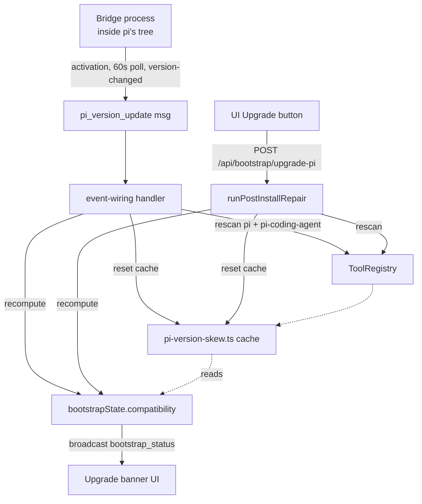

# Design — modernize-pi-version-handling

## Context

The dashboard's "what version of pi is running?" question has FOUR answer sources that should agree but currently disagree under common conditions:

| Source | Used by | Today's failure mode |
|---|---|---|
| `createRequire.resolve("@mariozechner/pi-coding-agent/package.json")` from `pi-version-skew.ts` | `bootstrap_status.compatibility.current` | Misses managed-only installs and Windows `.cmd` shims |
| `ToolRegistry.resolve("pi-coding-agent")` (module-kind) | `Settings → Tools` UI | Works (this is the source of truth) |
| `bridge → pi.events / direct readFileSync` from inside pi's process | Bridge runtime | Always works (bridge runs inside pi's tree) |
| `package.json::piCompatibility` | Floor for the upgrade hint | Stale at 0.70.0; lifted to 0.73.0 here |

Two of the four agree; two are wrong or stale. The fix is to make `pi-version-skew.ts` reuse `ToolRegistry` (source of truth) and to let the bridge (process-internal source of truth) invalidate the dashboard's caches whenever it observes a version change.

## Architecture



Both upgrade paths now invalidate the same two caches in the same order.

## The version probe

```ts
// packages/server/src/pi-version-skew.ts (simplified)

export function readCurrentPiVersion(registry: ToolRegistry): string | undefined {
  // Phase 1: prefer the module-kind tool (always points at SKILL pkg root).
  const mod = registry.resolve("pi-coding-agent");
  if (mod.ok && mod.path) {
    const pkgJson = path.join(path.dirname(path.dirname(mod.path)), "package.json");
    return tryReadVersion(pkgJson);
  }

  // Phase 2: fallback to the executor-kind, with a Windows-aware bail.
  const exe = registry.resolve("pi");
  if (exe.ok && exe.path) {
    if (exe.path.endsWith(".cmd") || exe.path.endsWith(".bat")) {
      return undefined; // explicit: shim sits at unpredictable depth
    }
    const real = fs.realpathSync(exe.path);
    const pkgJson = path.join(path.dirname(path.dirname(real)), "package.json");
    return tryReadVersion(pkgJson);
  }

  return undefined;
}
```

The `createRequire` block disappears entirely. The registry's `bare-import` strategy is already in the chain inside `registry.resolve("pi-coding-agent")`.

## The cache-invalidation contract

```
EVENT                            EFFECT
═══════════════════════════════════════════════════════════════════
runPostInstallRepair() returns   registry.rescan() — already there
                                 _resetVersionSkewCache() — NEW
                                 updateBootstrapCompatibility()
                                 broadcast bootstrap_status

pi_version_update msg arrives    registry.rescan("pi")        — NEW
                                 registry.rescan("pi-coding-agent") — NEW
                                 _resetVersionSkewCache()     — NEW
                                 updateBootstrapCompatibility()
                                 broadcast bootstrap_status
```

The two paths converge on the same four-step recipe. We extract a small helper to avoid drift:

```ts
async function refreshPiCompatibilityState(deps: { registry, bootstrapState, broadcast }) {
  deps.registry.rescan("pi");
  deps.registry.rescan("pi-coding-agent");
  _resetVersionSkewCache();
  await updateBootstrapCompatibility(deps.bootstrapState, serverPkgJsonPath, deps.registry);
  deps.broadcast({ type: "bootstrap_status", ...deps.bootstrapState });
}
```

Both `runPostInstallRepair` and the new `pi_version_update` handler call this helper.

## Bridge-side polling

```ts
// packages/extension/src/bridge.ts (sketch)

let lastPiVersion: string | undefined;
let pollHandle: ReturnType<typeof setInterval> | undefined;

function readPiVersionFromBridge(): string | undefined {
  try {
    // Bridge runs inside pi's tree — createRequire always works here.
    const req = createRequire(import.meta.url);
    const pkg = JSON.parse(fs.readFileSync(req.resolve("@mariozechner/pi-coding-agent/package.json"), "utf-8"));
    return pkg.version;
  } catch {
    return undefined;
  }
}

function maybePushVersion() {
  const v = readPiVersionFromBridge();
  if (!v || v === lastPiVersion) return;
  lastPiVersion = v;
  connection.send({ type: "pi_version_update", version: v });
}

function startVersionPoll() {
  maybePushVersion();
  pollHandle = setInterval(maybePushVersion, 60_000);
}

function stopVersionPoll() {
  if (pollHandle) clearInterval(pollHandle);
  pollHandle = undefined;
  // lastPiVersion intentionally retained so re-activation skips a no-op push.
}
```

Plugged into the existing `session_register` flow + `disconnect` cleanup.

## Why phases 1+2 land before phase 3

Phase 3 (bumping the floor) flips a server-side flag that the banner uses to decide "should I show 'upgrade recommended'?". If the version probe is broken (phase 1 not done) or the version isn't refreshed on out-of-band upgrade (phase 2 not done), users hitting the banner see one of:

- "Upgrade recommended" with the wrong current-version → confusing.
- "Current: ?" → looks broken.
- A correct current-version that goes stale within minutes → user upgrades, banner doesn't update, user double-clicks, 409 conflict.

Land 1 and 2 first (no behavior change for users not at the version boundary), then 3 (now safe to flip the flag).

## Test plan

```
packages/server/src/__tests__/pi-version-skew.test.ts                  EXTEND
  + managed-only install resolves through registry
  + Windows .cmd shim returns undefined explicitly
  + Unix npm-bin chain still works (pre-existing)

packages/server/src/__tests__/server.test.ts                           EXTEND
  + runPostInstallRepair calls _resetVersionSkewCache after rescan

packages/extension/src/__tests__/bridge-pi-version-poll.test.ts        NEW
  + first activation pushes version once
  + same-version poll pushes nothing
  + changed-version poll pushes a fresh message
  + read failure logs warning, no crash

packages/server/src/__tests__/event-wiring-pi-version-update.test.ts   NEW
  + pi_version_update handler invokes the four-step recipe in order
  + broadcasts bootstrap_status with the new compatibility

packages/shared/src/__tests__/protocol.test.ts                          EXTEND
  + pi_version_update round-trips JSON
```

## Risks

```
R1. Bridge polling adds traffic
    → 1 message per 60s per bridge ONLY when version changes (after first push, the cached value gates it).
    → After-first-push idle: zero traffic.

R2. _resetVersionSkewCache is currently a private export
    → Already exported (other tests use it). No new surface.

R3. The Windows .cmd bail-out is a behavior change (returns undefined where today it returns wrong)
    → Documented in spec. Caller (banner) already handles undefined as "version: ?".

R4. piCompatibility bump cascades through hardcoded provider lists?
    → No. replace-hardcoded-provider-lists landed first; bridge catalogue carries the union.

R5. Bridge can't read pi version from inside pi (extremely unusual partial install)
    → Logs warning, skips push. lastPiVersion stays undefined, next poll retries.
```

## Migration

None required. Banner currently shows version `0.70.0` (stale) or `?` (Windows). After the change, the banner shows the actual version. No persisted data is touched.
