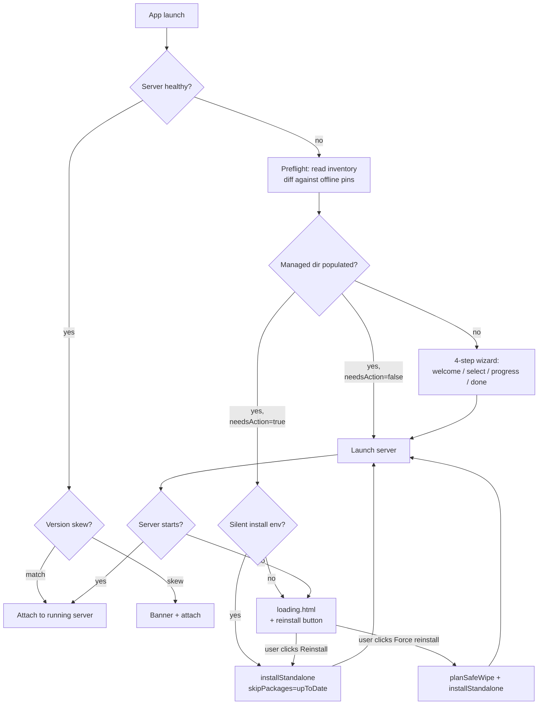

## Context

Three independent observations drove this design:

1. **The recovery machinery already exists; only the triggers are missing.** `installStandalone()` accepts a skip list, the offline cacache supports `--offline` reinstall, `installManagedNode` already handles missing-marker / mismatched-marker repair. What's missing is a per-launch trigger that decides *which* packages need work, and a UI surface other than the wizard that exposes it.
2. **`loading.html` is where every failure already lands.** The user doesn't need to know about Doctor to recover — they need the recovery affordances to appear on the page that shows the failure.
3. **The wizard's questions are noise.** Mode is autodetectable from `decideStartupAction`. API keys are post-install. Bridge-install is autoflowable from detection. The only meaningful interactive choice is "which optional packages do you want from the bundle" — and that's currently buried as step 6 of 7.

The design collapses these into a coherent three-surface model with strict ownership.

## Three Surfaces, Zero Overlap

### Wizard — first-run welcome only

**Trigger:** `~/.pi-dashboard/node_modules/` is empty AND no `mode.json` (or `mode.json` is in v1 migration state).

**Steps:**
1. `step-welcome` — branding + "Get started" button. Zero interaction beyond click-through.
2. `step-select-packages` — unified catalog reader showing three groups: Required (always installed, disabled checkboxes), Bundled extensions (toggleable, defaults from `BUNDLED_EXTENSION_IDS`), and a footer linking to "Configure more in Settings → Packages after setup."
3. `step-progress` — per-package install rows streaming from `installStandalone()` progress callback.
4. `step-done` — completion + "Launch dashboard" + deep-link button to "Configure API keys" → `/settings?tab=provider-auth`.

**Explicitly not wizard's job:** mode selection, API key configuration, error recovery, version checks, package version bumps, npm-registry browsing.

### Loading page — universal recovery

**Trigger:** every launch where server is not reachable within ~15s health-check poll loop.

**On error:**
- Existing affordances stay: `Start server`, `Open Doctor`, server log tail, known-server selector.
- New: page calls `api.checkManagedInventory()` (new IPC). Result is shown as a one-line diagnosis when something fixable is detected.
- New: `Reinstall managed packages` button appears when diagnosis has any `missing` or `stale` entries.
- New: `Force reinstall` link appears under "Advanced" disclosure when diagnosis is `corrupt` OR after a failed `Reinstall managed packages` attempt.

**Diagnosis copy examples:**
- `Missing: pi-coding-agent. Reinstall will fetch from the bundled offline cache.`
- `Outdated: pi-coding-agent (have 0.69.0, want 0.70.5). Reinstall will update.`
- `Corrupt: ~/.pi-dashboard/node_modules unreadable. Reinstall will repair.`

**Progress:** streams via existing `dashboard:launch-status` channel (extended status type) so the loading-page status line shows `Reinstalling pi-coding-agent…` instead of `Connecting to dashboard…`.

### Doctor — diagnostics + force reinstall

**Existing responsibilities preserved:** all-checks-at-once report, copy-to-clipboard, log file access, managed-dir browsing.

**New:** "Force reinstall managed packages" button in a danger-styled section, with two-step confirmation. First click expands an audit panel showing:
- **Will be wiped:** absolute paths from `planSafeWipe(...).wipe` (entries matching Electron-owned whitelist + `node/` + `.offline-cache/`)
- **Will be preserved:** absolute paths from `planSafeWipe(...).preserve` (user-installed `pi-*` packages and anything else under `node_modules/`)

Second click confirms via `dialog.showMessageBox`. On confirm: shutdown server if running → wipe per plan → run `installStandalone()` → relaunch server.

## The Whitelist Contract

`packages/shared/src/managed-package-whitelist.ts` (new) exports:

```ts
export const ELECTRON_OWNED_PACKAGES: ReadonlySet<string> = new Set([
  "@earendil-works/pi-coding-agent",
  "@fission-ai/openspec",
  "tsx",
]);
```

**Single source of truth.** A regression test asserts this list equals the package names in `packages/electron/offline-packages.json`. Bumping pins → bumping whitelist → test passes. Adding a package to the bundle but forgetting the whitelist → test fails with a clear error message.

**Used by:**
- `planSafeWipe(managedDir)` — decides what to wipe vs preserve
- `installStandalone()` reconciliation — never operates on a package outside the whitelist
- Preflight version diff — only compares whitelist entries

**Not used by:**
- Pi-core updater (`/api/pi-core/update`) — operates on the broader `pi-*` ecosystem; intentionally distinct from "Electron-owned"
- User-installed `pi-foo` extensions — by definition outside the whitelist, untouched by every Electron path

## Preflight Reconciliation

`packages/electron/src/lib/preflight-reconcile.ts` (new):

```ts
export interface PackageDiff {
  pkg: string;
  installed: string | null;   // null = missing
  expected: string;
  status: "missing" | "stale" | "current" | "corrupt";
}

export interface InventoryDiff {
  diffs: PackageDiff[];
  needsAction: boolean;       // any non-current entry
  upToDate: string[];         // for skipPackages
}

export function readManagedInventory(managedDir: string): InventoryDiff;
export function compareWithPins(
  inventory: Map<string, string | null>,
  pins: Map<string, string>
): InventoryDiff;
```

`readManagedInventory` is pure I/O (no spawn, no network) — reads each whitelist entry's `package.json#version`, classifies as missing / corrupt / present. `compareWithPins` is pure logic, testable with no fs.

**Where it runs:**
1. **`main.ts` startup, server-not-running branch.** Before launching server: read inventory, diff against `offline-packages.json` pins. If `needsAction`, prompt user (silent install via env override available for unattended scenarios).
2. **`loading.html` on connection-failure path.** Same inventory + diff; surfaces diagnosis text and reinstall button.
3. **Doctor diagnostic section.** Shows full diff as informational rows alongside other checks.

**Cross-version notification (server-up case):**
When `isDashboardRunning()` returns true, fetch `/api/health` → `{ version, piVersion }`. Compare against `app.getVersion()`:
- `running > app`: banner "Running dashboard is newer than this app (vX.Y.Z vs vA.B.C). Using running server." — non-blocking, dismissible per session.
- `running < app`: banner "Running dashboard is older than this app (vA.B.C vs vX.Y.Z). Restart for new features?" with `[Restart server]` button → `requestServerLaunch({force: true})`.

## The Three-Tier Catalog

`installable.json` v2 schema:

```jsonc
{
  "version": 2,
  "packages": [
    {
      "name": "@earendil-works/pi-coding-agent",
      "kind": "core",
      "required": true,
      "source": "offline-cache",
      "version": "0.70.5"
    },
    {
      "name": "@blackbelt/openspec-tools",
      "kind": "extension",
      "required": false,
      "source": "bundled-git",
      "defaultOn": true
    }
  ]
}
```

**`source` field drives install strategy:**
- `offline-cache` → extracted from `resources/offline-packages/npm-cache.tar.gz`, `npm install --offline`
- `bundled-git` → pi's package manager pointed at `resources/recommended-extensions/` Git cache
- `npm-registry` → live npm fetch (requires internet; only used for entries added post-install via Settings → Packages)

**Catalog assembly:**

```ts
export async function assembleCatalog(opts: {
  managedDir: string;
  resourcesPath: string;
}): Promise<InstallableList> {
  const core = await readCoreFromOfflinePackagesJson(opts.resourcesPath);
  const extensions = await readBundledExtensionsFromGitCache(opts.resourcesPath);
  // npm-registry tier intentionally NOT in wizard catalog — Settings → Packages handles online discovery.
  return mergeIntoInstallableList([...core, ...extensions]);
}
```

**v1 migration:** if `installable.json` is missing or has no `version` field, treat as v1 (synthesize v2 from current contents by inferring `kind` from the package name + `source: "offline-cache"` for known whitelist entries, `source: "bundled-git"` for others). One-shot migration on first read; rewritten atomically.

## State Machine — Before vs After

### Before (current)

```mermaid
flowchart TD
  start[App launch] --> health{Server healthy?}
  health -->|yes| attach[Attach to running server]
  health -->|no| firstRun{isFirstRun?<br/>(mode.json absent)}
  firstRun -->|yes| decide{decideStartupAction}
  firstRun -->|no| launch[Launch server blindly]
  launch --> fail{Server starts?}
  fail -->|yes| attach
  fail -->|no| dialog[Dialog: open wizard?]
  decide -->|power-user + install| autoSkip[installStandalone, no wizard UI]
  decide -->|wizard bridge-only| wizardBridge[Wizard at step-bridge-install]
  decide -->|wizard full| wizardFull[Full 7-step wizard]
  autoSkip --> launch
  wizardBridge --> launch
  wizardFull --> launch
  dialog -->|yes| wizardFull
```

### After



## Force-Reinstall Safety Model

`planSafeWipe(managedDir)` returns `{ wipe: string[], preserve: string[] }`:

1. **Always wipe:** `<managedDir>/node/` (recopied by `installManagedNode`), `<managedDir>/.offline-cache/` (transient).
2. **Whitelist-driven wipe:** for each entry in `node_modules/`, scoped path → resolve to package name → wipe iff in `ELECTRON_OWNED_PACKAGES`.
3. **Always preserve:** any `node_modules/` entry not on whitelist (user-installed `pi-*` ecosystem packages, dashboard-installed peer deps, etc.).
4. **Always preserve outside `~/.pi-dashboard/`:** all `~/.pi/` paths (config, sessions, credentials, preferences). The wipe operates strictly within the managed dir.

`forceReinstall(managedDir)` runs the plan then calls `installStandalone()`. The installer's npm invocation uses `--no-save --no-prune` flags (verify behavior is additive, not destructive of preserved entries).

## What Does Not Change

- **`/api/pi-core/update`** continues to be the in-dashboard update path for the broader `pi-*` ecosystem. No overlap with Electron's whitelist.
- **`installManagedNode`** behavior unchanged — already handles missing-marker repair correctly.
- **Recommended-extensions bundling** (Git cache in `resources/recommended-extensions/`) unchanged at build time. The wizard's catalog reads this cache differently (per-package metadata for the unified selector), but the cache contents are produced by the existing `bundle-recommended-extensions.mjs` script.
- **`build-installer.sh`** unchanged. New `build-local.sh` is a wrapper.
- **Server-side bootstrap** (`bootstrap-install-from-list.ts`) gains a `source` field router but the reconciliation loop and progress reporting are unchanged.

## Alternatives Considered

### Alt 1: Delete the wizard entirely; loading page is the only first-run surface

Discussed in conversation. Rejected because:
- "Cannot connect to server" framing is wrong for a brand-new user with nothing installed.
- Loading page is a *recovery* surface (negative valence). Wizard is an *onboarding* surface (positive valence). Different jobs.
- First-run choice (which optional packages) deserves a clean dedicated screen, not a recovery diagnosis page.

### Alt 2: Keep `mode.json`; add preflight as a separate gate before it

Rejected because:
- Preflight + presence-check is strictly more informative than `mode.json`. Anything `mode.json` tells us, the managed-dir state tells us better.
- Two state files (`mode.json` + `~/.pi-dashboard/node_modules/`) drift over time; one state file (just the filesystem) doesn't.
- Migration path is trivial: existing `mode.json` files are read once for backward-compat intent then deleted.

### Alt 3: Build-time offline cache default-on, drop `BUNDLE_OFFLINE_PACKAGES` flag

Rejected for **CI** (cache build is slow + per-arch + per-platform; opt-in keeps CI fast). Adopted for **local builds** via new `build-local.sh` wrapper.

### Alt 4: Include npm-registry tier in wizard

Rejected. Wizard stays 100% offline-capable. Online package discovery is post-install via Settings → Packages, where the in-dashboard package browser already provides better UX (search, README preview, install/uninstall lifecycle).

## Open Questions for Implementation

1. **Silent-install env variable name** — `PI_DASHBOARD_SILENT_BOOTSTRAP=1`? Or piggyback `CI=true` detection? Recommend explicit variable; CI may have legitimate need to see the prompt.
2. **Cross-version banner persistence** — banner dismissal per-session-only, or remembered until version changes again? Recommend per-session for newer-running-than-app (rare, transitional); remembered until version change for older-running-than-app (could persist across many launches if user ignores).
3. **Loading-page `Force reinstall` accessibility** — always shown under "Advanced," or only shown after `Reinstall managed packages` fails? Recommend the latter (avoid foot-guns; the reinstall path is non-destructive).
4. **Wizard "Install required only" button semantics** — install the `required: true` set with no bundled extensions, or install required + bundled extensions defaulting to their `defaultOn` flag? Recommend the latter (matches "Install selected" with all bundled extensions in their default checked state); rename button to "Install defaults" for clarity.

These are flagged as decisions for implementation; tasks.md will resolve them.

## Smoke-test findings from a parallel session (2026-05-17) — needs implementation

A parallel session performed live install-and-launch QA against a freshly built
`PI-Dashboard-darwin-x64-0.5.3.dmg` (built via `npm run build:local` after
rebasing on top of this proposal's branch + the
`fix-electron-wizard-npm-root-enoent` proposal). Five distinct failure modes
surfaced that this proposal in its current shape does NOT yet address. Each
is documented below with reproduction steps, evidence, and a recommended
fix. They are wired into `tasks.md` group 16 as concrete actionables.

### Failure 1 — Bootstrap `npm install` wipes workspace materialization

**Symptom.** After fresh install of the new `.app`, the Electron-spawned
server crashes during startup with `Error: Cannot find module 'fastify'`
from
`~/.pi-dashboard/node_modules/@blackbelt-technology/pi-dashboard-server/src/server.ts`.
The scope dir
`~/.pi-dashboard/node_modules/@blackbelt-technology/` is **empty** at
the moment of the crash (size 64 bytes = `.` + `..` only).

**Sequence (timestamps from `~/.pi/dashboard/server.log` + filesystem mtimes
in a clean repro):**

```
09:11:11   Electron extracted resources/server/ into ~/.pi-dashboard/
           → packages/{server,shared,extension,dashboard-plugin-runtime,dist}/ written
           → node_modules/@blackbelt-technology/{pi-dashboard-server,...,pi-dashboard-web}/ materialized
           → .version = "0.5.3" written
09:11:12   ~/.pi-dashboard/packages/server/src/cli.ts written
09:11:29   Electron spawned server pid=67864 from
           node_modules/@blackbelt-technology/pi-dashboard-server/src/cli.ts
09:11:30+  Server boots, runs bootstrap-install-from-list.ts:
             - reads ~/.pi-dashboard/package.json (lists pi/openspec/tsx)
             - shells `npm install --offline` from offline-packages cache
09:12:05   ~/.pi-dashboard/node_modules/ mtime updated (npm install wrote here)
           → node_modules/@blackbelt-technology/ now EMPTY
           → pi-dashboard-server/, pi-dashboard-web/, etc. all gone
```

**Root cause.** `bundle-server.mjs` materializes workspace symlinks into
physical copies of `packages/{server,shared,...}` directly under
`node_modules/@blackbelt-technology/` (the `Materialized 4 workspace
symlink(s) under @blackbelt-technology/` log line). These materializations
are NOT backed by entries in `~/.pi-dashboard/package.json`. When bootstrap
runs `npm install <pi> <openspec> <tsx>`, npm normalizes the tree against
`package.json` and **prunes anything not listed**. Workspace materialization
is collateral damage.

The surviving process keeps the `cli.ts` file open via Node's module cache
(in-memory; the file can be deleted post-load without crashing). But the
lazy `require("fastify")` inside `server.ts` fires AFTER the wipe and
fails because every probe in Node's module-resolution walk crosses the
emptied scope dir before reaching the legitimate `node_modules/fastify/`
at a higher level.

**Why it didn't show up in unit tests.** The bundle-time materialization
step runs against a clean filesystem and ends before any test executes.
No test currently asserts that materialized entries survive a subsequent
`npm install` invocation against the same dir.

**Recommended fix.** Two approaches, of equal merit — the implementing
session picks one based on follow-on complexity:

- **A. Promote materialized workspace packages to real npm dependencies
  in the synthetic `~/.pi-dashboard/package.json`.** During
  `bundle-server.mjs`, write `dependencies: { "@blackbelt-technology/pi-dashboard-server": "file:./packages/server", ... }` so
  `npm install` treats them as locally-linked deps and refuses to prune
  them. Pro: works with stock npm semantics. Con: changes the schema of
  the synthetic package.json; needs migration handling if v2 ships
  while v1 installs exist on disk.

- **B. Re-run materialization AFTER every `installable.package` install.**
  Extract `materializeWorkspaceSymlinks(managedDir)` from `bundle-server.mjs`
  into a shared helper and invoke it from `bootstrap-install-from-list.ts`
  immediately after the last `bootstrap.installable.done` event. Pro: no
  schema change; resilient to future npm-install paths. Con: duplicate
  logic in two places unless extracted into shared.

Recommendation: **B**. Lower risk of regressing existing v1 installs.
File-system materialization happens twice (build + first-launch bootstrap),
but both copies are idempotent and cheap.

**Acceptance test (must pass post-fix):**

```bash
# Fresh install scenario
rm -rf ~/.pi-dashboard/{.version,node_modules,package.json,package-lock.json,packages}
open /Applications/PI-Dashboard.app
sleep 15  # wait for bootstrap to complete
ls -la ~/.pi-dashboard/node_modules/@blackbelt-technology/
# MUST list pi-dashboard-server, pi-dashboard-shared, pi-dashboard-extension,
# dashboard-plugin-runtime, pi-dashboard-web (5 entries, NOT empty)
```

### Failure 2 — Client static-file resolution chain misses managed-dir layout

**Symptom.** Even after the materialization wipe is fixed (Failure 1),
the server still serves `404 Not Found` for `GET /` because its
client-resolution chain doesn't know about
`~/.pi-dashboard/packages/dist/client/`.

**Evidence.** With the workspace materialization intact, the server runs
from
`~/.pi-dashboard/node_modules/@blackbelt-technology/pi-dashboard-server/src/server.ts`.
The resolution chain at `packages/server/src/server.ts:1095–1114` is:

```ts
const clientSearchPaths: string[] = [];
try {
  const webPkgJson = createRequire(import.meta.url).resolve(
    "@blackbelt-technology/pi-dashboard-web/package.json"
  );
  clientSearchPaths.push(path.join(path.dirname(webPkgJson), "dist"));
} catch { /* fall through */ }
clientSearchPaths.push(
  path.join(__dirname, "..", "..", "pi-dashboard-web", "dist"),               // scoped sibling
  path.join(__dirname, "..", "..", "..", "@blackbelt-technology", "pi-dashboard-web", "dist"),  // parent-hoisted
  path.join(__dirname, "../../client/dist"),                                  // monorepo sibling
  path.join(__dirname, "../../dist/client"),                                  // legacy
);
```

With `__dirname = ~/.pi-dashboard/node_modules/@blackbelt-technology/pi-dashboard-server/src/`:

| # | Resolved path | Exists post-extraction? |
|---|---|---|
| 1 | `createRequire("@blackbelt-technology/pi-dashboard-web/package.json")` | ✗ unresolvable (scope dir empty pre-fix; pi-dashboard-web/package.json missing from managed `node_modules/.package-lock.json`) |
| 2 | `~/.pi-dashboard/node_modules/@blackbelt-technology/pi-dashboard-web/dist/index.html` | After Failure 1 fix: ✓ — this works |
| 3 | `~/.pi-dashboard/node_modules/@blackbelt-technology/pi-dashboard-web/dist/index.html` | Same as #2 (extra hop noop) |
| 4 | `~/.pi-dashboard/node_modules/@blackbelt-technology/client/dist/index.html` | ✗ |
| 5 | `~/.pi-dashboard/node_modules/@blackbelt-technology/dist/client/index.html` | ✗ |

So IF Failure 1 is fixed via approach B, path #2 succeeds. IF fixed via
approach A (file: dependency), `createRequire` (path #1) succeeds. Either
way the chain recovers.

**But — the actual extracted layout puts the client at
`~/.pi-dashboard/packages/dist/client/index.html`**, which is the path
`bundle-server.mjs` writes via `cpSync(clientSrc, path.join(SERVER_BUNDLE, "packages", "dist", "client"))`.
None of the 5 strategies probe this location. Today this path is reachable
only indirectly via the materialized `pi-dashboard-web` symlink-replacement.

**Recommended fix.** Add a sixth resolution strategy that walks up to find
the managed dir root, then probes `<managedDir>/packages/dist/client/`.
Independent of materialization state. Pseudocode:

```ts
clientSearchPaths.push(
  // Managed install root — robust against scope-dir wipe.
  // Walks up from <__dirname>/.../node_modules/<scope>/<pkg>/src/ to
  // <managedDir>/ then descends into packages/dist/client/.
  resolveManagedDirRoot(__dirname)
    ? path.join(resolveManagedDirRoot(__dirname)!, "packages", "dist", "client")
    : "",
);
```

`resolveManagedDirRoot(startDir)` walks up looking for a `.version` file
(the bundle marker) and returns the containing dir, or `null` if not
found. Pure function, easily unit-testable.

Alternative: **eliminate the dual layout** by having `bundle-server.mjs`
place the client at `node_modules/@blackbelt-technology/pi-dashboard-web/dist/`
as the canonical location and drop the `packages/dist/` copy. Reduces the
chain to 1 strategy + fallback. Bigger change, more risk.

Recommendation: **add the 6th strategy now** (mechanically safe), **mark the
dual layout as tech debt** for a future cleanup change.

### Failure 3 — Loading page reads the wrong `server.log` path

**Symptom.** The loading-page "Server log (last 20 lines)" panel shows
stale content from May 8 even on a launch in mid-May 16. Displayed text:

```
[2026-05-08T15:45:57.243Z] Launching via CLI: /Users/robson/.pi-dashboard/node_modules/.bin/pi-dashboard start --port 8000 --pi-port 9999
Dashboard server started (pid 59006) at http://localhost:8000
```

**Root cause.** `packages/electron/src/main.ts`'s `api.readServerLog`
handler reads `~/.pi-dashboard/server.log` (the **installer log** written
by an old `pi-dashboard start` invocation in 2026-05-08). The **actual**
dashboard server log lives at `~/.pi/dashboard/server.log` (note the
different dot-dir: `~/.pi/` vs `~/.pi-dashboard/`).

Verified in this session: `~/.pi-dashboard/server.log` is 200 bytes,
mtime `May 8 17:46`. `~/.pi/dashboard/server.log` is 1.2 MB, mtime
updated continuously by the running server. Loading page consumes the
wrong one.

**Recommended fix.** `recovery-ipc.ts::registerRecoveryIpc` (or wherever
`dashboard:read-server-log` lands) must read from
`os.homedir() + "/.pi/dashboard/server.log"`, NOT
`os.homedir() + "/.pi-dashboard/server.log"`. Add a regression test
asserting the resolved path matches the dashboard's `getServerLogPath()`
shared helper (see `packages/shared/src/dashboard-paths.ts` or define one
there; the path is currently hardcoded across multiple modules).

**Single-source-of-truth move:** add
`packages/shared/src/dashboard-paths.ts` exporting
`getDashboardConfigDir()`, `getDashboardServerLogPath()`,
`getManagedDir()`. Migrate every hardcoded `path.join(homedir(), ".pi", "dashboard", ...)`
and `path.join(homedir(), ".pi-dashboard", ...)` site to the shared helpers.
Grep candidates: `rg -nE '".pi/dashboard"|".pi-dashboard"' packages/**/src/`.

### Failure 4 — Pre-wizard probe 2s timeout false-negative during bootstrap

**Symptom.** Second-launch of `PI-Dashboard.app` (when a first server is
still booting or running but bootstrapping) lands on the loading-page
recovery UI with the message:

> Launch failed: Port 8000 is in use by another service. Change the
> dashboard port in `~/.pi/dashboard/config.json`

Despite `/api/health` returning HTTP 200 with `{ok:true, pid:..., starter:"Electron"}`
in under 1ms when curl'd manually from the same machine.

**Evidence.**

Electron log:
```
[2026-05-16T22:00:06.769Z] === Electron starting === pid=1677
[2026-05-16T22:00:07.031Z] Pre-wizard health check: running=false
[2026-05-16T22:00:25.461Z] [launch-source-v2] resolved kind=extracted
[2026-05-16T22:00:25.522Z] [launch-source-v2] spawned server pid=89137  ← same pid as previous server
[2026-05-16T22:00:25.522Z] splash: Preparing dashboard…
```

Reproducing the timeline:
- 22:00:07.031 — Electron probes `/api/health` with `AbortSignal.timeout(2000)`. Probe returns either `{running:false}` (AbortError) or `{running:false, portConflict:true}` (response shape mismatch).
- 22:00:25.461 (18s later) — launch-source-v2 resolver concludes `kind=extracted` and "spawns" the server, but the spawned PID logged (89137) is **the same as the previously-running server**.

**Root cause.**
`packages/shared/src/server-identity.ts::isDashboardRunning` uses a
2-second timeout. During bootstrap install (offline-cache extraction of
three npm packages, native module rebuild, jiti TypeScript transpilation,
bridge extension registration), the running server's event loop can
block long enough that the probe times out.

Additionally, the Electron log line
`Pre-wizard health check: running=${t.running}` does NOT differentiate
`{running:false}` (AbortError / ECONNREFUSED) from
`{running:false, portConflict:true}` (HTTP 200 with unexpected JSON
shape). Both branches log identically; the user-surfaced "Port in use by
another service" copy fires for the latter, leaving the user with no way
to distinguish from a real port conflict.

**Recommended fix.** Three parts:

1. **Increase the probe timeout** for the pre-wizard health check to
   ~8 seconds (matches the bootstrap install P95 window observed in
   this session: 9.3s, 15.2s, 18.4s on cold-cache scenarios). Keep the
   2s timeout for the loading-page polling loop where snappier UX
   matters and the server has had time to stabilize.
2. **Add a retry loop with bounded backoff** in the pre-wizard probe:
   on AbortError or 5xx response, sleep 500ms and retry up to 3 times
   (total ~8s + 3×500ms = 9.5s ceiling). Avoids false-positive
   `running=false` when the server is up but momentarily unresponsive.
3. **Discriminate the logging.** Change the log line to
   `Pre-wizard health check: running=${t.running} portConflict=${t.portConflict ?? false} pid=${t.pid ?? "n/a"}` so future
   debug sessions can tell apart the three terminal states.

Acceptance: launch Electron a second time while the first instance is
still mid-bootstrap. Second instance must detect `running=true`, NOT
show the loading-page "port in use" error.

### Failure 5 — Electron-spawned server has no watchdog respawn

**Symptom.** When the Electron-owned server child dies for any reason
(crash, `POST /api/restart`, manual `kill`), the parent Electron app
does NOT detect the death or restart the child. The dashboard window
becomes a ghost — still up, still pointing at `http://localhost:8000`,
but connecting to nothing.

**Reproduction.**

```bash
# Launch the app, wait for server to come up.
open /Applications/PI-Dashboard.app
sleep 15
lsof -nP -iTCP:8000 -sTCP:LISTEN | tail -1
# node    <pid>  robson   17u  IPv4 ...  TCP *:8000 (LISTEN)
curl -X POST http://localhost:8000/api/restart
# Server dies; orchestrator does NOT respawn (it expected a CLI-spawned parent).
sleep 5
lsof -nP -iTCP:8000 -sTCP:LISTEN | tail -1
# (empty — port is now free)
# Electron app is still running but the dashboard tab will eventually error.
```

**Root cause.** `packages/electron/src/lib/server-lifecycle.ts` spawns
the server child but does not attach a `child.on('exit', ...)` watchdog
that triggers respawn. The `setSpawnedPid(child.pid)` step is purely a
bookkeeping call for the cross-platform shutdown rule, not a lifecycle
hook.

**Recommended fix.** Add a `child.on('exit', (code, signal) => ...)`
hook in `spawnFromSource` (or the wrapper in `server-lifecycle.ts`).
Behavior:

- If `signal === "SIGTERM"` AND a graceful-shutdown flag was set (e.g.
  by the app's quit handler), do nothing.
- Otherwise: log the exit, broadcast a `dashboard:launch-status
  {phase: "crashed", code, signal}` event to all renderer windows,
  and trigger the loading-page flow (set `currentWindow` to load
  `loading.html` with `params.serverUrl=http://localhost:${port}` again).
  Loading page's existing health-check loop will then detect
  `running:false` and surface "Start server" + recovery affordances.

This dovetails with the loading-page recovery already in scope for
Group 6. A crashed server flows back into the same recovery UX as a
never-started server, which is the correct mental model: the user
shouldn't care WHY the server is down, only that the loading page
helps them get it back.

### Cross-failure interaction with `fix-electron-wizard-npm-root-enoent`

The parallel proposal `fix-electron-wizard-npm-root-enoent` adds an
`electronBundledRuntimeStrategy` to the `npm` + `node` tool registry
chains. **That fix is robust to Failure 1 (workspace materialization
wipe).** The new strategy resolves `npm` via
`<process.resourcesPath>/node/lib/node_modules/npm/bin/npm-cli.js` —
an absolute path inside the `.app` bundle that npm install can never
touch. So pi's `DefaultPackageManager.runCommandSync("npm", ["root", "-g"])`
works correctly even when `~/.pi-dashboard/node_modules/@blackbelt-technology/`
is wiped. The two changes are complementary and can ship independently.

**Implication for implementation order:** Fix Failure 1 BEFORE
`fix-electron-wizard-npm-root-enoent` ships if you want a single
end-to-end-verifiable build. Otherwise the test surface remains
unit-only for the npm-ENOENT fix (which is fine — the tests are
comprehensive; see that proposal's tasks 3+4).
