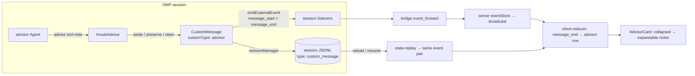

# surface-omp-advisor — design

## Context

The OMP advisor (verified against `@oh-my-pi/pi-coding-agent@17.0.4` sources) is a
second `Agent` assigned the `advisor` model role. After each primary turn it reviews the
transcript delta and may call its `advise` tool with `{ note, severity?: "nit" |
"concern" | "blocker" }`. `AgentSession.#routeAdvice` delivers accepted notes as
`CustomMessage { role: "custom", customType: "advisor", display: true, attribution:
"agent", content, details: { notes } }` via three channels:

| Channel | Trigger | Effect |
|---|---|---|
| `aside` | any `nit`; `concern`/`blocker` during an immune-turns window | batched into one YieldQueue card (multiple notes per card) |
| `preserve` | `concern`/`blocker` after a terminal answer, after user interrupt, in plan mode, or under ACP deferral | visible card, no interruption |
| `steer` | `concern`/`blocker` while the agent streams | injected into the running turn (card also lands in the transcript) |

Two facts make the dashboard integration cheap on the harness side:

1. **Events already flow.** `#preserveAdvisorCard` calls
   `agent.emitExternalEvent({ type: "message_start" | "message_end", message: card })`
   (`agent-session.ts:2371-2372`), which "appends to agent state and dispatches to all
   session listeners" (`agent-session.ts:16255`). The bridge subscribes to both event
   types (`packages/extension/src/bridge.ts` `enrichedEventTypes`) and forwards them via
   `event_forward`; the server stores and rebroadcasts them. The steered path's
   `sendCustomMessage` emits the same pair through the normal agent loop.
2. **Cards persist.** Session JSONL entries of shape `{ type: "custom_message",
   customType: "advisor", content, details, display, attribution, id, timestamp }`
   (verified against real session files under `~/.omp/agent/sessions/`).

The single drop point on the live path is the client reducer; the drop point on the
replay path is `state-replay.ts`.

## Decisions

### D1 — New `advisor` chat-row role, not the interactive-renderer registry

The `interactiveUi` row role + renderer registry (`interactive-renderers/`) models a
*prompt lifecycle* (`pending → resolved/cancelled`, response wiring, PromptBus
correlation). Advisor cards are display-only transcript entries — the advisor never asks
the user anything (there is no reply control even in the TUI,
`advisor-message.ts:33-133`). Forcing them into the prompt registry would fabricate
requestIds, pending states, and response plumbing that can never fire.

Add `role: "advisor"` to the `ChatMessage` role union
(`packages/client/src/lib/event-reducer.ts:22`) carrying the note list, and render it
with a dedicated `AdvisorCard` component. If a future OMP version ever lets the advisor
pose decisions, the correct vehicle is the existing PromptBus `prompt_request` protocol,
not this card.

### D2 — Reducer maps `message_end` (upsert on id); `message_start` is a no-op for advisor

Preserved/aside cards fire `message_start` and `message_end` back-to-back with identical
content. The reducer SHALL append the advisor row on `message_end` when
`data.message.role === "custom" && data.message.customType === "advisor"`, keyed by
`data.entryId ?? data.message.id` (upsert, so a `message_start` handler added later —
or duplicate delivery across replay+live overlap — cannot double-render a card). Steered
cards pass through the same two events, so all three delivery channels converge on this
one branch. `display === false` cards are skipped defensively (none are emitted today).

### D3 — Replay synthesizes the same event pair from `custom_message` entries

`replayEntriesAsEvents` (`packages/shared/src/state-replay.ts`) gains a branch:
`entry.type === "custom_message" && entry.customType === "advisor" && entry.display !== false`
→ emit `message_start` + `message_end` whose `data.message` is the entry reshaped to
message form (`{ role: "custom", customType, content, details }`), with
`entryId: entry.id`. This mirrors the live emission exactly, so the reducer needs no
replay-specific path. It sits beside — and does not alter — the existing
`type: "custom"` + `customType: "flow-event"` branch (`state-replay.ts:62`): pi-flows
persists `custom`, OMP persists `custom_message`; both shapes legitimately exist.

### D4 — Card content comes from `details.notes`, never from parsing `content`

`content` is a pre-formatted XML `<advisory>` batch for the *primary model's* benefit
(`formatAdvisorBatchContent`). The structured `details.notes: AdvisorNote[]` (`{ note,
severity, advisor? }`) is the render source: collapsed row shows
`Advisor [<name>] · N notes · <top severity> · <first-note preview>`; expanded shows each
note railed by severity (`nit` neutral, `concern` amber, `blocker` red). Fallback for a
missing `details` (hand-written or future entry): render `content` as preformatted text.
Severity precedence for the collapsed badge: `blocker` > `concern` > `nit`.

### D5 — Spawn flag rides the established optional-field degradation pattern

`SpawnSessionBrowserMessage` gains `advisor?: boolean`, documented like `gitWorktreeBase`
("old servers ignore unknown fields → bare spawn"). Server side:
`session-action-handler.ts` passes it into `spawnPiSession` options;
`process-manager.ts` appends `--advisor` to the omp argv only when the value is `true`
(there is no negative flag — `omp --advisor` is boolean-only, `src/commands/launch.ts`).
The flag is persisted to the session `.meta.json` (`advisor: true`) on spawn so the chip
survives server restarts and resume. Default/undefined means "harness default" — which
is the global `advisor.enabled` config the Settings → Agent (OMP) page already edits.

### D6 — Passive chip: spawn-flag OR activity-observed

A session shows the "Advisor" chip when (a) its `.meta.json` carries `advisor: true`, or
(b) at least one advisor row exists in its reduced session state (proof of activity —
covers externally-spawned sessions where the harness default or `/advisor on` enabled
it). The chip is display-only with a tooltip explaining what the advisor is; it must not
look like a toggle, because it isn't one (see Deferred track).

### D7 — Live per-session toggle is deferred, blocked on upstream OMP

Verified dead-ends for a no-upstream-change live toggle:

- ExtensionAPI (`ExtensionContext` / `ExtensionActions`,
  `extensibility/extensions/types.ts:410-500, 1410-1431`): model/thinking/session-name
  controls only — no advisor, no builtin-command execution.
- Bridge slash-dispatch routes *extension* commands
  (`command-handler.ts:538` → `tryDispatchExtensionCommand`); `/advisor` is a builtin
  handled in `builtin-registry.ts` against `runtime.session` — unreachable from the bridge.
- RPC mode (`modes/rpc/rpc-mode.ts`): full method list has `set_model`,
  `set_thinking_level`, `steer`, … — no advisor method; `get_available_commands` is
  read-only.
- `pi.sendMessage` injects transcript messages; it cannot flip session state.

**Upstream ask (minimal, unblocking):** `AgentSession` already implements
`setAdvisorEnabled`, `isAdvisorEnabled`, `toggleAdvisorEnabled`, `getAdvisorStats`,
`formatAdvisorStatus` (`builtin-registry.ts:505-560` consumes them). Expose them to
extensions — e.g. `ExtensionContext.advisor: { isEnabled(): boolean; setEnabled(v:
boolean): boolean; getStats(): AdvisorStats }` — or add RPC `set_advisor_enabled` /
`get_advisor_status` methods.

**Ready-to-build once unblocked** (not this change): typed `set_advisor_enabled` on both
protocols following the `set_thinking_level` precedent
(`protocol.ts:667-683`, `browser-protocol.ts:1076-1088`), `browser-gateway` switch →
`PiGateway.sendToSession` → bridge `command-handler.ts` → the new API; bridge pushes an
authoritative advisor-state session update (mirroring `sendModelUpdateIfChanged`,
`bridge.ts:1199-1206`); header control beside `ThinkingLevelSelector`.

## Flow

## Out of scope

- WATCHDOG.yml roster editor (multi-advisor config) — TUI `/advisor configure` parity is
  a separate, larger feature.
- `__advisor.jsonl` side-transcript viewer (Agent Hub observability).
- Any advisor-specific dialog transport (see D1).
- Global `advisor.*` toggles — already shipped via the OMP settings mirror
  (`OmpSettingsPage.tsx`, `/api/omp-config`); this change only *reads*
  `advisor.enabled` to seed the spawn checkbox.
