# @blackbelt-technology/pi-dashboard-flows-anthropic-bridge-plugin

pi-flows-aware bridge plugin for **pi-dashboard**. Forwards
[`@pi/anthropic-messages`](https://github.com/BlackBeltTechnology/pi-anthropic-messages)
hooks into every spawned pi-flows agent subprocess, and exposes per-session
peer-probe state in the dashboard's Settings panel.

## What it does

`@pi/anthropic-messages` solves a real problem for sessions targeting
Claude-model `anthropic-messages` endpoints: it canonicalizes pi tool names
to the Claude Code shape (`read` → `Read`, `ask_user` → `mcp__pi__ask_user`,
…), translates inbound responses back, and rewrites the system prompt for
identity-fingerprint compatibility.

When pi-flows spawns an isolated agent session, that agent does **not**
inherit the parent's pi extensions. Without the bridge, agent tool calls hit
Claude Code's strict canonical allowlist with un-prefixed pi names, get
mangled to `bash_ide` / `read_ide`, and fail.

This plugin closes that gap by:

1. Probing for both peers (`@pi/anthropic-messages` and `pi-flows`) in the
   pi process.
2. When both are present, running `@pi/anthropic-messages`'s default export
   against the main session AND emitting `flow:register-agent-extension` so
   every spawned agent gets the same hooks scoped to its own pi instance.
3. Re-probing on every `session_start` so late-installed peers (after
   `npm install … && /reload`) are picked up automatically.
4. Broadcasting per-PID peer status to the dashboard so the Settings UI
   shows live activation state.

The plugin **does not reimplement any transforms** — it is pure plumbing
over `@pi/anthropic-messages`. Upstream fixes flow through `npm update`.

## Activation gates (inherited from `@pi/anthropic-messages`)

| Condition | Behaviour |
|---|---|
| Either peer missing | Plugin idle. Settings panel shows ✗ for the missing peer. |
| Both peers present, model `api === "anthropic-messages"` AND id matches `/claude/i` | Bridge active. |
| `forceCanonical = true` (Settings) | Bridge active for any `anthropic-messages` session regardless of model id. |
| `disableCanonical = true` (Settings) | Bridge inactive even for Claude sessions. |
| Any non-`anthropic-messages` API | Bridge is a true no-op. |

## Slot contributions

| Slot | Component | Purpose |
|---|---|---|
| `settings-section` (general tab) | `FlowsAnthropicBridgeSettings` | Per-PID peer status table + gate-override toggles |

## Manifest

```jsonc
"pi-dashboard-plugin": {
  "id": "flows-anthropic-bridge",
  "displayName": "pi-flows · Anthropic Messages Bridge",
  "priority": 500,
  "client":  "./src/client.tsx",
  "server":  "./src/server/index.ts",
  "bridge":  "./src/bridge/index.ts",
  "configSchema": "./configSchema.json",
  "claims": [
    { "slot": "settings-section", "component": "FlowsAnthropicBridgeSettings", "tab": "general" }
  ]
}
```

## State machine

```mermaid
stateDiagram-v2
  [*] --> probing : activate()
  probing --> waiting_peers : missing one or both peers
  probing --> active : both peers present
  waiting_peers --> waiting_peers : session_start, still missing
  waiting_peers --> active : both peers detected
  active --> degraded : peer removed (rare; defensive)
```



Once `wired = true`, hooks remain registered on the pi instance for the
process lifetime. A `degraded` status on a subsequent probe surfaces in the
UI and instructs the user to `/reload`.

## Diagnostic log

`@pi/anthropic-messages` writes activation + transform events to
`/tmp/pi-am.log` (or `PI_ANTHROPIC_MESSAGES_DEBUG_LOG` if set). To verify
the bridge reached a flow agent:

```bash
rm -f /tmp/pi-am.log
# … trigger a flow with at least one agent step …
grep -E '"stage": "(load|activate)"' /tmp/pi-am.log | sort -u
# Expect TWO different PIDs: parent pi + spawned agent pi.
```

## Dependencies

- `@pi/anthropic-messages` — peer (must be installed in the same scope as pi)
- `pi-flows` — peer (must be installed in the same scope as pi)
- `@blackbelt-technology/pi-dashboard-shared` — runtime types
- `@blackbelt-technology/dashboard-plugin-runtime` — provided by host

## Testing

```bash
npm --workspace @blackbelt-technology/pi-dashboard-flows-anthropic-bridge-plugin test
```
